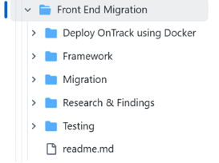
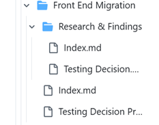
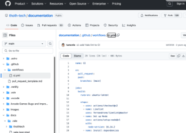
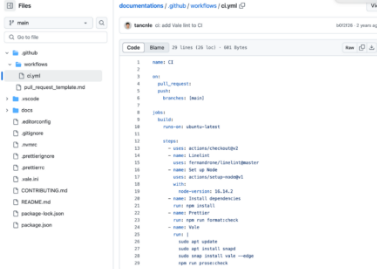
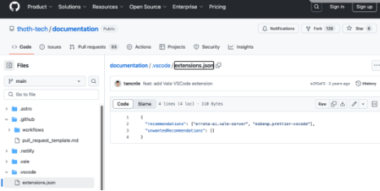
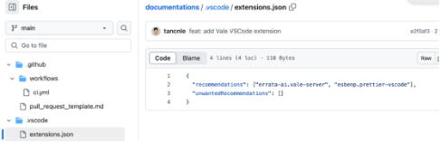
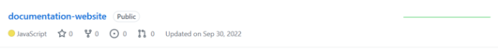
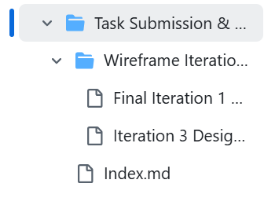
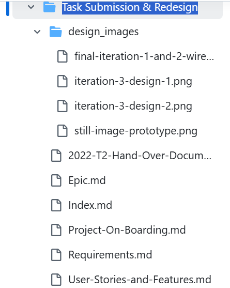

**Action Plan -**

**Group Documentation Repositories Separately**

**Revised Problem & Solution**

**Problem**
The documentation for **OnTrack and Splashkit** is scattered across multiple repositories, making it difficult for new students to find relevant information. There is half the information in one place and half in another, causing fragmentation and confusion. When someone searches for details, they are often forced to deal with similar content across multiple repositories without a complete picture. This ineffective structure hinders accessibility and learning.

**Solution**

1. Instead of creating separate repositories for each project, I propose **consolidating** the documentation into a single, unified repository.
1. This repository can serve as a centralized location for all project information.
1. Within this unified repository, I will -
   1. Organize OnTrack and Splashkit documentation into dedicated folders for each project.
   1. Include additional OnTrack information (e.g., Tutor Times, Local Setup) currently found in documentation-1.
   1. Ensure the structure is clear, accessible, and user-friendly for new students.

**Remove Duplication**

**Problem -** 
There are redundant files across repositories and within folders which make the documentation difficult to maintain and confusing for new users. A significant example of this duplication exists between **documentation-1** and **documentation-2**.

1. 90 percent of the content is identical across both repositories
1. The excessive use of index.md files, particularly in the Ontrack documentation, causes unnecessary clutter. While index.md files are useful as entry points for sections, I will evaluate each instance to strike a balance between keeping essential entry points and removing unnecessary additions. This will help streamline the structure without losing valuable navigation points.
1. Unique content such as the Password Guideline in documentation-1 is missing in documentation-2
1. In documentation-1, the **Research & Findings** folder in the **Front End Migration** directory contains two very similar files: Testing\_Decision.md and Testing Decision Process.md. –  
1. Both files share 90% of their content, making them largely redundant.
1. The only difference is that Testing Decision Process.md includes an additional conclusion section and provides extra details, such as well-defined steps like npm install and npm test.

To avoid duplication, **one consolidated file** should be sufficient.

**The only differences between documentation-1 and documentation-2 are as follows.** As I have identified these, we should consider merging the unique content into one file and deleting the other -

1. Password Guideline: Exists in the Company Documentation Team folder in documentation-1 but is missing in documentation-2.

1. Empty index.md Files: documentation-2 contains two empty index.md files, whereas documentation-1 has only one empty index.md file.

**Solution -** 
We need to consolidate redundant files and merge the unique content into one repository. This includes – 

1. Combining the duplicated content in **documentation-1** and **documentation-2** into a single repository
1. Ensuring unique files like the Password Guideline are included in the consolidated repository
1. Removing unnecessary duplicates like multiple index.md files

Eliminating these redundancies will make the documentation easier to maintain and more efficient to use.

Similarly, the **documentation and documentations** repos have a lot in common. Here are some of the similarities. It is important to note that I have not listed all the duplications, as 90% of the content is duplicated.

documentation

documentations

documentation

Documentations

**Revised Action Plan - Rename Files and Add Brief Descriptions**

**Problem -** 

Many files have **ambiguous or generic names**, making it difficult for new students to understand their purpose. This lack of clarity causes confusion and slows down learning.

1. Repository names like **“doubtfire-astro”** and **“doubtfire-io”** do not clearly indicate their contents.
1. Some repositories have **outdated README files**, which haven't been updated in years.
1. Examples of ambiguous names include files like **Aspose.Words.c1eaed0e...**.
1. Generic names such as **image1.png** provide no context.
1. Files within repositories lack clear project identifiers, making it harder for students to locate relevant documentation.

**Solution:**

1. Adopt Snake\_Case Naming Convention -
   1. Standardize file names using snake\_case (e.g., courseflow\_dfd\_0.png instead of CourseFlow-DFD-0.png).
   1. Snake\_case provides a consistent and easily identifiable structure that everyone can follow.
1. Rename Ambiguous and Generic Files -
   1. Replace ambiguous names like Aspose.Words.c1eaed0e... with meaningful names like contribution\_guide.png.
   1. Change generic names like image1.png to descriptive names such as project\_dashboard.png.
1. Update Repository Names and Descriptions -
   1. Clarify confusing repository names (e.g., “doubtfire-astro”) to indicate what they contain, such as “courseflow-docs”.
   1. Add or update repo descriptions to clearly explain their purpose and contents.
   1. Conduct a README update process for all OnTrack repositories to ensure they are current and relevant, similar to what was done for Splashkit.
1. Add Brief Descriptions -
   1. Include a one-line description for each repository and key file to help new students quickly understand their purpose and context.

**Ensure Consistent Repository Format**

**Problem**
The structure and naming conventions across repositories are inconsistent, making navigation difficult and leading to confusion.

**Solution**
We should unify the structure of all repositories to maintain consistency. This includes – 

1. Using consistent naming conventions such as lowercase with hyphens for file names (e.g., courseflow-dfd-0.png)
1. Adding a README.md file to directories like src to explain the folder structure and its purpose

This consistency will make the documentation easier to navigate and maintain.

**OnTrack Onboarding Documentation** 

**Problem**
OnTrack lacks clear and accessible **onboarding documentation**, which has caused confusion for new students. This was a significant issue at the beginning of the semester when students struggled to get started due to the absence of centralized guidance.

**Solution**

1. Create comprehensive **OnTrack onboarding documentation** and host it on the **Thoth Tech website** ([thoth-tech.netlify.app](https://thoth-tech.netlify.app/)) for easy access.
1. The onboarding documentation should include
   1. **Setup Instructions**: Step-by-step guidance for setting up the OnTrack environment.
   1. **Key Resources**: Links to essential tools, guides, and repositories.
   1. **Common Issues and Troubleshooting**: Solutions to frequent setup and usage problems.
   1. **Quick Start Guide**: A simplified guide to help students quickly understand OnTrack and begin using it.

**Objective**

1. Ensure new students have a **clear entry point** for getting started with OnTrack.
1. Make the onboarding process **streamlined and accessible** via the Thoth Tech website to reduce confusion and frustration.

This addition to the action plan addresses the urgent need for onboarding support and ensures new users can quickly find everything they need to get started.

**Correct All Minor Discrepancies**

**Problem**
There are minor inconsistencies across the documentation that can create confusion and reduce clarity. These issues include mismatched file names, inconsistent endpoint conventions, and duplicated content. For example - There are numerous **empty index.md files** that we must consider deleting

**Solution**
We need to address all documented minor inconsistencies to improve clarity and maintainability. This includes

1. Resolving naming mismatches like **setting.md** vs **"settings"** in the SPIS list
1. We should use lowercase and hyphens for file names (e.g., courseflow-dfd-0.png instead of CourseFlow-DFD-0.png).
1. Aligning duplicated API content, such as those found in tutorials.md and similar files across repositories
1. Deleting empty **index.md** files

By correcting these minor discrepancies, the documentation will become more organized, user-friendly, and easier to maintain, minimizing confusion for new users.

**Further explanation for better clarity**

**

In documentation-1, the **Research & Findings** folder in the **Front End Migration** directory contains two very similar files: Testing\_Decision.md and Testing Decision Process.md.

1. Both files share **90% of their content**, making them largely redundant.
1. The only difference is that Testing Decision Process.md includes an additional **conclusion section** and provides extra details, such as well-defined steps like npm install and npm test.

To avoid duplication, **one consolidated file** should be sufficient.

**Task Submission & Redesign**

**In document-1**

**In document-2**

Here again, every folder, sub-file, and the content of all files, except for the two differences mentioned above, are the same. We should consider consolidating them into **one repository** to eliminate redundancy.

