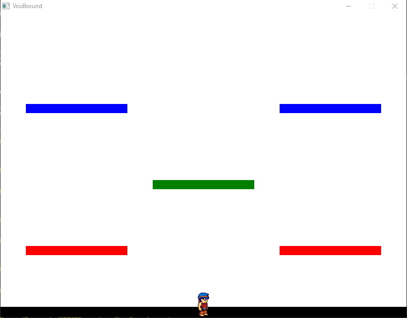
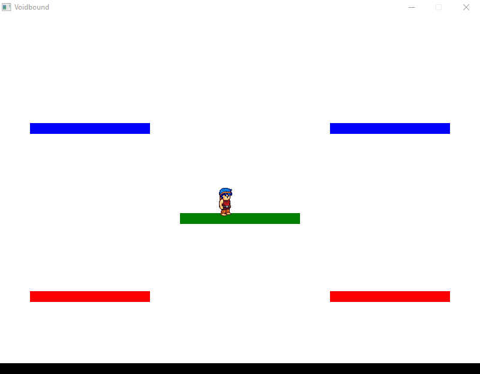

# Tutorial 6: Collision Detection and Physics

This tutorial involves adding gravity and jumping, as well as platforms for the player to stand on

This tutorial builds on the following code until previous tutorials are completed

```cpp
#include "splashkit.h"

void handle_animations(animation player_animation)
{
	if (key_typed(LEFT_KEY)) assign_animation(player_animation, "WalkLeft");
	if (key_typed(RIGHT_KEY)) assign_animation(player_animation, "WalkRight");


	if (!key_down(LEFT_KEY) and !key_down(RIGHT_KEY))
	{
		if (key_released(LEFT_KEY)) assign_animation(player_animation, "StandLeft");
		if (key_released(RIGHT_KEY)) assign_animation(player_animation, "StandRight");
	}
}

int main()
{
	// Declare variables for window dimensions
    int width = 800;
    int height = 600;

	// Open a game window with specified title and dimensions
    open_window("Voidbound", width, height);

	// Load player spritesheet and set its cell details
    bitmap player_sprites = load_bitmap("PlayerBmp", "player_sprite_sheet.png");
    bitmap_set_cell_details(player_sprites, 64, 64, 9, 2, 18); // cell width, height, cols, rows, count

	// Load the animation script
    animation_script player_script = load_animation_script("PlayerScript", "player_animations.txt");

    // Create the animation
    animation player_animation = create_animation(player_script, "StandRight");

    // Create a drawing option
    drawing_options opt = option_with_animation(player_animation);

	// Load the background image from the specified path
    //bitmap background = load_bitmap("sky", "Resources/images/sky.png");

	// Declare variables for player bitmap dimensions
	double w = bitmap_cell_width(player_sprites);
	double h = bitmap_cell_height(player_sprites);

	// Calculate the player's starting position
	double x = width / 2 - w / 2;
	double y = height / 2 - h / 2;

	// Declare speed of player movement
	int walk_speed = 6;

	while (!key_down(ESCAPE_KEY)) // Game closes when escape key is pressed
	{

		// Check keyboard state
		process_events();
		// Clear the screen with the loaded background image
		clear_screen();
		//draw_bitmap(background, 0, 0);

		// Player controls
		if (key_down(LEFT_KEY) and x > 0)
		{
			x -= walk_speed;
		}
		if (key_down(RIGHT_KEY) and x < width - w)
		{
			x += walk_speed;
		}
		if (key_down(UP_KEY) and y > 0)
		{
			y -= walk_speed;
		}
		if (key_down(DOWN_KEY) and y < height - h)
		{
			y += walk_speed;
		}

		// Draw player bitmap
		draw_bitmap(player_sprites, x, y, opt);
		update_animation(player_animation);
		handle_animations(player_animation);

		// Refresh the screen to display the drawn rectangle
		refresh_screen(60);
	}

    // Close the game window
    close_all_windows();

    // Indicate successful program completion and return 0
    return 0;
}
```

## Point Position and Vector Movement

To assist in applying physics to the player character, this tutorial uses the `point_2d` and `vector_2d` types to keep track of player position and movement.

To use the `point_2d` type to store the player's position, the current variables used for the player position must be changed.
The player's x and y position are now stored in an instance of the `point_2d` type as shown in the below code.
The starting y position of the player has also been lowered to be closer to the bottom of the screen.

```cpp
// Calculate the player's starting position
point_2d player_position;
player_position.x = width / 2 - w / 2;
player_position.y = height - 100;
```

To use the `vector_2d` type to keep track of player movement, the current method of changing the player's x and y position must be changed.
The first step to implementing the `vector_2d` type is to initialise a variable for the vector, as shown below.
The x and y components of the vector are initially set to zero to indicate that the player is not moving by default.

```cpp
//initialise player movement vector
vector_2d player_vector;
player_vector.x = 0;
player_vector.y	= 0;
```

The next step is to change how horizontal movement is implemented by making changes to the vector instead of changing the player's position directly.
The `if` statements handling horizontal movement should be changed to the below example.

```cpp
if (key_down(LEFT_KEY) and player_position.x > 0)
{
	player_vector.x -= walk_speed;
}
if (key_down(RIGHT_KEY) and player_position.x < width - w)
{
	player_vector.x += walk_speed;
}
```

The vector must be reset every update to prevent the arrow keys from accelerating the player instead of moving them at a constant speed.
This means that the below code must be placed above the movement code to reset the vector before changes are made to it.

```cpp
// Reset player vector
player_vector.x = 0;
player_vector.y	= 0;
```

Now that the movement code is not directly changing the player's position, additional code is needed to apply the vector to the player's position.
The following code moves the player's `point_2d` variable using the distance and direction described by the vector.
This code must be placed in between the code that handles player movement and the code that draws the player.

```cpp
// Move player
player_position = point_offset_by(player_position,player_vector);
```

Finally, the code that draws the player must be updated to use the new `point_2d` variable, as shown below.

```cpp
// Draw player bitmap
draw_bitmap(player_sprites, player_position.x, player_position.y, opt);
```

Putting the above steps together, the game loop should now look like the following:

```cpp
while (!key_down(ESCAPE_KEY)) // Game closes when escape key is pressed
{

	// Check keyboard state
	process_events();
	// Clear the screen with the loaded background image
	clear_screen();
	//draw_bitmap(background, 0, 0);

	// Reset player vector
	player_vector.x = 0;
	player_vector.y	= 0;

	// Player controls
	if (key_down(LEFT_KEY) and player_position.x > 0)
	{
		player_vector.x -= walk_speed;
	}
	if (key_down(RIGHT_KEY) and player_position.x < width - w)
	{
		player_vector.x += walk_speed;
	}
	if (key_down(UP_KEY) and y > 0)
	{
		y -= speed;
	}
	if (key_down(DOWN_KEY) and y < height - h)
	{
		y += speed;
	}

	// Move player
	player_position = point_offset_by(player_position,player_vector);

	// Draw player bitmap
	draw_bitmap(player_sprites, player_position.x, player_position.y, opt);
	update_animation(player_animation);
	handle_animations(player_animation);

	// Refresh the screen to display the drawn rectangle
	refresh_screen(60);
}
```

## Gravity and Jumping

Now the player's vertical movement can be updated so that the player can jump and fall.
Because this involves different types of movement, more speeds must be defined for jumping and falling as shown below.

```cpp
// Declare speed of player movement
int walk_speed = 6;
int jump_speed = 18; // Determines jump height
int max_jump_frames = 15; // Determines time to complete jump
int jump_frames = 0; // Current jump frames
int fall_speed = 6;
```

When the player character jumps, they should move for a set distance before falling, but travelling this distance instantly looks unusual.
This can be avoided by applying a speed over a set number of game updates to move the player gradually. The three jump variables are used to achieve this gradual movement.

To implement jumping, replace the current upwards movement `if` statement with the following two `if` statements. The code that executes when the up key is pressed now just sets the value of `jump_frames`.
The actual movement is handled in a separate statement to allow for the character to jump without holding down the up key.

```cpp
if (key_typed(UP_KEY))
{
	jump_frames = max_jump_frames;
}
// Apply jump movement
if(jump_frames > 0)
{
	player_vector.y -= jump_speed;
	jump_frames--;
}
```

The `if` statement handling downward movement can now be replaced with falling due to gravity.
A temporary condition is used to stop the player when they reach the bottom of the window until there are other surfaces to stand on.

```cpp
// Apply gravity
if(player_position.y < height - h)
{
	player_vector.y += fall_speed;
}
```

Run the game to make sure the new movement is working. The player character should be able to jump from and land back on the bottom of the window.

## Creating platforms

The Metroidvania game needs objects that the player can jump and walk on to traverse the game world. For this tutorial, platforms are added to test the physics that allow for this traversal.

It is a good idea to use structs when creating objects that have multiple properties, so a struct is used for the platforms. The following struct contains the rectangle object and colour that make up the appearance of the platform.
The struct should be placed near the top of the code, outside of any function.

```cpp
struct platform_data
{
	rectangle rectangle;
	color color;
};
```

To keep track of the platforms in the game, a data structure is required to store a list of platforms.
This tutorial uses vectors as this structure, so add the following imports at the top of the code.

```cpp
#include <vector>
using std::vector;
```

To help with code readability, a function is used to create the platforms and store them in a vector to return to the main function.
The following function creates a platform representing the ground and five aerial platforms to jump on.

```cpp
vector<platform_data> create_platforms()
{
	vector<platform_data> result;
	platform_data platform;

	// Ground platform
	platform.rectangle = rectangle_from(0,580,800,20);
	platform.color = COLOR_BLACK;
	result.push_back(platform);

	// Air platforms
	platform.rectangle = rectangle_from(50,460,200,18);
	platform.color = COLOR_RED;
	result.push_back(platform);

	platform.rectangle = rectangle_from(550,460,200,18);
	platform.color = COLOR_RED;
	result.push_back(platform);

	platform.rectangle = rectangle_from(300,330,200,18);
	platform.color = COLOR_GREEN;
	result.push_back(platform);

	platform.rectangle = rectangle_from(50,180,200,18);
	platform.color = COLOR_BLUE;
	result.push_back(platform);

	platform.rectangle = rectangle_from(550,180,200,18);
	platform.color = COLOR_BLUE;
	result.push_back(platform);

	return result;
}
```

To put the platforms in the game, the function must called before the game loop starts, and the platforms must be drawn.

The line below creates the platform vector and receives the platforms from the function.

```cpp
vector<platform_data> platforms = create_platforms();
```

To handle the drawing of the platforms, the following for loop is used in the game loop.
Place this code above the code to draw the player to ensure that the player is drawn over the platforms.

```cpp
// Draw platforms
for (int i=0; i < platforms.size(); i++)
{
	fill_rectangle(platforms[i].color, platforms[i].rectangle);
}
```

The game should now display the platforms, although they cannot be jumped on.



## Collision Detection

Collisions can be used to detect when the player is standing on a platform so that the code can stop them from falling through.
To start, create a boolean variable that is used to check if the player should be falling or not. It should be defined before the game loop, like the speed variables, and should default to false.

```cpp
bool on_ground = false; //whether the player is on a surface or in the air
```

Now collision detection can be used to change the boolean when needed. The `bitmap_rectangle_collision` function is used to detect collisions between a bitmap, like the player, and a rectangle.

A second condition is used to make sure that only the character's feet can collide with the platform. This condition is used to ensure that the player's fall is only stopped if they are standing on top of a platform.
A break statement is required to exit the for loop when a collision is found, because only one platform must be collided with.

This loop should be placed inside the game loop before the player movement code.

```cpp
// Check collisions
for (int i=0; i < platforms.size(); i++)
{
	if(bitmap_rectangle_collision(player_sprites,player_position,platforms[i].rectangle) // If the player is touching the platform
		and player_position.y + h - platforms[i].rectangle.y <= 10) // But only if the player's feet are touching the platform
	{
		on_ground = true;
		break;
	}
	else
	{
		on_ground = false;
	}
}
```

The final step is to modify the jumping and falling code to make use of the new boolean. This ensures that the player cannot jump in mid-air or fall through platforms.

```cpp
if (key_typed(UP_KEY) and on_ground)
{
	jump_frames = max_jump_frames;
}
// Apply jump movement
if(jump_frames > 0)
{
	player_vector.y -= jump_speed;
	jump_frames--;
}
// Apply gravity
if(!on_ground)
{
	player_vector.y += fall_speed;
}
```

## Putting it All together

Below is the complete C++ code that combines all the previous steps to add physics and collisions to the game.

```cpp
#include "splashkit.h"
#include <vector>
using std::vector;

struct platform_data
{
	rectangle rectangle;
	color color;
};

void handle_animations(animation player_animation)
{
	if (key_typed(LEFT_KEY)) assign_animation(player_animation, "WalkLeft");
	if (key_typed(RIGHT_KEY)) assign_animation(player_animation, "WalkRight");


	if (!key_down(LEFT_KEY) and !key_down(RIGHT_KEY))
	{
		if (key_released(LEFT_KEY)) assign_animation(player_animation, "StandLeft");
		if (key_released(RIGHT_KEY)) assign_animation(player_animation, "StandRight");
	}
}

vector<platform_data> create_platforms()
{
	vector<platform_data> result;
	platform_data platform;

	// Ground platform
	platform.rectangle = rectangle_from(0,580,800,20);
	platform.color = COLOR_BLACK;
	result.push_back(platform);

	// Air platforms
	platform.rectangle = rectangle_from(50,460,200,18);
	platform.color = COLOR_RED;
	result.push_back(platform);

	platform.rectangle = rectangle_from(550,460,200,18);
	platform.color = COLOR_RED;
	result.push_back(platform);

	platform.rectangle = rectangle_from(300,330,200,18);
	platform.color = COLOR_GREEN;
	result.push_back(platform);

	platform.rectangle = rectangle_from(50,180,200,18);
	platform.color = COLOR_BLUE;
	result.push_back(platform);

	platform.rectangle = rectangle_from(550,180,200,18);
	platform.color = COLOR_BLUE;
	result.push_back(platform);

	return result;
}

int main()
{
	// Declare variables for window dimensions
    int width = 800;
    int height = 600;

	// Open a game window with specified title and dimensions
    open_window("Voidbound", width, height);

	// Load player spritesheet and set its cell details
    bitmap player_sprites = load_bitmap("PlayerBmp", "player_sprite_sheet.png");
    bitmap_set_cell_details(player_sprites, 64, 64, 9, 2, 18); // cell width, height, cols, rows, count

	// Load the animation script
    animation_script player_script = load_animation_script("PlayerScript", "player_animations.txt");

    // Create the animation
    animation player_animation = create_animation(player_script, "StandRight");

    // Create a drawing option
    drawing_options opt = option_with_animation(player_animation);

	// Load the background image from the specified path
    //bitmap background = load_bitmap("sky", "Resources/images/sky.png");

	// Declare variables for player bitmap dimensions
	double w = bitmap_cell_width(player_sprites);
	double h = bitmap_cell_height(player_sprites);

	// Calculate the player's starting position
	point_2d player_position;
	player_position.x = width / 2 - w / 2;
	player_position.y = height - 100;

	//initialise player movement vector
	vector_2d player_vector;
	player_vector.x = 0;
	player_vector.y	= 0;

	// Declare speed of player movement
	int walk_speed = 6;
	int jump_speed = 18; // Determines jump height
	int max_jump_frames = 15; // Determines time to complete jump
	int jump_frames = 0; // Current jump frames
	int fall_speed = 6;

	bool on_ground = false; //whether the player is on a surface or in the air

	vector<platform_data> platforms = create_platforms();

	while (!key_down(ESCAPE_KEY)) // Game closes when escape key is pressed
	{

		// Check keyboard state
		process_events();
		// Clear the screen with the loaded background image
		clear_screen();
		//draw_bitmap(background, 0, 0);

		// Reset player vector
		player_vector.x = 0;
		player_vector.y	= 0;

		// Check collisions
		for (int i=0; i < platforms.size(); i++)
		{
			if(bitmap_rectangle_collision(player_sprites,player_position,platforms[i].rectangle) // If the player is touching the platform
				and player_position.y + h - platforms[i].rectangle.y <= 10) // But only if the player's feet are touching the platform
			{
				on_ground = true;
				break;
			}
			else
			{
				on_ground = false;
			}
		}

		// Player controls
		if (key_down(LEFT_KEY) and player_position.x > 0)
		{
			player_vector.x -= walk_speed;
		}
		if (key_down(RIGHT_KEY) and player_position.x < width - w)
		{
			player_vector.x += walk_speed;
		}
		if (key_typed(UP_KEY) and on_ground)
		{
			jump_frames = max_jump_frames;
		}
		// Apply jump movement
		if(jump_frames > 0)
		{
			player_vector.y -= jump_speed;
			jump_frames--;
		}
		// Apply gravity
		if(!on_ground)
		{
			player_vector.y += fall_speed;
		}

		// Move player
		player_position = point_offset_by(player_position,player_vector);

		// Draw platforms
		for (int i=0; i < platforms.size(); i++)
		{
			fill_rectangle(platforms[i].color, platforms[i].rectangle);
		}
		// Draw player bitmap
		draw_bitmap(player_sprites, player_position.x, player_position.y, opt);
		update_animation(player_animation);
		handle_animations(player_animation);

		// Refresh the screen
		refresh_screen(60);
	}

    // Close the game window
    close_all_windows();

    // Indicate successful program completion and return 0
    return 0;
}
}
```

The player character should now be able to jump and walk on the platforms to traverse the game world.


