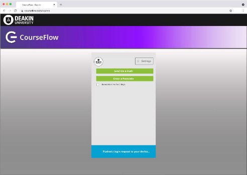
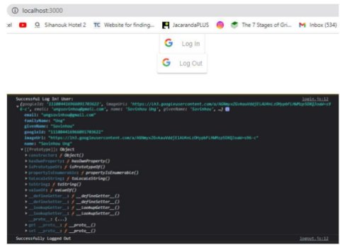

# CourseFlow Website - Two Factor Authentication (2FA)

Documentation

_Sovinhou Ung Hazratomar Hassanzada Ted Wang_

## Introduction

2FA, also known as 2 factor authentication. It is an extra layer of security used to protect user
accounts, systems, databases, or applications from unauthorised access and potential attacks. With
2FA, users are required to go through two different types of authentication and verification factors
to verify their identity before they are allowed to access onto their accounts.

The purpose of installing two-factor authentication in our project is to enhance the security of
user accounts and systems with additional protection, rather than a single layer of password. The
traditional method of authentication involves username and password, which makes the system
vulnerable to cyber-attacks, such as phishing, brute-force attack and password guessing.

Okta Verify as an example of Two-Factor authentication applications, is being used by Monash
University, it first verifies the first factor, which is an element that users should know, that can
be their username and password recorded in the system. Once it has been verified, Okta Verify app
then generate an one-time passcode(OTP) on the user’s mobile device, where it appears three
different numbers on a timely basis, which it refresh itself within a few seconds. The user needs to
input the correct OTP generated by Okta Verify into the application or the system will refresh
another one for protection purpose.

Another 2FA example would be Duo Mobile that is used by Deakin University, where it first allow
users to input their username/password as first stage of authentication, then users will be prompt
to complete second step using Duo Mobile App, where the user have two options: 1st to press to
authorise access by 1 click button, 2nd to use the OTP generated by the Duo Mobile on timely basis,
it also auto-refresh itself every few seconds, to increase to difficulties of unknown attacks and
enhances both user’s data and system.

2FA is crucial to Course Flow as Course Flow is being designed to have database storing all the
clients’ sensitive information, ranging from university students to stakeholders’ collaboration,
which may include their personal details, academic transcripts/records, or even financial data.
These valuable data are very attractive to cybercriminals as they are the best source for launching
cyberattacks. By installing 2FA, Course Flow’s database will have less chance of data breach, and
better defence to cyberattacks, by protecting sensitive and valuable information, Course Flow will
be gaining trust and secureness from its clients and stakeholders.

## Frontend Design

An important aspect of the 2FA, is the design, specifically areas of usability as well as
pleasantness. This should be through a user-friendly and an informative interface for the users when
they are prompted to set up the Two Factor Authentication on the CourseFlow website. This would be
done through the language JavaScript.

## User Interface (UI) Components

_Login Page_

The user is redirected to a login page, here the user would log in and have an easily accessible and
concise way of enabling 2FA. A simple yet effective way of doing this would be to add a checkbox.

After enabling there would be a form of visual cue that shows the 2FA has been set up for the
specified account, this could be through a visual cue.

_Registration Page_

The registration page is important as the user would set up their account initially. Here the user
would be prompted to turn on 2FA right away.

## User Experience (UX) Considerations

There are many things to keep in conideration of the user, such as the simplicity of the information
and to reduce technical jargon to a minimum, to make the instruction simpler to understand.

The idea here is to make the user guidance as clear as possible so that we reduce the amount of user
error. However, user errors are inevitable, therefore we must be able to control them in some
capacity. Providing clear error messages is one way to help minimise the error in the future.

However after repeated attempts, an account lockout should be instated with clear explanations as to
why such a lockout has occurred.

Positive feedback should be given after a successful set up of the 2FA, which would be done through
a simple message.

To provide a visual aid to our description the following potential Figma prototypes were created. In
these prototypes we envision our 2FA to make use of Duo Mobile/single sign-on, the same 2FA used
currently by Deakin students. The purpose of this is to make the experience of our website more
seamline and connected. However, we are currently working on a prototype using google services.

## Figma Design Prototypes

Figma
Design:[ https://www.figma.com/file/8ysP7PILvnv8Qensruz7X6/Untitled?type=design&node-id=0- 1&mode=design&t=gf1Q60nXWClcf97T-0 ](https://www.figma.com/file/8ysP7PILvnv8Qensruz7X6/Untitled?type=design&node-id=0-1&mode=design&t=gf1Q60nXWClcf97T-0)

## Backend Design

` `We will be using typescript in order to complete this task. The backend designs will be consisted
with the use of Google OAuth 2.0, this is to test the log in client using this method. We will be
able to see if we can integrate and implement this into our Course Flow project afterwards.

` `A prototype has been built for this method, we have successfully used Google API and OAuth 2.0 to
sign in and sign out account successfully, the next step would be to create a working page on the
frontend side and connect it with the backend side that will allow user to use their google account
to log in to Courseflow.

What we have right now is:

` `We have coded and made the early prototype work, now we need to use C# to implement this and
connect it with frontend.

## Advantages of 2FA

**Enhanced security:** Beyond just a password, 2FA adds another layer of security, in the case of
someone stealing your password, a person would still need access to the device that receives the 2FA
notification.

**Protection against Phishing:** as many passwords can be easily guessed or stolen through
cyberattacks such as phishing. This occurs when the attacker uses social engineering in order to
coerce the victim into giving up private information. 2FA would mitigate this as the password alone
would be inadequate to gain access to the account without the second factor.

## Plans of Google Log In Client and Plans of Deakin Log In

` `As google is trusted by many, it makes sense to implement this in. 2FA is already included in
Gmail, so we do not need to worry about implementing that in our code. In a way, this helps us save
time. However, this will only be the testing part as we will then improve on this and add more ways
for user to log in such as Deakin Log in and single sign on.

## Single Sign On

` `Our goal at the end will be to implement a single sign on method which allows user to have email
verifications sent of a onetime password.
