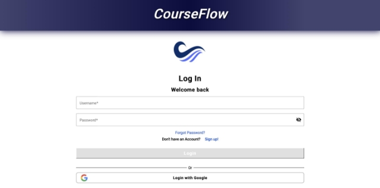
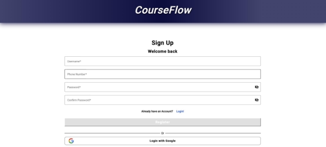
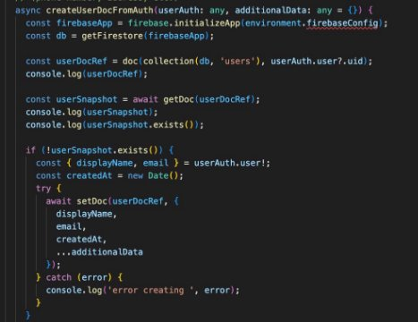
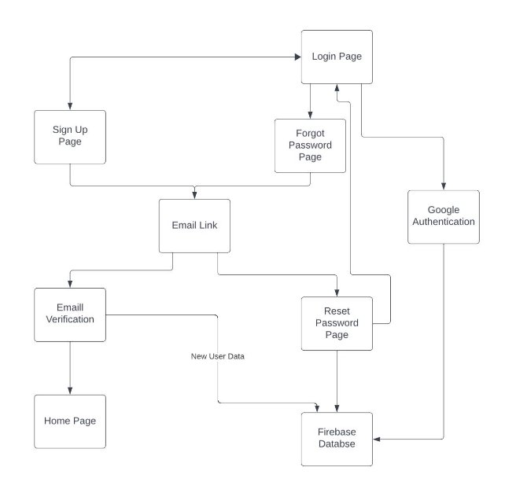

# CourseFlow Login and Registration Page Development Report

##### Prepared by: Hazratomar Hassanzada, SoVinhou Ung

## Introduction

### Project Overview

CourseFlow is a dynamic online platform which allows university students to view the progression of
their unit as well as prerequisites for any units that must be completed before attending the
required unit. Having this allows for a dynamic representation of how the course will be completed
throughout their duration.

Therefore, as we are dealing with personal and private data, we must insure the security and
authenticity of the user when they are entering our application. To do this, we must create a sign
in page for the user to get their personalised experience when interacting with our application, so
that the course map has specified to their degree.

And to ensure that whoever is signing into that user is the actual user and not a third-party
person, we have utilised a form of multi-factor authentication. In using multi-factor
authentication, we are improving the security as it Will create additional measures to increase
authentication through email verification or through Google.

Multi-factor authentication well increase the security layer in order to ensure that the correct
users are entering and to stop or at the least, minimise attackers from gaining access to potential
user data. However, this also increases the inconvenience when entering the application as it also
adds an extra step that must be done before, therefore, we must ensure that this process is
seamless.

### Report Purpose

Throughout the creation process of the sign in page as well as the signup page and the
authentication, we have made multiple choices, created multiple components and use different coating
paradigms, and have written hundreds of lines of code in order to fulfil those choices. Keeping
track of this through memory and comments within the code becomes tedious, therefore an alternate
approach must be used.

In order to document everything that has been done, we are creating this report outlining everything
that has been created and all that we have been able to contribute to the CourseFlow application.
This report will provide an in-depth explanation as to the various programming paradigms that we
have used as well as the choices we made, and why we made them. We will go into detail as to why
some choices were made, and not others, and why some alternate solutions we chosen.

Furthermore, this report will be useful for the future members of the CourseFlow team in the
upcoming trimesters, as it will allow them to gain an understanding of various components, and how
they all work together in order to provide the login, signup and multi-factor authentication, so
that any updates that need to be made can be made effectively and efficiently, without potential
errors or issues.

Finally this report will act as a sort of revision and correction of the previous report that was
created in the beginning of this trimester, which outlined the plan of implementing the login and
sign up. However as many things identified in that report were changed or ended up not coming into
fruition completely, this report aims to rectify that.

Overall we will detail the developments process, indicating both technical and non-technical choices
made and the practices used to implement the login and registration page.

## Project Background

### Technical Stack

As chosen by the senior members of CourseFlow and Thoth Tech, the stack that has been chosen for the
entirety of CourseFlow is Angular for the frontend development. Angular was chosen as it is a great
and popular open source option and is industry used. Its dynamic nature allows for web application
to be more intuitive and interactive. Angular follows what is called the model-view-controller(MVC),
which allows for the dynamic nature and single page web applications, that we will use for our login
and sign up and the multi-factor authentication.

Another reason that Angular is such a good choice, is the tools and environments what is the
libraries that they provide allows for a much more scalable, maintainable and robust application.
Furthermore angular provides a resources called angular material which provides basic materials such
as buttons and search bars which can be used in CourseFlow web application.

Typescript will be the primary programming language in the development of this application, which
is a version of Javascript that allows for static typing. In general it adds another layer of syntax
on top of Javascript, this the name Typescript. And when used in conjunction with angular, the
web-applications carted will be more powerful as Angular utilises javascript and typescript.

Additionally for the backend, we will be using typescript and Google’s Firebase as well as for the
database. Firebase is a great choice when it comes to realtime databases and allows for projects to
sync data across multiple devices.

### Project Goals

The goal of the project is to simply create a user friendly and registration page so that it is
intuitive and interactive. In order to accomplish we use angular and typescript as well as googles
firebase for the banned services in order to a more secure and scalable solution.

## Authentication and Authorisation

Authentication and authorisation is an essential part in the sign and sign up step of a web -
application. Therefore choosing a service that can provide necessary tools to do this both
efficiently and effectively ensuring both robustness and scalability becomes extremely vital.

Throughout the development of the Login and Sign up, we had considered different services that would
allow for such authentication and authorisation, before eventually settling on Google’s Firebase. In
this section of the report we would like to provide an explanation as to why some services were not
chosen, especially services mentioned in the previous report.

### Cisco Secure Access by Duo

As Deakin students one obvious choice for Authentication was Duo, as it is already implemented into
Deakin's system. Cisco Secure Access by Duo is a multi-factor authentication solution which is
provided by Cisco Solutions. It allows for enhanced security and an extra layer security when
accessing private information or personal data, and to thwart unwanted attackers. This would have
been a very good option as Duo provides many services such as Single sign-on (SSO) which is one of
the most prominent services used by Deakin.

SSO essentially allows for a user credentials to be entered once and have access to multiple
applications after MFA within the browser that require the same credentials, meaning they do not
need to be entered every time a different applications is used. This is great as it reduces effort
and how tedious this process would have been.

As Deakin is already using the SSO for authentication, using this for our application would have
made it much more seamless for the user when entering CourseFlow, however there were some things
that restricted the use of SSO in our application. To use both the users Deakin credentials and SSO,
we would have needed Deakin’s API so that we could have access to the database of the users. Doing
this would have opened many potential security threats to the data, as we are only students and not
trained in handling this type and volume of data. We would have also needed to pay for it as well,
which is why the DUO option would have been outside the scope of this unit

### Google Firebase

Eventually we decide that Googles Firebase would be the best viable option based on the
resources we had and the timeframe provided. Firebase is a comprehensive and accessible platform and
is mostly used for developing web applications. It allows for the deployment and management for web
applications more efficiently and effectively as they carry most of the technical weight in terms of
storage and servers. Essentially they are able to simplify the development process and reduce the
time-to-market for web-applications.

Firebase allows for many resources and services to be used by developers to be able to create their
web application such as the Google OAuth for authentication, a realtime database for storage of data
and many more.

Firebase was the best option for us and for CourseFlow as we did not need to pay any money upfront
to use their service as it freely available, and only need to pay once you start to scaling up.
Furthermore we did not need to wait for the api keys as we did for Deakin and Duo SSO, therefore
integration into the login and sign up page could asap.

Finally one more reason for the use of Firebase was ease of integration. One thing we were most
worried about was the integration into our components, and the difficulty that would arise, however
with public documentation was readily available, unlike for DUO, integration was easier than
anticipated.

## Frontend Development

As touched upon previously, we will be using the angular framework as it is robust and allows for
the ease of use creation of web applications. Within our angular file, the project structure
consists of components services and the routing to each webpage, which is a widely and commonly used
business structure.

As for the language, we will be using type script for programming as it's cold quality is much more
sophisticated as compare to normal JavaScript, due to its added static and syntax. Another key point
to note is the is of which typescript integrates with angular. We will discuss the following
frontend pages:

### Login Component

The login page was designed to follow the industry standards that are already set in place. A user
will have the option to sign in with their own personal email, which does not need be gmail
specific. Or if the user would like they can also login with their gmail account. We kept the design

to simplistic and user-friendly, in order to mitigate any confusion. It contains a clean and

responsive layout and coupled with input validation and error handling, it mitigates potential user
error substantially.

**login.component.html**

This is the html file the contains all the code pertaining to the actual backbone of the login page.
This contains all the element that is to define the structure of the layout. All the styling and
formatting are called from the other components of the login page, and they all come together to
create the final login page.

The html file calls the header card from the header component located in the header file and
displays on the top page. Then the login form is called from the login style file which allows the
login page to be visually appealing.

**login.component.scss**

This style file differs from the redly css files that are generally associated wth frontend
applications. Scss is an extension of the common css file, however it is much more user-friendly and
has more functionality in our case, for example we leverage the use of nested rules which come to
help in the actual login form.

**login.component.spec.ts**

In our login file we also have this component, which are files used for testing all of the angular
components. This file is created when all the components are created as well. They test the
component, and or services. They test the functionality of the components, specifically in our case
the login page.

**login.component.ts**

This is the core application which is programmed in typescript, in angular. This basically defines
the behaviour of the login page and essentially the logic of the page, and is basically the

communicator of for the templates used.

### Sign-Up Component

The registration page was design to be as simplistic as possible in order to mitigate any user
error/confusion. We used simple angular material for example for the text boxes and buttons, to
create the sign up form. The page utilises Firebase Authentication for user registration which is
first validated before it creates new user accounts.

Following from the login page, we have the same 4 components for the sign up page as well, which
follow the same pattern with different connections.

**registration.component.html**

The html file calls the header card from the header component located in the header file and
displays on the top page. Then the signup form is called from the signup style file which allows the
signup page to be visually appealing.

**Registration.component.scss**

This style file is distinct from the css files commonly found in frontend applications. While Scss
is a subset of the standard css file, it is much more intuitive to use and has more features. In our
case, we utilises nested rules which come into play in the registration form.

**Registration.component.spec.ts**

In our registration file, we also have a component, which is a set of files used to test all of our
angular components. This component is created when all components are created. It tests the
component, or service, and evaluates its functionality, particularly in our registration page.

**Registration.component.ts**

This is the primary application that is written in the typescript language and compiled in the
language of angular. It is responsible for defining the behaviour of a sing up page and, in essence,
the logic of the page and is essentially the communication medium for the templates.

### Email Verification

In these component we designed he email verification page, to ensure the email being entered is
legitimate before being saved into the database. Email verification is a very important step in the
pursuit of authenticating a users account. The email verification happens. When the user signs up.
They are then redirected to a verification page, which guide them on how to authenticate the email.
The email is sent a link in which the user would then press which would verify the email and
therefore the users details would be stored into the fire base database.

We were able to implement this as fire base provides a built-in functionality for email
verification. Finding documentation online made it easier to implement into our application. Email
verification is great as it adds another extra layer on top of just the username and password for
authentication.

**Verification-page-fg.component.html**

In this html file we also call the header card from the header component located in the header file
and displays on the top page, in order to keep consistency when the user is interacting with the
CourseFlow application. Then the link is pressed they are then redirected to the homepage.

**Verification-page-fg.component.spec.ts**

In our verification file, we also have a component, which is a set of files used to test all of our
angular components similar to the other spec.ts files. This component is created when all components
are created. It tests the component, or service, and evaluates its functionality, particularly in
our verification page.

**Verification-page-fg.component.ts**

This is the primary application that is written in the typescript language and compiled in the
language of angular. It is responsible for defining the behaviour of the verification page and, in
essence, the logic of the page and is essentially the communication medium for the templates.

## Backend Development

### Google OAuth Integration

The Google integration into our web application involved the use of the fire base system as it was a
user friendly and a very straightforward procedure, are you Junior developer could follow. Before we
set up the database for registration, we first insured that the Google integration worked. We did
this by creating a Firebase project , and then we had to set up the fire base for authentication and
include the Google sign in method.

Then we had to gather in the API keys for the fire base on Google owes from the Google cloud console
and get the client ID and client secret. After doing that, we then created a new fire base file by
first installing fire base onto our project. Then we had to configure the fire base systems and
settings so that it could be utilised by our project. This would be done in the environment, file
within the environment.ts file.

Then as you can see within the code above, we have to initialise the environment for a Google OAuth
to operate correctly and then, within the login page, we would call the Google login card component
so that we can use it within the login form.

The following these steps we were successfully able to use Google Oauth as a form of signing through
the Fire bass authentication method within our angular application, which allows people to sign in
securely through their Google accounts

### Firebase Database

After the integration of Google Oauth, naturally, we have to then set up the database correctly so
that we can store the user details. Setting up the database is the same as the setup for the Google
authorisation. After finishing and completing the config files for firebase, we then had to create a
database reference so that we can be able to interact with it.

const database = firebase.database(); const databaseRef = database.ref();

Then, in order to read the data, we would have to use methods to retrieve data through real-time
updates, which fire base provides as a functionality. Then we would need to write the data into the
database. However, the issues with writing the users details into the database as we are not
verifying the email and we are saving the users information without authorisation. Therefore, we had
to also integrate email verification as a form of authorisation.

We then had to integrate error handling in cases where are saving the data to the database fails.
After doing this, we were able to implement the database successfully in angular and have it be

able to read right and update the password of the user in the case, it is forgotten.

### Forgot Password

Firebase is great as it allows us a great many forms of functionality, one of them being the forgot
password functionality. In the likely case that users forget their password, we have the option to
reset their password through their email via a link.

The way we did, this was by setting up the fire base first secondly, we had to then create a reset
component for the password, which are the files necessary for angular. Then made a very

simplistic password page which was done through a forgot-password HTML form. Then, to create the
reset password functionality, we had to import indication from angular firebase. Here we implemented
the logic of how the reset password would work.

A link would be sent to the email in which they would press, and once pressed, they would be
redirected to a new page. Here they would have the ability to enter the new password. They would
like into a text box and save it. Sending the link via their email insures that the person who oh is
the account is the one resetting the password.

To ensure that the forgot password functionality worked, we had to test it manually through various
emails of our personal use.

Through the steps were able to successfully integrate the forgot. Password functionality from
Google's Fire base.

## Codebase and File Structure

### Wireframe

The file structure of our application can be separated into components and modules. Each component
has its own HTML file as well as its own styling sheet. Above is a wire frame diagram, which shows
the dependencies for each page and how it interacts with the database. In this wireframe we have the
major components listed and how they interact with one another.

### Security Measures

As we are storing potential private data of the users, we must insure the security and have
preventative measures in place so that we can mitigate any potential data attacks.

### Firebase

Great thing about firebase security is it has powerful and flexible rules which restricts the amount
of access and control, people have based on their level of access. For us this is done through the
authentication in which you have to have an account and then verify the email.

### OAuth Security practices

This also has very good security practices as we are protecting user accounts and data from
vulnerabilities from the unauthorised access from attackers through various means such as secure
connections such as https when the app will be deployed.

### Challenges Faced

During the creation of our login and registration pages, we had many challenges that we had faced.
We wanted to implement many components and different ways of implementing it. However, we had to
change based on our circumstances. The following are some of the challenges we faced.

### Cisco Secure Access by Duo

Given that Duo is already integrated into the Deakin system, as Deakin students it was an easy
choice for authentication. Multi-factor authentication is a service offered by Cisco Solutions. It
enables an improved security, an additional degree of protection when accessing personal
information, and the ability to prevent uninvited invaders. This would have been a great choice
because Duo offers a variety of services, including Single Sign-On (SSO), which is one of the most
well-known services utilised by Deakin.

The reason we face challenges with Cisco secure access was that we would need to pay for it. We
would've love to use the single sign-on provided by duo as we are taking students, and Deakin
already uses duo and single sign on as a means of authentication. Other reason was the ease of which
the single sign on wood integrate into a project would be much greater in comparison to other
services available, such as Googles firebase

We would have needed Deakin's API to access the user database in order to use both the users' Deakin
credentials and SSO. As we are merely students and untrained in managing this type and volume of
data, doing this would have exposed the data to a wide range of possible security dangers. The DUO
option would have been outside the purview of this unit because we would have additionally required
to pay for it.

### Learning Angular

Additionally, another challenge that we faced was learning angular. As we are just merely students
an have no experience other than what the units we undertake provide angular was different from the
other frameworks that we have tried.

To learn angular we must have prior knowledge of TypeScript. TypeScript is a Jarvis script super set
that is statically formed. In order to be able to use angular we must have familiarity with the
concepts as well as its syntax.

Angular follows what is called a component like structure where. Everything is separated into
components so that it is modular, in essence each component encapsulates a single part of the UI or
a specific behaviour.

One great thing that angular provides is called angular materials which we utilised when creating
the sign in Page and the registration page. It provides basic materials such as buttons and
textboxes which helps to create forms much more efficiently.

Another key thing that must be understood is routing and how routing for single page applications
works through a router link.

## Conclusion

In conclusion this report has been able to provide a comprehensive explanation as to how the login
and registration pages were developed and executed. We were able to provide a very in depth
explanation as to how we were able to connect the database as well as the authentication measures
that we integrated into the course flow application through the use of googles fire base.

By leveraging angular and TypeScript for the front end development we were able to integrate Google
OAuth so that users code sign in with their Google accounts without having to sign up with a
different account.

While developing this application we were able to maintain industry standards so that in the future
should course flow change the database or the authentication they can do so efficiently and
effectively as they continue to refine and expand the application.

In the future moving forward through user feedback the future members of Courseflow can implement
feedback to develop a more innovative product.
