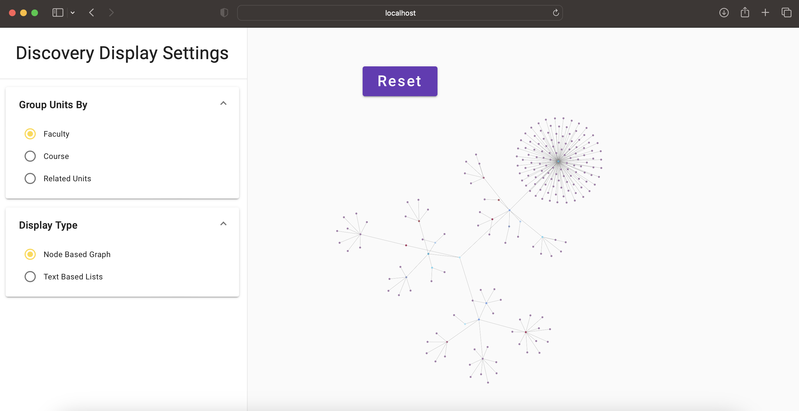
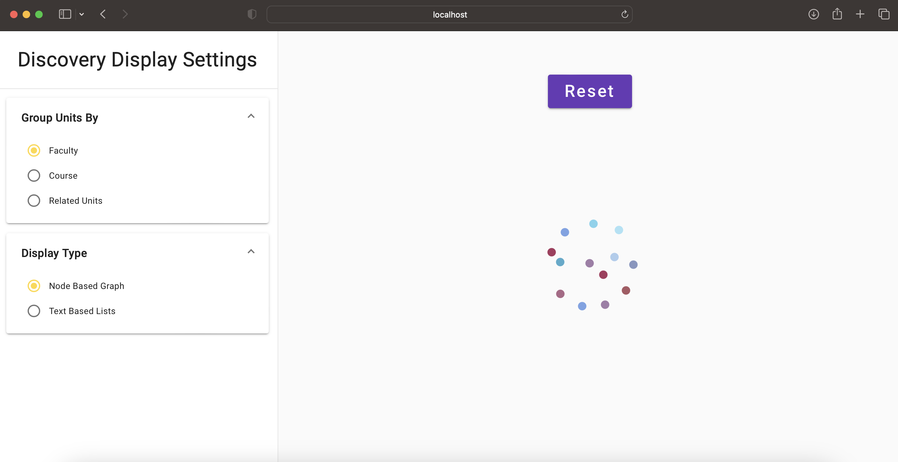

# NGX-Graph Research

Author: Mark Enriquez

## Introduction

Ngx-graph is an Anuglar library that is primarily used for creating and displaying graphs.

## Installation

There will be different installation requirements depending on how you start up the project.

### From the Beginning

If you are not planning to clone the research repository, you will have to install ngx-graph as
described in the documentation:

https://swimlane.github.io/ngx-graph

However, please be aware of a few issues that occurred for me when installing ngx-graph version
8.2.2 and Angular version 16.2.0:

- You will get 4 high severity security issues related to versions of d3.js libraries used as
  dependencies for ngx-graph.
- You will get errors in the browser related to BrowserAnimationModule.
- You will get errors on types.
- Attempts to use previous versions of ngx-graph failed, likely due to the version of Angular being
  used.

The steps I took to resolve the issues are detailed below.

#### Steps to install and resolve issues

1. In your terminal, run:

   ```shell
   npm install @swimlane/ngx-graph --save
   ```

2. To resolve the 4 severity issues:

   Add the following overrides to package.json right after the devDpendencies.

   For context, I'll include the devDependencies to make the location clear:

   ```json
   "devDependencies": {
       "@angular-devkit/build-angular": "^16.1.4",
       "@angular/cli": "~16.1.4",
       "@angular/compiler-cli": "^16.1.0",
       "@types/jasmine": "~4.3.0",
       "jasmine-core": "~4.6.0",
       "karma": "~6.4.0",
       "karma-chrome-launcher": "~3.2.0",
       "karma-coverage": "~2.2.0",
       "karma-jasmine": "~5.1.0",
       "karma-jasmine-html-reporter": "~2.1.0",
       "typescript": "~5.1.3"
   },
   "overrides": {
       "@swimlane/ngx-graph": {
           "d3-scale": "4.0.2",
           "d3-selection":"3.0.0"
       }
   }
   ```

   Make sure to delete the node modules folder and package-lock (didn't work if not done) and then
   run npm install.

3. To resolve the browser errors:

   Go to your app.module.ts file and do the following import and module addition:

   ```json
    import { BrowserAnimationsModule } from '@angular/platform-browser/animations';

    @NgModule({
      declarations: [

      ],
      imports: [
        BrowserAnimationsModule,
      ],
      bootstrap: [AppComponent]
    })
   ```

4. To resolve the typing issues:

   Installing the d3 types fixed these issues for me:

   ```
   npm i @types/d3
   ```

### Clone from CourseFlow Research Branch

All above modifications have already been handled if cloning from the CourseFlow Repo and switching
the branch to research/discovery-page.

Simply run the below command once the branch has been switched:

```shell
npm install
```

## Features Explored

Overall, ngx-graph is quite simple to use due to its out of the box component that can be used to
display different types of graphs.

All we really need to do is format the data correctly into a list of nodes and create the links we
want between the nodes and then, feed them into the component.

### Force Directed Graph

We have two choices for the force directed graph which to my understanding, just uses different
underlying libraries:

- D3 Force Directed.
- Cola Force Directed.

To get the force directed graph going, we need to provide the layout property with either
"d3ForceDirected" or "colaForceDirected".

The screenshot below shows a cut down version of the data using the cola based force directed graph:



#### Advantages

- Simple to use.
- Works nicely for small amounts of nodes.
- By default:
  - It comes with zooming and panning capabilities.
  - Nodes can be moved upon dragging.
  - Collisions are enabled by default, which helps with the layout of the nodes.
- These default capabilities require a fair amount of work in d3.js to get the same functionality.

#### Disadvantages

- Extremely slow when dealing with large amounts of data.

### Custom Layouts for Positioning

To deal with the extreme slowness of the force directed graph, I tried using a custom layout where I
would set the positions with pre-calculated positions.

The rendering of the nodes worked but I could not figure out a way to get the links/edges to render.

There was also strange behaviour where the interface implemented run method was getting called 4
times. Additionally, while logging the graph edges would show the edges, logging the graph object
itself would not show the edges which is a very unexpected behaviour.

The screenshot below depicts a simple example with some simple data with pre-calculated positions to
show the nodes.



### Modification of Dagre Layout Positions

This attempt failed due to strange behaviour when trying to access properties. Similar to the edges
issue mentioned above, the nodes object would show the position array but attempts to access the
specific position array property resulted in undefined. This prevented me from going into the nodes
and updating the positions after the internal calculations were done.

## Comparison to d3.js

The table below describes some of the advantages and disadvantages of both libraries.

| Library   | Advantages                                                                       | Disadvantages                                                                                               |
| --------- | -------------------------------------------------------------------------------- | ----------------------------------------------------------------------------------------------------------- |
| d3.js     | A lot of flexibility.                                                            | Very technical.                                                                                             |
|           | Feature rich.                                                                    | Requires a lot of JavaScript/TypeScript to get things working.                                              |
|           | Finer control of parameters.                                                     | Force directed graphs are slow when a lot of data is used.                                                  |
| ngx-graph | Easy to use.                                                                     | A lot of problems/errors on installation.                                                                   |
|           | Out of the box component that can change type of graph via different parameters. | Strange results (data missing) in console logs for ngx-graph data types.                                    |
|           |                                                                                  | Force directed graphs are extremely slow when a lot of data is used and cannot load (far worse than d3.js). |

## Conclusions

Here are a few final remarks regarding ngx-graph and the Discovery Page in general:

- At this point in time, ngx-graph is not viable for the goals of CourseFlow.
- Not enough documentation around this library.
- Examples online are lacking.
- d3.js, if you know how to use it, is much better and flexible than this library.
- Until ngx-graph is updated, I think it will be better to work with d3.js and make components more
  flexible (essentially creating our own version of ngx-graph).
- After working on ngx-graph, I realized that doing the force-simulation on the front end is a bad
  idea.
  - Despite the d3.js version actually loading unlike the ngx-graph with large amounts of data,
    slower devices may not be capable of handling the simulation (even with smaller numbers).
  - This led to my decision to use pre-calculated positions.
  - Due to issues with ngx-graph and setting positions manually, d3.js will be the better choice for
    this.

If future students would like to continue work on this library, please go to the CourseFlow
repository and find the project inside the research/discovery-page branch.
