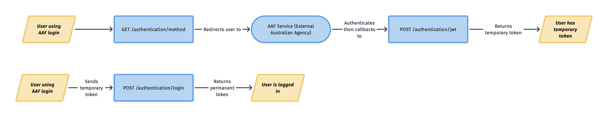

# SSO documentation

## Diagram Overview

This is completed ... say what else For short term and long term

## Shared Module

Please see the
[Thoth Tech Deakin Authentication SSO repository](https://github.com/thoth-tech/deakin-sso-authentication-module)

Talk about what needs to be done, short term and long term

## Training Resources

How can we train up in Angular (Tour of Heroes) How can we train up in Ruby

## Certain design decisions

Note here
