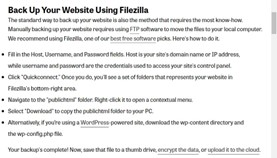

# Capstone A - Individual Research Contribution

Harrison Allwood (Junior) - 219218444

## I. SSL Encryption - Login & HTTP/HTTPS

What does this provide? Visible and measurable security measures, clients/users can trust:

- Protection from phishing
- Business name embedded in URL (SSL w/ EV)
- Padlock icon in page search (common website safety checklist item for end users)

Need to install a Public Key Certificate, implementation as follows:

Considering the number of prospective students using Dreambig & the amount of information/files
uploaded, an EV SSL should be obtained. There are multiple vendors:

- [GoDaddy](https://www.godaddy.com/en-au/web-security/ev-ssl-certificate)
- [Comodo](https://ssl.comodo.com/ssl-ev-certificates-extended-validation)
- [SSLTrust](https://www.ssltrust.com.au/ssl-certificates/extended-validation)

## II. Passwords & Authentication

From my understanding, Dreambig will be heavily built off the OnTrack framework. As this is accessed
through Deakin SSO, existing password protocols will likely remain and students will use the same
password across all services (DeakinSync, STAR, OnTrack, Dreambig etc.).

2-Factor Authentication already exists within the Deakin framework also. The use of 2FA via Duo
Security promotes trusted and verifiable access to important services and documentation. Also
accessible on mobile devices via Apple & Google Play stores:

Web session inactivity timeouts could also be implemented and defined by the web server,
dramatically reducing the time window for an attacker to intercept/steal an existing user session.
Given Dream Big will likely be considered a low risk application, an idle timeout range of 30-60
minutes could be deemed appropriate.

Idle timers can be implemented through Angular, to increase security and reduce the amount of
unnecessary calls made to the API.

Here is an example of how the code could be written in
[JavaScript](https://gist.github.com/bbachi/0e75b9e7658e0e7c3d2780853ccfe50f).

## III. Data Storage & Backup

- Some proven and reliable off-the-shelf (OTS) cloud vendors:
  - Microsoft Onedrive
  - Google Drive
  - Dropbox

The upload and download process alone is important, however we should consider implementing
applications to encrypt and decrypt files, when they are uploaded to or downloaded from Dreambig
respectively. Interesting read regarding
[this](https://www.comparitech.com/blog/cloud-online-backup/6-apps-to-encrypt-your-files-before-uploading-to-the-cloud/).

AES-256 is an industry standard for encryption, the majority of the vendors identified in initial
research utilise this protocol. Drag and drop features used by students and faculty alike can be
verified through password and will work with multiple OS’ (MacOS, Windows, Android, IOS).

In the event of unforeseen increases in internet traffic, network instability issues or major server
failures, website/application backups are essential.

There are two primary routes for website backup. One of which is the use of FTP sites, to enable
data to be manually copied and stored on a local computer (Host Device). This utilises secure shell
(SSH) to transfer data files to an offsite server.

Another option is the use of software, such as Firezilla. Firezilla uses a straightforward
methodology, which can even be used with sites powered by Wordpress:

