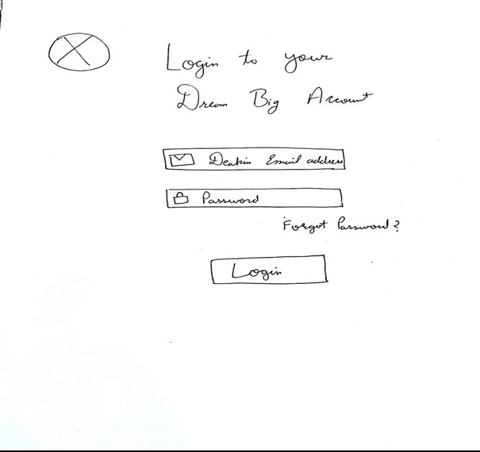
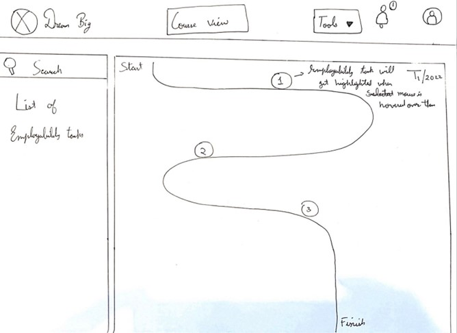
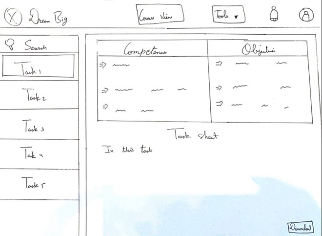

# Dream Big Wireframes

This is the login page for the dream big application. Every Deakin student have their Deakin login
credentials so we can use those credentials to log in to our dream big web application.

This is the main page that users will see when they are logged in to our web application. They will
be presented with the list of employability tasks for the current trimester. The navigation bar on
the left contains the list of the employability task that students have to finish. User should be
able to mark these tasks and once they are done it will appear are green on the journey map.

When the task is selected it will appear like this and the user will have the option to download it
on their personal computer.

