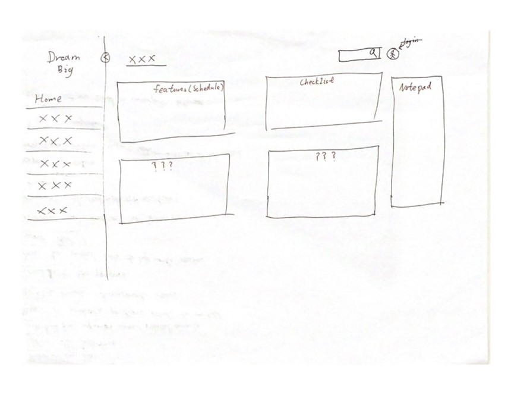

Front-end

Front-end development consists of three basic coding languages - HTML, CSS, and JavaScript - on
which the three most commonly used frameworks on the market, Vue.js, Angular.js, and React.js, are
then built.

HTML5 is the simplest way of front-end development, which has the advantage of being easier to learn
and requires less data to be stored when developing, which makes the development cost go down. In
addition, HTML5 can be easily adapted to Web, ios and Android without spending too much time on
interface adaptation issues. But its disadvantage is the user experience line tea, because the HTML5
application is poor in operation, the performance ability is general, so in terms of user experience
and performance HTML5 has a great shortage, and lack of application smooth feeling.

CSS is a style sheet language, it is used to express the HTML file style language, the role is used
for static modification of web pages, such as modify the colour, adjust the layout, modify the font
format, etc.. And for CSS has developed a number of frameworks, such as Bootstrap. Bootstrap with
global CSS settings, you can use pre-compiled CSS files for rapid development to achieve the effect
of pre-processing scripts, it can also use the same code quickly and effectively adapted to the
three ends. It also has a more complete set of effects, as it also uses the jQuery plugin to help
provide a more comprehensive set of effects. Its drawbacks are also obvious, the learning cost is
too high, you need to understand the whole framework, the css framework is very bloated for small
projects and there is a lot of code that is not used.

JavaScript is to add dynamic elements to HTML pages, but also to make other applications more
interactive, to improve the user experience, but also to better complete the development of various
functions of the web page. The three most commonly used frameworks Vue, React and Augular are also
based on JavaScript to develop.

Angular is a front-end framework powered by Google, Angular is designed to create dynamic
single-page web applications and progressive web applications. augular provides powerful two-way
data binding, no longer need to use JS or jQuery to manipulate DOM elements, as the data in the
model changes, the view will also change. Plus development time. Also AngularJS has a strong
community that provides enough training material to find solutions to almost any problem that
arises. Its performance for full TV dynamic applications is not very good, and complex SPAs may be
inconvenient to use due to their size. And it has a high learning cost.

Vue.js has a clean and logical architecture that makes it easy to understand and build. vue.js uses
a component-based architecture that breaks large chunks of code into smaller components, each
written in HTML, CSS and JavaScript, making it very easy to read. And it's very small at 18KB. at
this size, it also supports many out-of-the-box front-end development tools that require little to
no configuration. Making it easy for beginners to join and practice using it. the downside of Vue.js
is the problem of two-way binding, which sometimes causes some errors in reading data when the
reactive system re-renders only which blocks of data are penalized, and thus requires spreading the
data. Also its flexibility may lead to overly messy code due to excessive flexibility.

Component development in React.js allows the virtual DOM to be updated with minimal changes to the
user's application without affecting other parts, making the user experience better and the
developer work faster. For components, React can reuse React components, which can reduce
development costs and time. In addition single data flow helps to quickly modify elements while
reusing components, and whether modifying child elements or negative elements, it is using downward
data binding to make sure that the child structure will not affect its parent structure, yes the
code is stable and also makes it convenient to reuse components. As an old framework, of course,
React.js also has a strong community service. the downside of React.js is that the documentation is
very poor, which is caused by the constant release of new tools, but also because the pace of
development is so fast that it may take more time to learn. Also JSX as a syntax extension allows
HTML and JavaScript to be mixed together for developers which may affect its complexity in the
learning curve. Finally React.js subdues the UI layer of the application and does not cover the
rest, so some other technology needs to be chosen to get the full working set of user project
development.

After my search, I thought that if it was just for creating prototypes, then Vue.js would be a
better choice because it doesn't involve any build tools and is easy to use by just opening the
file, editing, and refreshing. The goal of our project is a product for long-term student use, so I
think a more suitable framework for our project is React.js. React.js is a JAVASCRIPT library for
building UIs with reusable components and first-class support for TypeScript. JavaScript and
TypeScript language services allows users to perform large-scale automatic refactoring, such as
renaming props in a component, and the editor automatically finds all the files of the component and
renames them automatically. In addition, only one set of code can be used in Web, IOS and Android.

UI Design:

[https://www.flaticon.com/](https://www.flaticon.com/)

This is a free icon and sticks website could use for our web.

Figure1 is a low-quality prototype about home page, the box on the right could remove or add
anything new. The main purpose is making it clear and show our features like schedule, checklist,
noticeboard or others that could show as point information.

Reference website:
[https://www.ateamsoftsolutions.com/top-3-front-end-technologies-for-web-development-in-2022/](https://www.ateamsoftsolutions.com/top-3-front-end-technologies-for-web-development-in-2022/)

[https://www.c-sharpcorner.com/article/what-and-why-reactjs/#:~:text=React%20allows%20developers%20to%20create,view%20in%20the%20MVC%20template](https://www.c-sharpcorner.com/article/what-and-why-reactjs/#:~:text=React%20allows%20developers%20to%20create,view%20in%20the%20MVC%20template)

[https://www.flaticon.com/](https://www.flaticon.com/)

[https://frontendmasters.com/guides/front-end-handbook/2018/what-is-a-FD.html](https://frontendmasters.com/guides/front-end-handbook/2018/what-is-a-FD.html)

[https://www.uplers.com/blog/what-are-the-pros-cons-of-foundation-and-bootstrap/](https://www.uplers.com/blog/what-are-the-pros-cons-of-foundation-and-bootstrap/)
