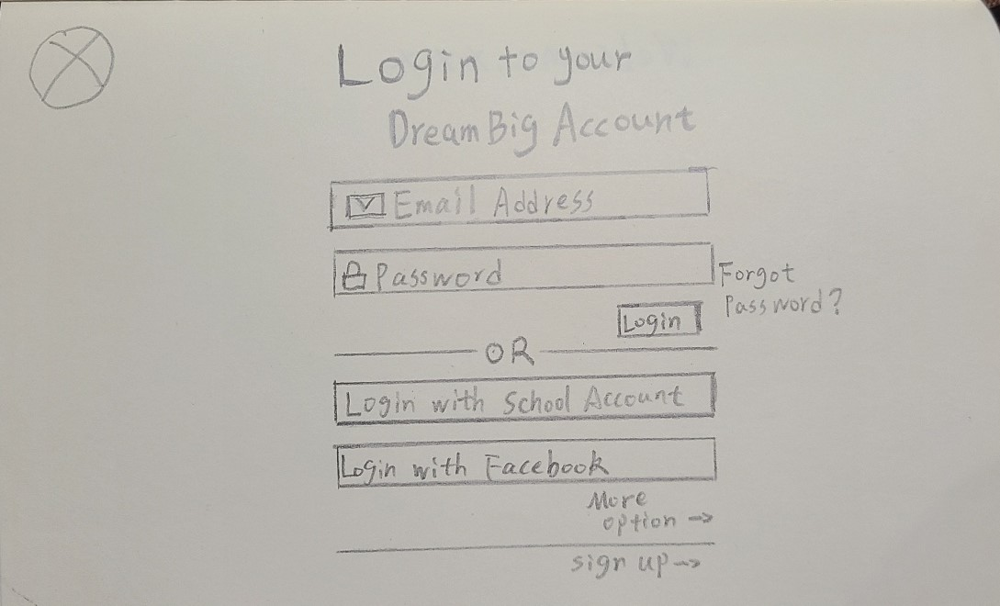
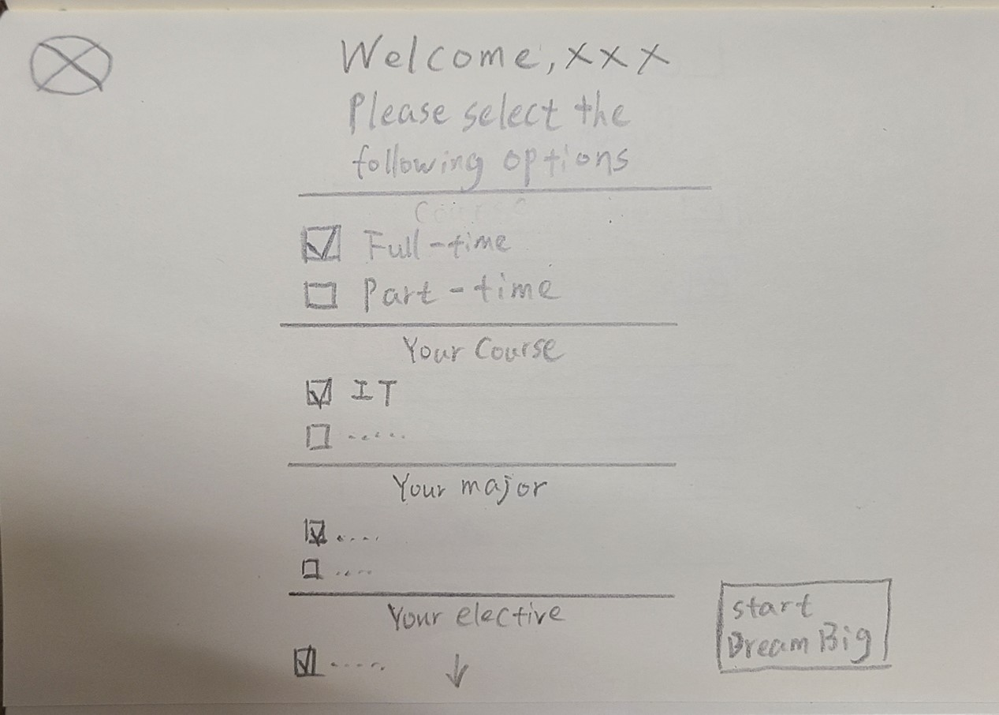
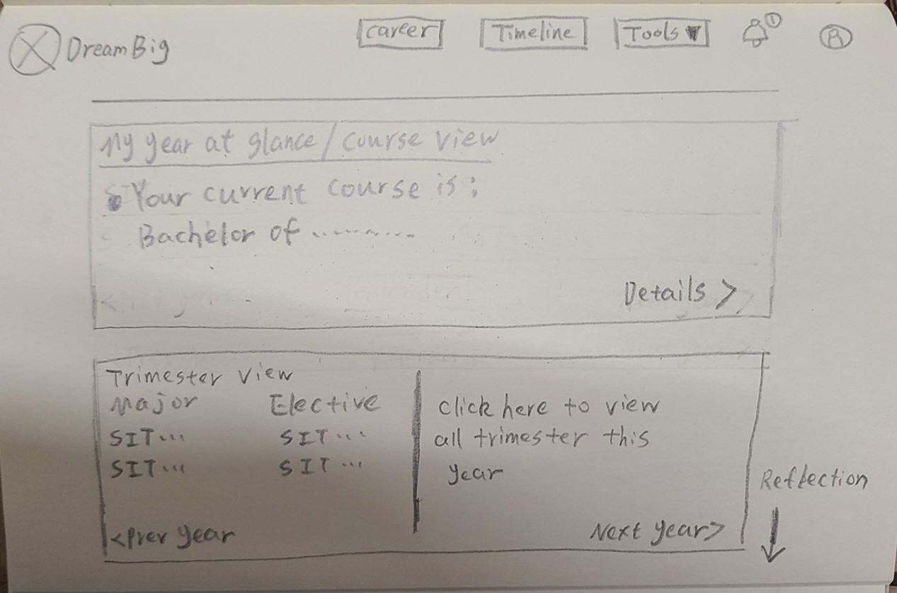
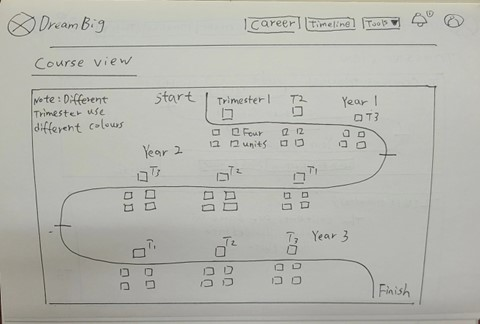
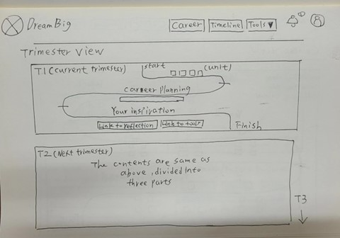
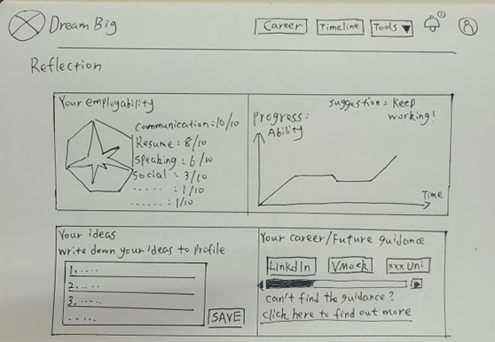

# Group 1 WireFrame

Guanyu Chen

## Log in page

For Log in page, user will create an account or using other ways to log in to DreamBig. Users can
choose multiple ways, for example: School account, Facebook, Google etc. Once the system can
authenticate and identify, the user will be taken to the next page “First Login”.

## First Login

For the first login page, users will receive a web page like the survey, which will be used to carry
out the current learning status of users. Users can make corresponding choices according to their
own conditions. After selection, DreamBig will display all the contents selected by users on the
home page.

## Home Page

For the Home page, it will display course and trimester view and also reflection. These three main
parts in home page will display the important information that users want to know. User can click
these three parts and get more details. At the top of the home page, it shows “Career, Timeline,
Tools”, and the Bell sign is Notification, a person sign is user profile.

## Course View

## Trimester View

## Reflections

For Reflection part, user will see they employability part and progress which will let user know
which part they need to improve. User can also use link that DreamBig provided, write down some
ideas and save into user profile.
