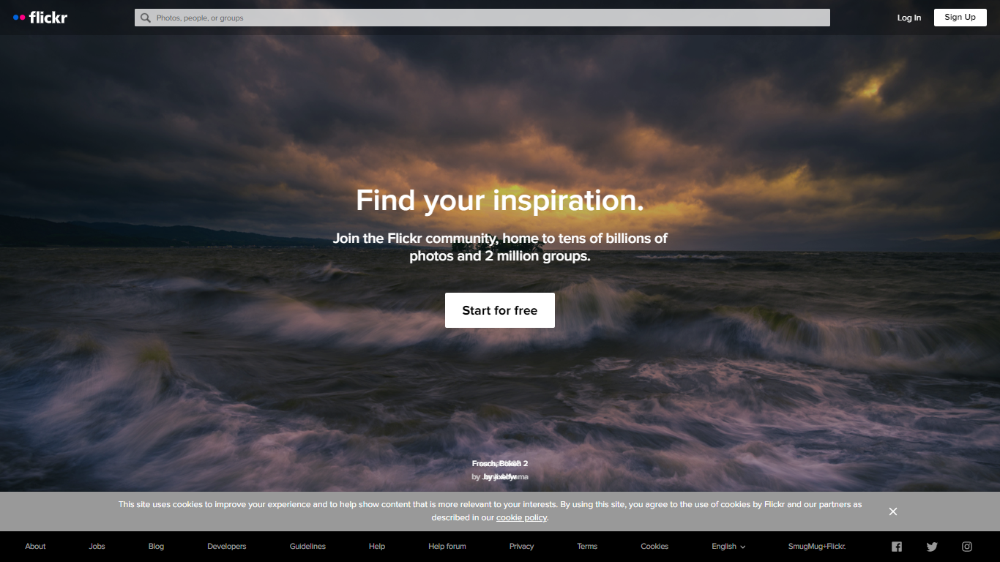

# Research for the Design Prototype

*The internal systems team has been tasked with creating a website that will include all the information for all the capstone projects. It is indeed designed to serve as a primary hub where students can find all their information in one place. Hence, we require a website that is well-designed and easy to use with responsive design, helpful navigation and high-quality content and security features. Also, it should reflect our company, its products, services, and, eventually, its identity.*
 

#
 

Taking inspiration from different websites, below are some proposed website prototypes

 

**Prototype 1:**
 

Typography that is large, clear, and legible makes welcome messages easy to read and make more impact. This usually entails an elevated level of contrast against the background and the use of a bold typeface.
 
  

The projects of the company can be added with internal links under the related Capstone areas. Internal links contribute to a better user experience and demonstrates that there is more key information concerning the topic. 

 

Furthermore, the website can include what more it offers with relevant and quality content in an organized manner providing clear and helpful content which will help our visitors scan the content by breaking it up into smaller chunks.
  

The bottom of the website can include a form of contact (a must have) for the visitors as it is helpful in generating leads from our website, keeping track of the inquiries, offering support to customers, delegating tasks to the team and much more.

#

**Following is another prototype proposed for our website. It is more of a graphical composition with the same features as the first protype. The website will typically use more basic web-safe typeface, complex graphics, lighting effects, and pictures.**

 
 

 

This is the proposed welcome page of the website with a navigation bar at the top and some of add on features.
 
 

 

 

 
 
Then, it is followed by some more features of the website, and then the capstone projects. The capstone projects have been added under further various categories which are proposed to be opened via internal links.
 

 
 
Later, we can add some more information in the above proposed style.

 

  

Lastly, a contact form can be added with some graphical imagery unlike the first proposed prototype.

 

 

#

## Some of the static websites that set an example for the prototype are

 

## Soundcloud website
 

SoundCloud is an online audio distribution platform and music sharing website developed in Sweden that allows users to publish, advertise, and share audio, as well as a digital signal processor that allows listeners to stream audio.
The following are some screenshots attached of the website:
 
 

 
 
 

# 
## Flickr
 

Flickr is a photo and video hosting service as well as an online community based in the United States. It was launched by Ludicorp in 2004 and quickly became a popular platform for amateur and professional photographers to share high-resolution images.
The following are some screenshots attached of the website:
 
 

 
 

 

# 
## Sketchfab
 

Sketchfab is a website for publishing, sharing, discovering, buying, and selling 3D, VR, and AR material. It provides a viewer based on WebGL and WebXR technologies that allows users to see 3D models on the web using any mobile browser, desktop browser, or Virtual Reality headset.
The following are some screenshots attached of the website:
 
  

 

 
