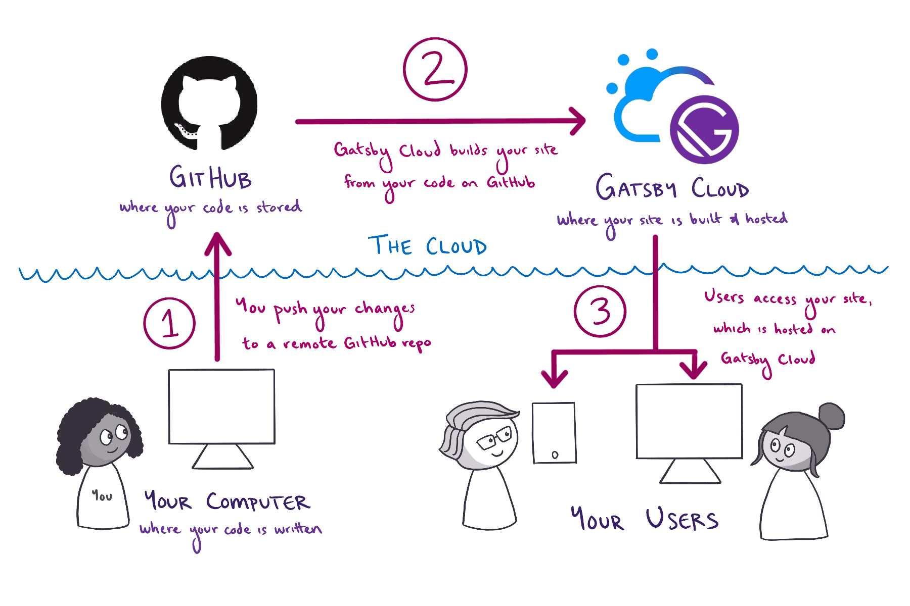

# Gatsby User Manual

## Introduction

Gatsby is a React-based open-source framework for creating websites and apps. It's great whether
you're building a portfolio site or blog, or a high-traffic e-commerce store or company homepage. is
now one of the most popular React frameworks for building superfast, and super SEO-friendly Jamstack
websites. It can be perfectly combined with different headless CMSes, or eCommerce platforms to
drive extraordinary performance and SEO results.

The diagram below gives a high-level view of how all the pieces of this process fit together.

Detailed Description

First, you write the code for your Gatsby site from your computer. When you're ready to make your
changes live on the internet, you go through the following steps:

You push your changes from your computer to a remote repository on GitHub. GitHub is an online
platform for storing code for your projects.

Gatsby Cloud watches your GitHub repository for changes. When it sees your new changes, Gatsby Cloud
builds your site from your code on GitHub.

Gatsby Cloud hosts the finished version of your site at a unique URL, which users can use to access
the latest version of your site.

## In other words

The Gatsby.js web framework is a static website builder framework built on top of React.js, unlike
the server-rendered ones such as Next.js. This will let you view your apps Gatsby.js web framework
using the File Explorer in VS Code. Select that link for localhost to see your new Gatsby project.
Use the Gatsby CLI (Install Instructions) to create a new website, specifying this default
boilerplate.

You can use the Gatsby starter from the official release, or any other Gatsby repo. You can run your
new Gatsby website either in the Terminal on your computer, or in the integrated Terminal in VsCode
VsCode, if you are using that. To start adding Auth0 to your Gatsby application, you need to install
Auth0s SDK for React single page applications into your application.

we can use Auth0, which is an authentication and authorization platform, to add authentication to
your GatsbyJS app, as well as to your serverless functions on Netlify. Auth0 provides a secure
access infrastructure for authenticating users to your app. wehreas you can set up GatsbyJS
authentication with Auth0 by
[clicking Here](https://www.freecodecamp.org/news/how-to-set-up-gatsbyjs-authentication-with-auth0-d07abdd5a4f4/)

Now you know how to implement authentication using Auth0 on pretty much any Gatsby application.
Check out Gatsbys documentation on sources from private APIs for more information about using data
from a private API in a Gatsby website. There are a few React I18n libraries that you can use to
help with localizing your Gatsby.

---

- Let us continue exploring how we can implement Gatsby I18n on any given app. We are going to be
  using Gatsby-plugin-react-i18next library for accomplishing the localization.

- Providing a smooth integration with react-i18next, the gatsby-plugin-react-i18next library
  generates routes for each language, which allows search engines to quickly locate the right
  version of a site. The Gatsby Community Plug-in does not translate or format your content, rather,
  it creates routes for each language, allowing Google to find the correct version of your website
  faster, and, when necessary, to specify alternate user interface layouts. The Gatsby plugin,
  gatsby-plugin-i18n, generates routes for each language that you define, using the language code as
  the prefix on your routes, and comes with I18n methods for Gatsby projects, such as
  getCurrentLangKey , getLangs , and getUrlForLang .

- To help the site--which understands those routes--we can use the gatsby-plugin-i18n plugin. The
  community plugin for Gatsby helps to use react-intl, i18next, or any other Internationalization
  (I18n) libraries with Gatsby.

- There are a few React i18n libraries that you can use to localize with Gatsby. Recently, working
  on a gatsby.js project. There are a few plugins/libraries out there which can help to instrument
  your Gatsby code for internationalization.

- After setting up ypur Gatsby, now we can begin with adding the pages in multiple languages. so,
  you can handle all the translations from a single location, add additional languages, and have
  them translated automatically by Google Translate or gTranslate, which is used inside of my Gatsby
  pages. you can perform the steps which are provided
  [Here](https://simplelocalize.io/blog/posts/gatsby-i18n/) and can use formatjs library since it is
  one of the most popular React libraries for internationalization, and plays nicely with the
  GatsbyJS plugin system.

- Luckily for us, Gatsby is built on top of React, so we could take advantage of the popular library
  I18nNext to do some i18n on the little demo app. I am going to be using formatjs library since it
  is one of the most popular React libraries for internationalization, and plays nicely with the
  GatsbyJS plugin system.

- Gatsby uses React for building pages and structuring content, and graphql to handle the sites
  data. Yes, Gatsby is an open-source framework which integrates features of React, GraphQL, and
  Webpack in one tool to create static websites and applications.

You can use the following sites which can also guide you while setting up your Gatsby\_

- <https://auth0.com/blog/securing-gatsby-with-auth0/>

- <https://swizec.com/blog/how-to-set-up-gatsby-and-auth0-for-easy-authentication-on-your-next-project/>

- <https://craigphares.com/gatsbyjs-auth0-spa/>

- <https://phrase.com/blog/posts/i18n-with-gatsby/>

- <https://betterprogramming.pub/internationalization-with-gatsby-ae3991c39e92>

- <https://simplelocalize.io/blog/posts/gatsby-i18n/>

_Whereas you can find the complete guide over [Here](https://lokalise.com/blog/gatsby-i18n/) about
implementing Gatsby i18n._
