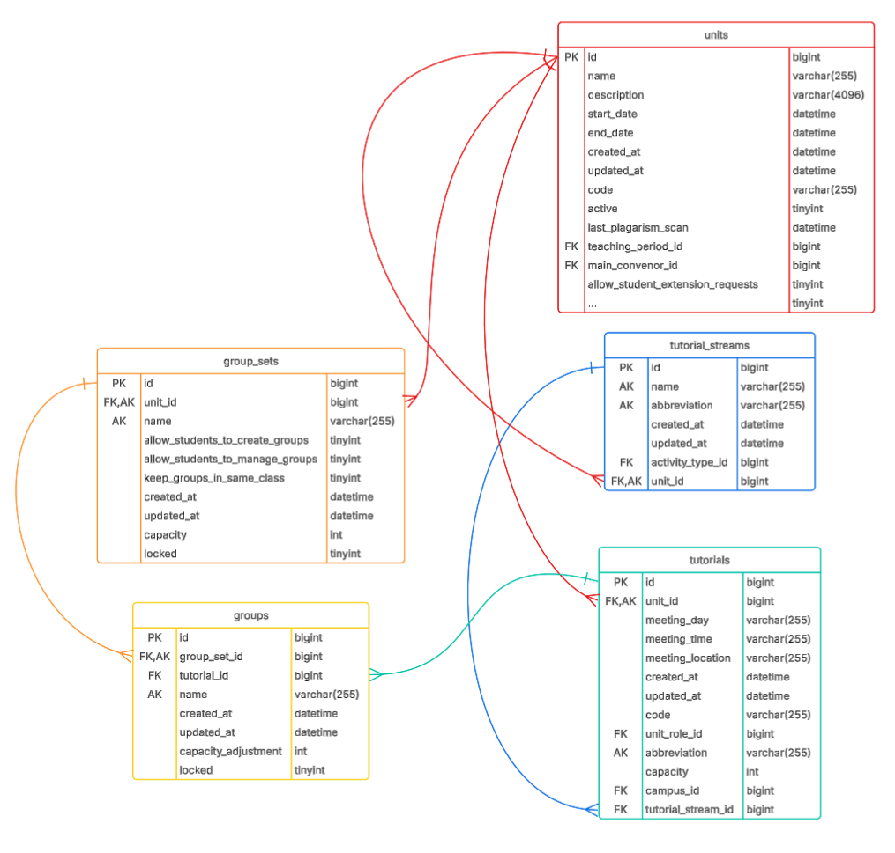
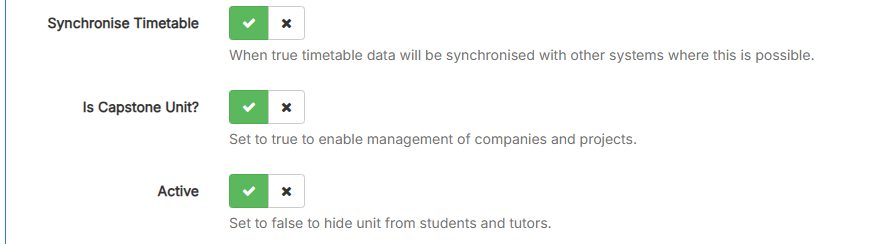
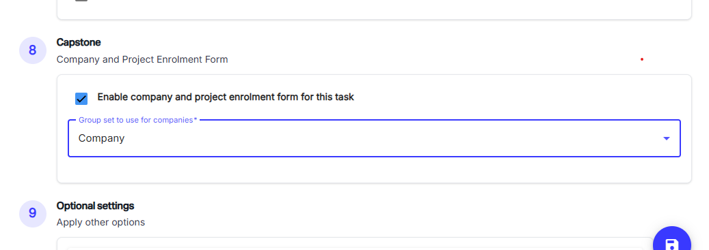
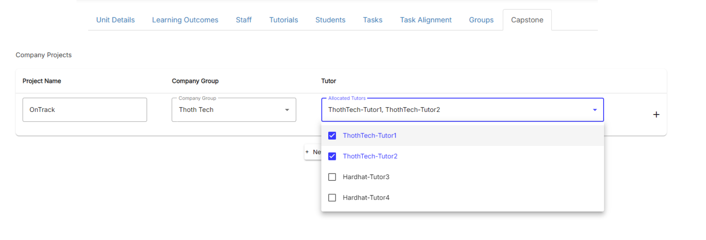
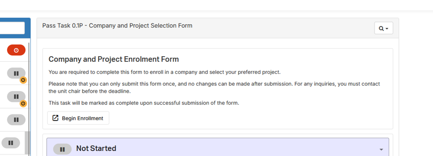
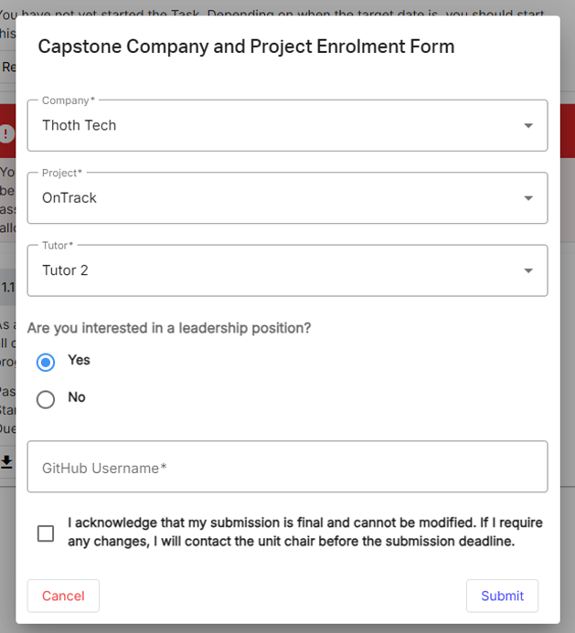
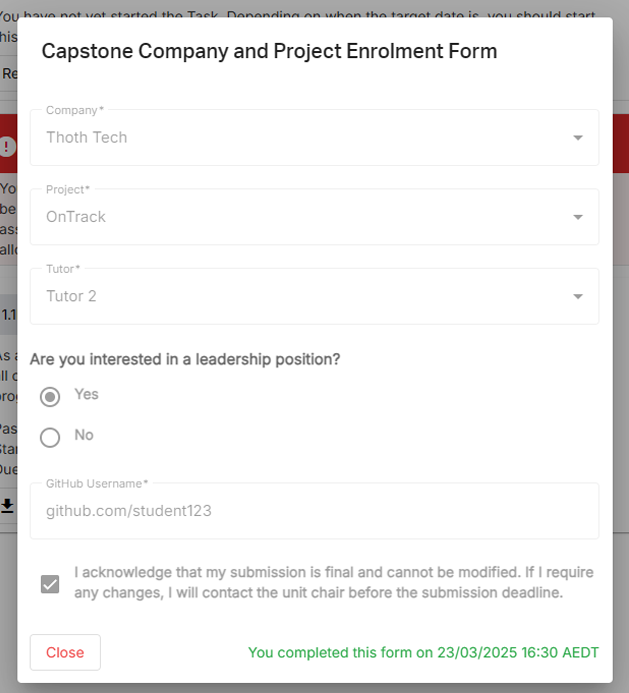
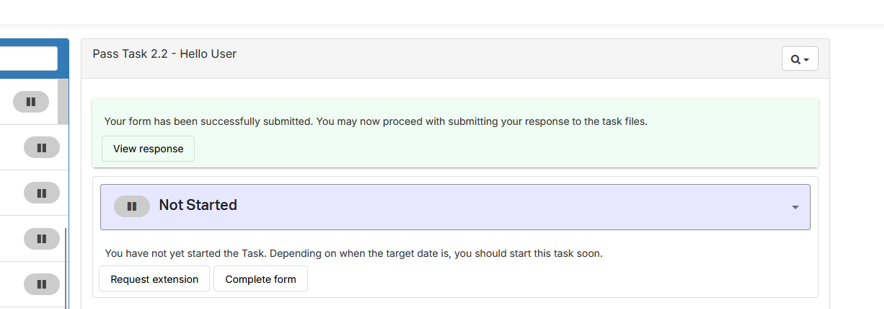
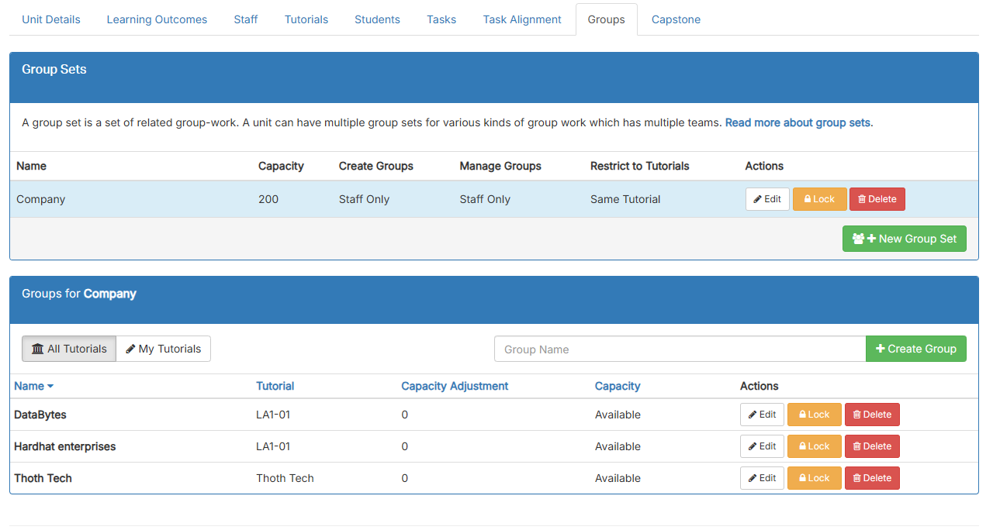

# Capstone company & project self enrolment feature

## Project scope

### Description

This project aims to improve the capstone company and project selection process within OnTrack by
developing a form-based task that collects and processes student selections efficiently. The goal is
to ensure seamless enrolment, prevent errors, and facilitate easy data extraction.

### Objectives

- Develop an OnTrack task for SIT374 & SIT378 to handle company and project selection.
- Ensure student selections are accurate and complete before submission.
- Generate a CSV file containing all student selections for administrative use.
- Maintain the ability to modify the form as required.

### Scope of Work

The enhancement will include the following steps within a single OnTrack task:

#### 1. Company allocation task

- Students self-enrol in a company through the native OnTrack groups.
- The selected company is automatically linked to the form task.

#### 2. Project Selection

- Display available projects within the selected company.
- Enforce project capacity limits (default max 30 students, except for designated projects with
  different limits)
- Mark fully allocated projects as unavailable (disabled with "Project Full" text)

#### 3. Leadership Interest

- Provide a multiple-choice question: "Are you interested in a leadership position? (Yes/No)"

#### 4. GitHub Username Submission

- Collect students' GitHub usernames for ease of repository management.

#### 5. Submission Process

- Ensure all fields are completed before allowing submission.
- Students should be able to view their submission responses within OnTrack.
- Subission should be final (no resubmissions allowed after end of week 2).

### Data Management

- The task should auatomatically collect student names and IDs.
- All form responses should be downloadable as a CSV file for each unit separately.
- Admins should have the ability to modify the form to add/remove project teams or companies.

### Implementation Considerations

- A spearate onboarding mobule will be created to guide students on companies and projects before
  making selections.
- The form task should have a user-friendly interface and clear instructions to eliminate errors
  (eg. Ensure users cannot select a project team that is already full)
- Staff should have an easy-to-use interface for managing project teams and downloading student
  selections.

### Expected Outcomes

- Streamlined project allocation process within OnTrack.
- Reduced administrative workload for managing company and project selection.
- Improved student experience by ensuring clear and error-free selection processes.

---

## Use Cases

TODO..

---

## Understanding how SIT374 & SIT378 are currently managed

### Group Sets & Groups

- In Team Project A & B units, `groups` are used for submission tasks 2.1P & 6.1P, allowing each
  capstone company to make their own handover report submissions.
- As we have the two units, juniors in Team Project A will submit their report for their group
  (Company), and seniors in Team Project B will submit their report for their group (Company).
- These groups each are linked to a tutorial within the unit (Company tutorial), automatically
  enrolling students into that tutorial.

### Tutorial Streams & Tutorials

- `tutorial_streams` are used to categorise different tutorials.
- Students can only be enrolled into one `tutorial` from each `tutorial_stream`
- Tutorials have a designated tutor, allowing them to access the work submitted students that are
  "enrolled" into their tutorial.

### Current schema design

    

We can observe that group_sets, groups, tutorial_streams, and tutorials, are all children of a
particular Unit. However, since SIT374 and SIT378 are separate units, we can visualise the data
structure something to be like this:

- SIT374 Team Project A (Unit)
  - Company (group_set)
    - ThothTech
    - DataBytes
    - Hardhat Enterprises
  - Company (tutorial_stream)
    - ThothTech (tutorial)
    - DataBytes (tutorial)
    - Hardhat Enterprises (tutorial)
  - Enrolment (tutorial_stream)
    - SIT374 (tutorial)
    - SIT764 (tutorial)
  - Mentor (tutorial_stream)
    - Thoth-Tutor1 (tutorial)
    - Thoth-Tutor2 (tutorial)
    - DataBytes-Tutor3 (tutorial)
    - Hardat-Tutor4 (tutorial)

_This unit is then essentially duplicated for SIT378 Team Project B. This means that all the
'Company' group_sets and groups, and the 'Company', 'Enrolment', and 'Mentor' tutorial_streams and
streams, are also duplicated_

## Implementation Proposal

- The goal will be to utilise the existing OnTrack `group` and `tutorial` features as much as
  possible.

### Front end

#### UI Concepts

##### Admin/Convenor POV

- Enabling capstone management for a unit

    

- Enable enrolment form for a task

    

- Creating projects, and allocating tutorials to project

    

##### Students POV

- Awaiting form submission

    

- Filling out the form (modal)

    
    

- Completed the form

    

### Back end

- We will continue to use the "Company" `group_set` and `group` entities to retrieve the available
  list of Companies to choose from.
- Existing UI:

    

- We will create a new `capstone_company_projects` entity. This is because we might want to link
  multiple tutorials to a single project that a student can choose from, so we cannot use the
  existing `tutorial` entities to represent a project.

#### `capstone_company_projects`

|     | Attribute        | Data Type | Note                                                |
| --- | ---------------- | --------- | --------------------------------------------------- |
| PK  | id               | INT       |                                                     |
| FK  | company_group_id | INT       | References the `id` of the company's `group` entity |
|     | name             | string    | eg. "OnTrack" or "Splashkit" for ThothTech company  |

- We will create a new `capstone_company_project_tutorials` to establish which tutorials belong to
  which company project.

#### `capstone_company_project_tutorials`

|     | Attribute           | Data Type | Note                                                 |
| --- | ------------------- | --------- | ---------------------------------------------------- |
| PK  | id                  | INT       |                                                      |
| FK  | capstone_project_id | INT       | References the `id` from `capstone_company_projects` |
| FK  | tutorial_id         | INT       | References the `id` from existing `tutorials` table  |

\*_The capacity of the project will be enforced by the logic already existing in the `tutorial`
entity_

#### `capstone_form_responses`

|     | Attribute            | Data Type    | Note                                                        |
| --- | -------------------- | ------------ | ----------------------------------------------------------- |
| PK  | id                   | INT          |                                                             |
| FK  | task_id              | INT          | References the task the form is for                         |
| FK  | student_id           | INT          | References the id of the student                            |
| FK  | selected_company_id  | INT          | References the `id` of the company `group`                  |
| FK  | selected_project_id  | INT          | References the `id` in `capstone_company_projects`          |
| FK  | selected_tutorial_id | INT          | References the `id` in `capstone_company_project_tutorials` |
|     | leadership_interest  | BOOL         |                                                             |
|     | github_username      | VARCHAR(100) |                                                             |

#### Extending `units`

|     | Attribute   | Data Type | Note                                                                                 |
| --- | ----------- | --------- | ------------------------------------------------------------------------------------ |
|     | ...         |           |                                                                                      |
| +   | is_capstone | BOOL      | Enables the capstone tab when editing the unit. Allows enrolment form to be enabled. |

#### Extending `task_definitions`

|     | Attribute                     | Data Type | Note                                                    |
| --- | ----------------------------- | --------- | ------------------------------------------------------- |
|     | ...                           |           |                                                         |
| +   | capstone_form_enable          | BOOL      | Enables capstone form for a task                        |
| +   | capstone_company_group_set_id | BOOL      | Determines which group set to use for company selection |

#### Improving batch imports of groups and tutorials

- When a unit is duplicated (e.g., via OnTrack Rollover), only `group_sets` and `tutorial_streams`
  are copied; `groups` and `tutorials` must be manually imported.
- Now, our only hurdle with this proposal is administration having to duplicate all the group,
  tutorials, company projects, and project tutorial links for both SIT374 and SIT378.
- Currently, admins are already able to upload a collection of `groups` through a CSV.
- We will also extend this functionality to the `unit-tutorials-list` component, allowing ease of
  management of tutorials, so that they can be batch imported into both SIT374 and SIT378.

#### Linking of tutorials between SIT374 and SIT378

Because we now have two tutorials that **_virtually_** belongs to the same project and company, but
exist under different units, we need to link these two together, so that later on we can count the
number of students enrolled in that tutorial from both SIT374 and SIT378.

To achieve this, my proposal is to implement a feature that allows units to "sync" a tutorial (or
multiple) from an existing tutorial in another unit. (Not capstone specific)

#### `unit_tutorial_syncs`

| Attribute | Data Type          | Notes |
| --------- | ------------------ | ----- | --------------------------------------------------- |
| PK        | id                 |       |
| FK        | main_tutorial_id   | INT   | References `id` from the `tutorial` in one unit     |
| FK        | synced_tutorial_id | INT   | References `id` from the `tutorial` in another unit |

##### Constraints:

- **No linking within the same unit:** Tutorials cannot be synced within the same unit.
- **Deleting linked tutorials:**
  - If the `synced_tutorial_id` tutorial is deleted, only that link is removed.
  - If the `main_tutorial_id` tutorial is deleted, all links for that tutorial are removed,
    un-linking the `synced_tutorial_id` tutorials.

#### "Import Tutorial from Existing Unit" Feature:

- In the case where **SIT378** is the "main" unit and **SIT374** is the new unit:
  - Admins can use the "Import tutorials from existing unit" feature to sync tutorials from
    **SIT378** to **SIT374**.
  - A modal allows admins to select tutorials from **SIT378** and sync them with **SIT374**.

##### Process:

(TODO: create a sequence diagram)

1. Admin clicks "Import tutorials from existing unit" and selects tutorials to sync.
2. For each selected tutorial:
   - A new row is created in `unit_tutorial_syncs`:
     - `main_tutorial_id` = tutorial `id` from **SIT378**
     - `synced_tutorial_id` = tutorial `id` from **SIT374**
3. When listing tutorials in **SIT374**, we check if a tutorial's `id` exists in
   `synced_tutorial_id`:
   - If yes, it's a synced tutorial and cannot be edited. A tooltip says, "This tutorial cannot be
     edited because it is synced from SIT378".
4. When modifying a tutorial in **SIT378**:
   - The `put '/tutorials/:id'` endpoint should be modified to update the corresponding
     `synced_tutorial_id` in **SIT374** if it exists in `unit_tutorial_syncs`.

## Sequence Diagrams (TODO)

- Workflow of admins rollover SIT374/SIT378 -> upload csv of groups -> upload csv of tutorials ->
  upload csv of company projects

## Tasks that need to be done (TODO)

- [ ] Implement a "Import tutorials" feature TODO..

## Future plans

- Dynamic forms? Allow admins to dynamically build their own form and save responses as a JSON,
  allowing forms to be used outside of the capstone
