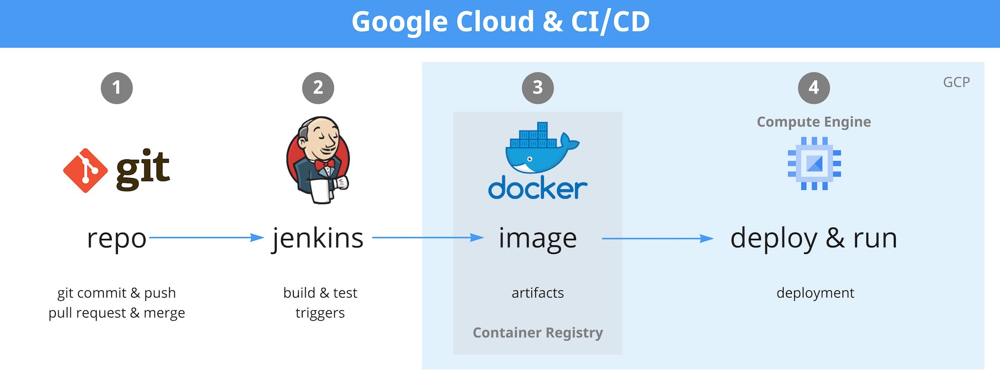

# Google Cloud - Overview

[Overview](#overview)

[Aims](#aims)

[Initial stages](#initial-stages)

[Next stages](#next-stages)

[Links](#links)

[Assets](#assets)

## Overview

The Google cloud team have deployed a functional instance of Doubtfire (also known as OnTrack)
hosted on Google Cloud Platform (GCP).

Our GCP project is centrally managed by Deakin IT where the team have been granted access.

- GCP Project Name: sit-22t1-ontrack-deplo-d026375
- GCP Project ID: sit-22t1-ontrack-deplo-d026375

In Google Compute Engine, we have created server instance running Linux (Centos 7.x). The instance
is a small, initial footprint that is configured to be publicly facing and accessible from the
internet over HTTPS (port 443).

We have used the source code from the Thoth Tech repository for the deployment into GCP, where we
used **docker compose** to deploy the images for the components required to run Doubtfire (api
server, app server, doubtfire-web, mariadb, nginx).

## Aims

- Deploy a student-run version of OnTrack hosted on Google Cloud. This version will be running in
  isolation, independently of the Deakin University version.
- Create a CI/CD pipeline that automates the building, deployment, and validation of a of the Thoth
  Tech OnTrack to Google Cloud.

## Initial stages

Initially, the Google Cloud team had spent time understanding GCP, Docker, and the Doubtfire
deployment. We ran several tests locally prior to deploying a server instance in GCP and deploying
Doubtfire.

## Next stages

Since we have a functional and accessible instance of Doubtfire running in GCP, the next stage would
be to focus on automation with CI/CD pipelines to deploy the Thoth Tech OnTrack to GCP. It would
also be a bonus to get LDAP authentication for OnTrack and email notifications configured with an
SMTP server.

## Links

- [GitHub repo for Thoth-Tech/Doubtfir-deploy-GCP](https://github.com/thoth-tech/doubtfire-deploy-GCP)
- [GitHub repo for Thoth-Tech/Doubtfire-deploy/DEPLOYING.md](https://github.com/thoth-tech/doubtfire-deploy/blob/main/DEPLOYING.md)
- [Trello board for Deployment - Google Cloud epic](https://trello.com/b/dI1yx9A1/deployment)
- [Miro for Google Cloud - Doubtfire](https://miro.com/app/board/uXjVO0h8ZSE=/?share_link_id=62396987373)
- [Miro for Google Cloud - CI/CD](https://miro.com/app/board/uXjVO64xoQw=/?share_link_id=57734801709)

## Assets

- [Google Cloud - Doubtfire](./assets/GoogleCloud_Doubtfire.jpg)
- [Google Cloud - CI/CD](./assets/GoogleCloud_CICD.jpg)
