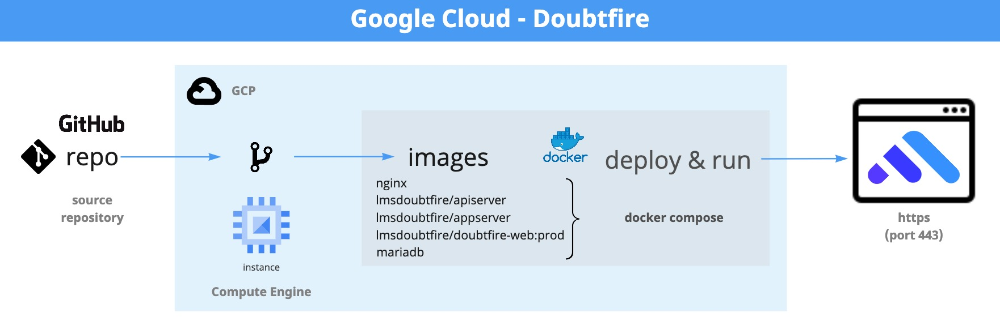
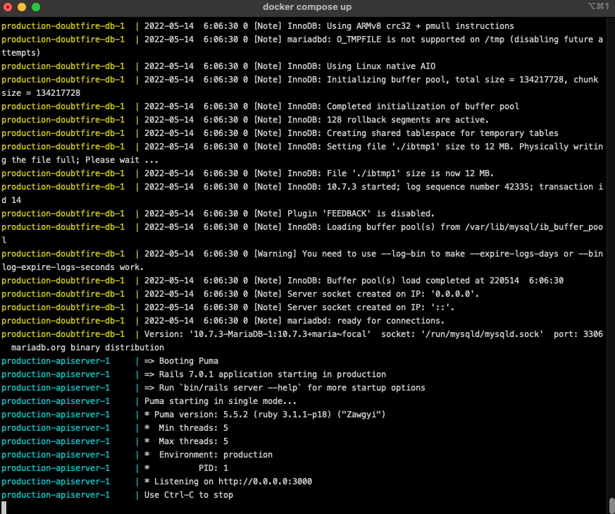
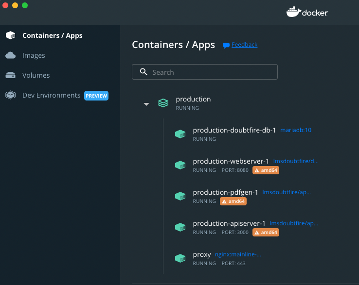
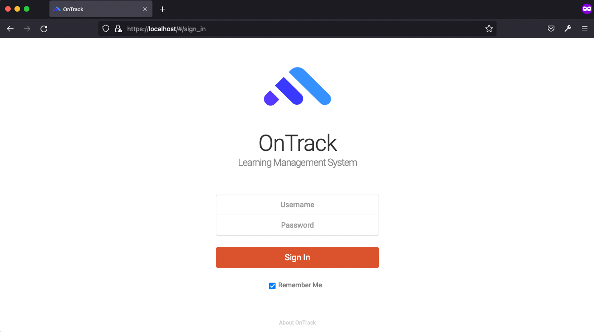
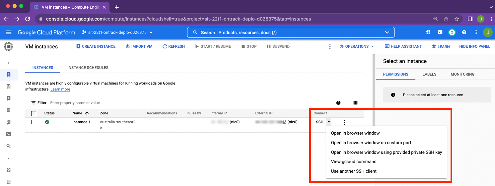
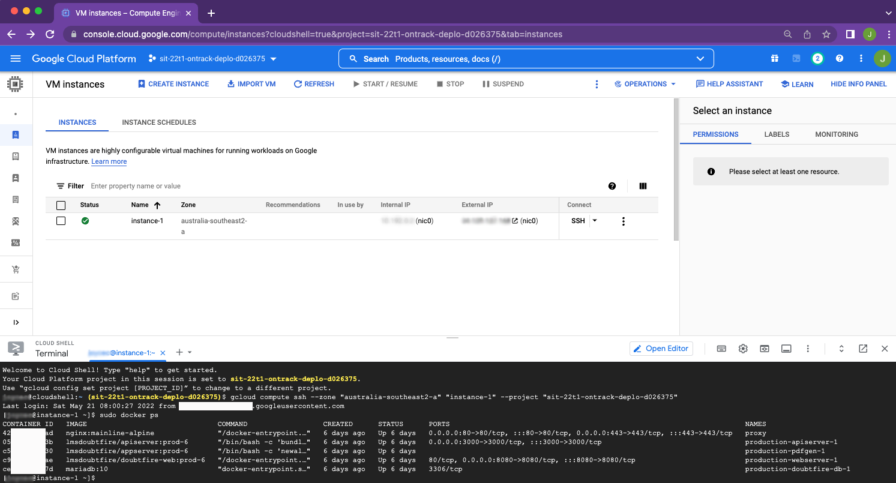
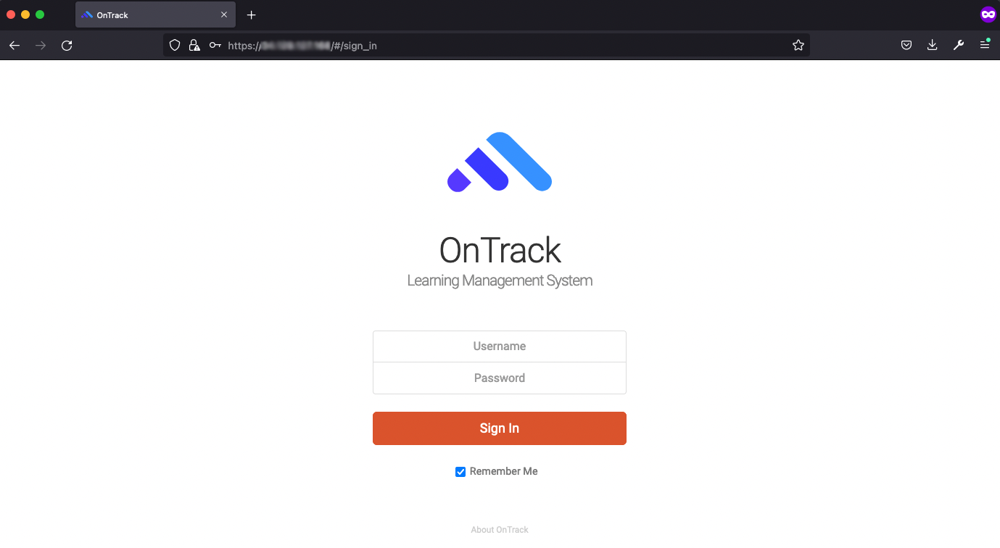
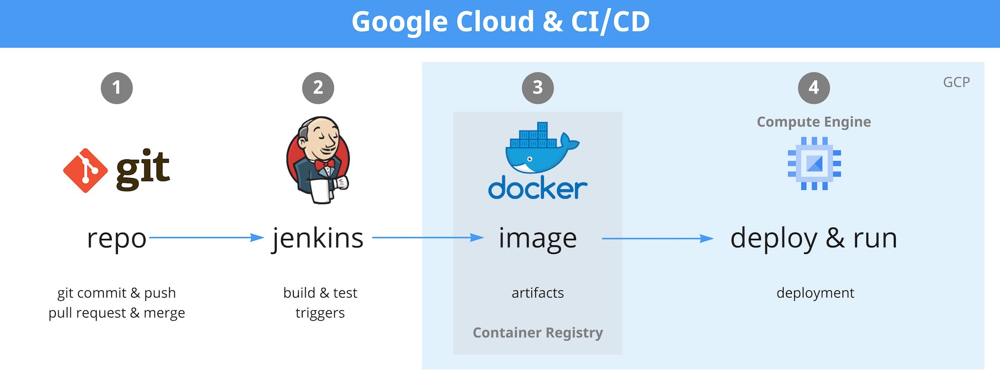

# Google Cloud - Overview

[Overview](#overview)

[Initial stages](#initial-stages)

- [Tests via localhost](#tests-via-localhost)
- [Google Compute Engine instance](#google-compute-engine-instance)
- [Deploying OnTrack](#deploying-ontrack)

[Next stages](#next-stages)

[Links](#links)

[Assets](#assets)

## Overview

The Google Cloud team's main deliverable for the project is to deploy a student-run version of
OnTrack which is hosted on Google Cloud Platform (GCP). The goal is for Thoth Tech to have their own
deployment to develop OnTrack that is separate to Deakin's deployment.



The Google cloud team have deployed a functional instance of Doubtfire (also known as OnTrack)
hosted on GCP.

Our GCP project is centrally managed by Deakin IT where the team have been granted access using our
Deakin Google Workspace accounts.

- GCP Project Name: sit-22t1-ontrack-deplo-d026375
- GCP Project ID: sit-22t1-ontrack-deplo-d026375

In Google Compute Engine, we have created server instance running Linux (Centos 7.x). The instance
is a small, initial footprint that has a publicly facing network and accessible over the internet
via HTTPS (port 443).

We have used the source code from the Thoth Tech repository for the deployment into GCP, where we
used docker compose to deploy the images for the components required to run Doubtfire (api server,
app server, doubtfire-web, mariadb, nginx).

## Initial stages

Initially, the Google Cloud team had spent time understanding GCP, Docker, and the Doubtfire
deployment.

### Tests via localhost

Prior to deploying to GCP, we ran several tests locally (localhost) on our own workstations to
determine the configuration changes required deploy Doubtfire successfully. On our individual
workstations, we cloned the
[Doubtfire-deploy-GCP repository](https://github.com/thoth-tech/doubtfire-deploy-GCP) and modified
the necessary files. We then used docker compose and Docker to run and deploy containers.



Success! We have Docker containers running locally.



Success again! We have OnTrack being hosted locally and is accessible via https://localhost:443 .



### Google Compute Engine instance

Once we determined the configuration changes required to be able to run locally (localhost), we then
needed to determine how to create and deploy a Compute Engine server instance in GCP that we could
use to deploy Doubtfire.

We started with a small, initial footprint and deployed a basic virtual machine (VM) instance with
following details;

- Name: instance-1
- Zone: australia-southeast2-a
- Machine type: e2-micro
- CPU platform: Intel Broadwell
- OS Image: Centos 7 (Image name centos-7-v20220406)
- Boot disk: 20GB SCSI (Balanced persistent disk, Google-managed encryption)
- Network interfaces: nic0 (with internal & external IP addresses)
- Firewalls: HTTP, HTTPS enabled
- GPUs/Display device: None, disabled

Once we had the instance up and running, we connected to the instance using command-line shell via
SSH. In the Google Cloud console, you can view the options to connect by clicking the drop-down menu
beside _Connect SSH_ on the instance view.



Alternatively, you can SSH to the instance via gcloud CLI -

```shell
gcloud compute ssh --zone "australia-southeast2-a" "instance-1"  --project "sit-22t1-ontrack-deplo-d026375"
```

There were a few packages that needed to be installed on the host, such as -

- yum-utils
- yum-config-manager (required to setup docker-ce repo, see
  [Docker docs](https://docs.docker.com/engine/install/centos/) for Centos)
- docker-ce, docker-ce-cli, containerd.io, docker-complose-plugin
- git
- openssl
- nano (optional)

Once installed using `yum`, we had the minimum requirements to get started on the Doubtfire
deployment.

### Deploying OnTrack

From here, we pulled down the doubtfire-deploy repository, generated a new certificate and private
key for the host, and ran docker compose to deploy the containers for the OnTrack deployment.



And we can browse to OnTrack over the internet using our public IP address via HTTPS (port 443).



## Next stages

Since we have a functional and publicly accessible instance of Doubtfire running in GCP, the next
stages would be to focus on the Deployment team project objectives, such as -

- Create a CI/CD pipeline that automates the building, deployment, and validation of the Thoth Tech
  OnTrack deployment onto GCP.
- LDAP authentication for OnTrack.
- Email notifications configured with an SMTP server.
- Review security posture and instance sizing of the Thoth Tech OnTrack deployment in GCP.

Here's a high-level diagram of using CI/CD pipeline to automate the deployment of OnTrack onto GCP -



## Links

- [GitHub repo for Thoth-Tech/Doubtfire-deploy-GCP](https://github.com/thoth-tech/doubtfire-deploy-GCP)
- [GitHub repo for Thoth-Tech/Doubtfire-deploy/DEPLOYING.md](https://github.com/thoth-tech/doubtfire-deploy/blob/main/DEPLOYING.md)
- [Trello board for Deployment - Google Cloud epic](https://trello.com/b/dI1yx9A1/deployment)
- [Miro for Google Cloud - Doubtfire](https://miro.com/app/board/uXjVO0h8ZSE=/?share_link_id=62396987373)
- [Miro for Google Cloud - CI/CD](https://miro.com/app/board/uXjVO64xoQw=/?share_link_id=57734801709)
- [Pull Request - OnTrack deployment on GCP](https://github.com/thoth-tech/doubtfire-deploy-GCP/pull/5)
