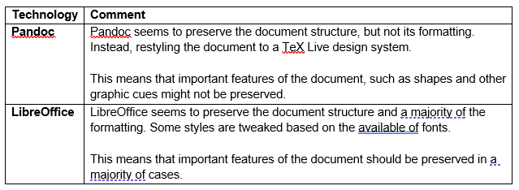

# **OnTrack Word Document Submission Team**

# **Author Information**

- Authors: Matt Kinnia and Simon Agahi
- Team: OnTrack - Word Document Submission
- Team (Delivery and/or Product) Lead: Simon Agahi and Nelson Lai

# **Document Summary**

- Documentation Title: OnTrack Word Document Submission Team
- Documentation Type: Technical
- Documentation Information Summary: Document detailing the original project aim, new project aim
  for our trimester, information on the two containers researched, performance KPI's and evaluating
  results, and a future students section for important information.

# **Document Review Information**

- Date of Original Document Submission to GitHub: 18/12/2022
- Documentation Version: 1.0
- Date of Previous Documentation Review: 18/12/2022
- Date of Next Documentation Review: to be decided

# **Key Links/Resources**

- <https://github.com/thoth-tech/doubtfire-overseer>
- <https://github.com/thoth-tech/doubtfire-web>
- <https://github.com/thoth-tech/doubtfire-api>
- <https://github.com/thoth-tech/documentation/blob/main/docs/OnTrack/Documentation/OnTrack%20Documentation%20Template.md>
- <https://github.com/thoth-tech/documentation/blob/main/docs/OnTrack/Documentation/OnTrack-Documentation-Template-Guide.md>

# **Contacts for further information**

See <https://github.com/thoth-tech/handbook/blob/main/README.md> .

# **Project Aim**

\
Overall, the aim of this project is to extend the Doubtfire (OnTrack) Learning Management System by allowing
students to upload word documents against a task submission. \
\
Word documents must be converted to the Portable Document Format (PDF) so it can be made accessible to
the tutors and unit convenors for assessment. \
\
Currently, Doubtfire only supports code, PDF and image task submissions.

# **Project Aim for Trimester 3, 2022**

\
This trimester, our aim is to research, compare and decide on the technology implementation that will
be used to convert the word document submissions to PDF. \
\
As a number of the team members are new to the capstone program, and/or new to the Doubtfire architecture,
a significant amount of time is dedicated to research and upskilling.

# **Introduction**

This trimester, we have focused on researching and comparing two Docker images which can be used for
converting word documents to PDFs; Pandoc and LibreOffice Writer. Specifically, these images are: \
\

- pandoc/latex:2.17
- instructure/libreoffice:6.3

# **Pandoc**

\
<https://pandoc.org/> is a Command Line Interface (CLI) document converter which supports an impressive
number of conversion input and output permutations, including word processing file extensions such as
.docx, .rtf and .odt. Pandoc is well documented and easy to use. Pandoc CLI is available as a Docker
image, so it can be executed in isolation or installed natively within an existing container.

# **LibreOffice**

\
<https://www.libreoffice.org/> is an open source productivity suite which contains a number of standalone
applications which are used to author documents, spreadsheets and presentations. While working with LibreOffice
typically involves a graphical user interface, headless interactions are possible via the CLI. Being
an open sourced software, many implementations or flavours are available on the internet. Because of
this, we found it challenging to navigate and find documentation that best fit our use case. LibreOffice
CLI is also available in a Docker image.

# **Performance**

\
In an effort to make an informed decision on which technology we should utilise going forward, we had
established three Key Performance Indicators (KPIs) in which we evaluated each technology against. \
\

- Speed; the time it took for a conversion to occur.
- Quality; the condition of the conversion output in comparison to the input.
- Footprint; the size of the technology implementation. \
  \
  In order to measure the technologies against the KPIs mentioned above, we had created a
  benchmarking tool in Python/Jupyter Notebook which allowed us to perform the evaluation. \
  \
  As a base case (it can be easily extended), the benchmarking tool converts three different sized
  ".docx" files, being 100kb, 500kb and 1MB, to ".pdf" and compares the time it took for each of the
  technologies. Whereby each file is converted three times so we can report on the best, worst and
  average cases. \
  \ The benchmarking tool and its outputs are available at “./Performance Benchmarking/runner.ipynb”.

# **Performance Conclusions**

\
More detail is available in the benchmarking tool itself, a summary is provided below. \
\
 \
\

- \*An average of three conversions of a 1MB .docx file. Speed should be used as an indicator only,
  this largely depends on the available resources on the executing machine. \
  \
  Notes on Quality \
  \
  Quality is a subjective KPI, and can’t be effectively measured using a discrete value. In this
  case, we are using quality as a measurement of likeness between the input and the output. \
  \
  See below for comments regarding conversion quality. \
  \
  

# **Future Students**

\
For future students, reflect on the overall project aim, and start thinking in which creative ways you
can help to contribute to this project team. Ultimately by integrating the chosen container into OnTrack
successfully, the original project aim will be complete. \
\
A project which was new to the whole team during trimester 3 2022, as well as being condensed into a
very short period of time, was ultimately what allowed us to achieve what we could and overcoming challenges.
With these resources being created with the intention to serve great future reference to future students
and try help them get a head start as much as possible, it is important to take some time and read/understand
all the information provided and available. \
\
So have a read of some of the important project information below, and hopefully clears up a lot of questions
you would’ve had, to give a head start into the Capstone unit. \
\
**First Steps:** understand the structure of OnTrack, what it is, and how it works. \
\
In brief, Doubtfire (OnTrack) can be described as a “modern, lightweight LMS” (Learning Management System)
that helps students submit work and receive feedback on it. \
\
 \
\
When looking at the OnTrack Architecture diagram, the red box, representing the API, is where most of
our work will be in, as it is mainly backend work that needs to be done. \
\
Doubtfire’s API is done in an open-source framework known as Ruby on Rails. Rails is written in Ruby
and provides default structures for a database and a web page. \
\
If you’re not familiar with the language or framework, learning and upskilling in these areas can be
included in the hours dedicated to upskilling. \
\
**NOTE:** minimum 30 hours of upskilling required, as explained by the directors of the capstone unit.
Could be subject to change for future trimesters, so please check with unit team first. \
\
**Deploy OnTrack Locally:** should be your priority if you are not a returning student to the project.
The link below will include three markdown files explaining everything you need to do to successfully
set Doubtfire up on your local computer, and so that you can get started working on it. \
\
**Link:** <https://github.com/thoth-tech/documentation/tree/doc/migration/docs/OnTrack/Front%20End%20Migration/Docker>
\
\
**Direction Moving Forwards & Deliverables:** now that you have Doubtfire setup and working locally,
you can start thinking about solutions and ways in which to contribute. \
\
I would recommend now that you have understood a bit of the structure of OnTrack, to then understand
how the API works, and finding the related code for the API to be able to start working on that. The
two kind of go hand in hand, understanding the backend of OnTrack’s API, alongside the overall structure.
