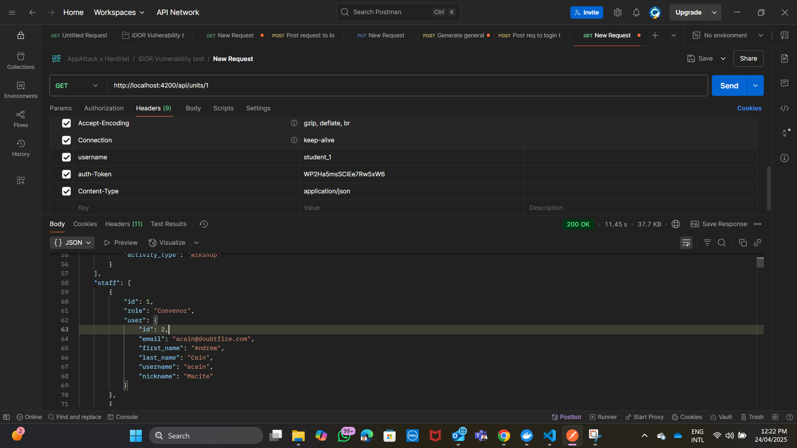
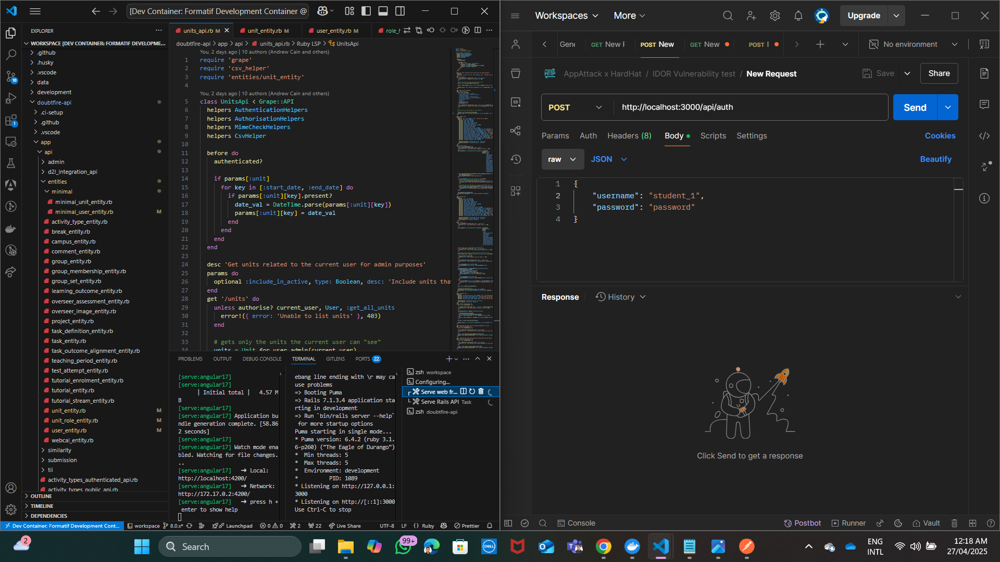
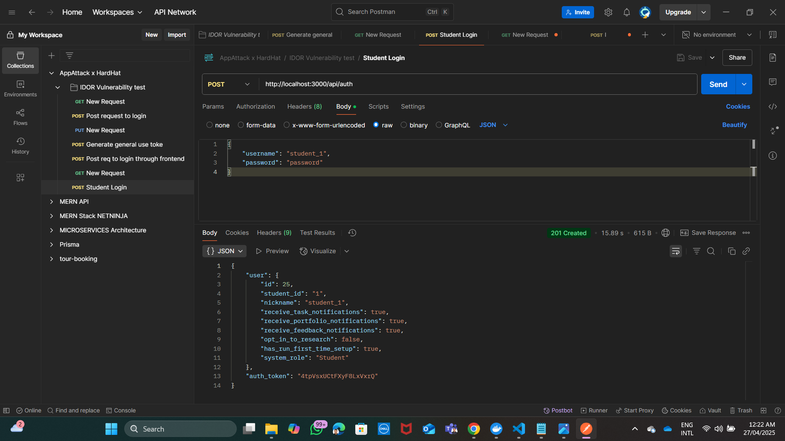
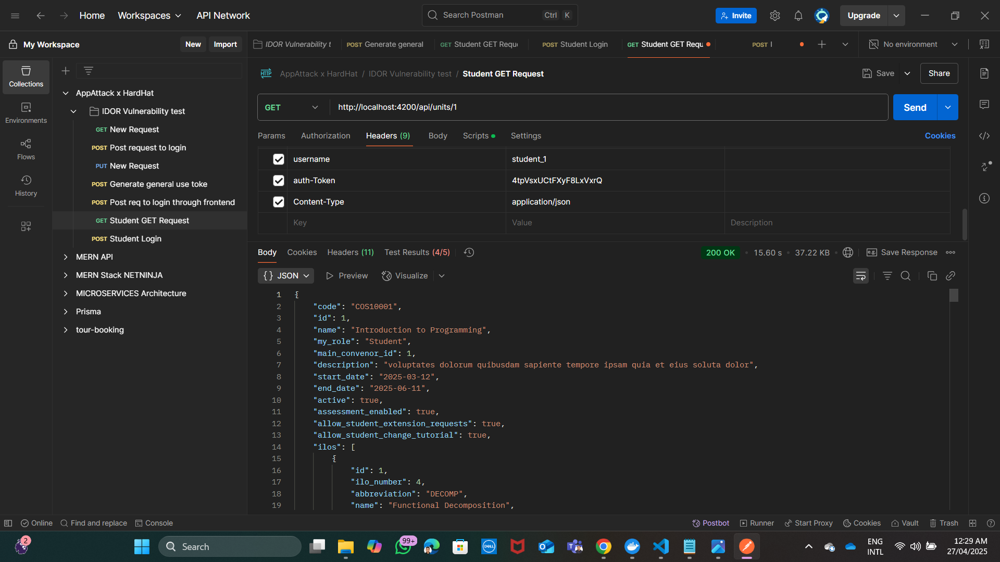
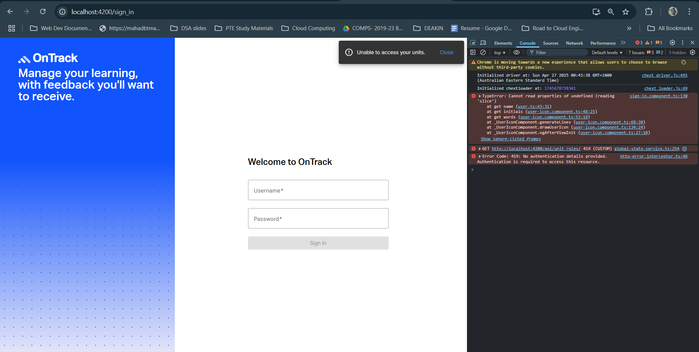

# AppAttack x OnTrack Vulnerability review

## Team Member Name

| Name                    | Student ID |
| ----------------------- | ---------- |
| Atharv Sandip Bhandare  | 223650012  |

---

## Vulnerability Details

### Vulnerability Name

Insecure Direct Object Reference (IDOR) – Unauthorized Access to Staff Information 

### Vulnerability purpose

- This vulnerability targets Insecure Direct Object References (IDOR), where a low level user entity, such as a student, can access high level entity such as internal staff information through insufficient authorization checks on the server.
- This vulnerability is made possible due to insufficient access control implementation on the backend, such as:
    - The API endpoint handling unit information does not perform role-based access control (RBAC) checks to differentiate between students and staff.
    - Sensitive fields like `main_convenor_id` and `tutor_id` are included by default in the API response, regardless of the user's role.
    - The system relies only on `authentication (whether the user is logged in)`, but fails to apply proper authorization filters to control what different types of users should see.
    - Lack of `object-level data filtering` or `data minimization practices` results in unnecessary information disclosure.

### Affected Assets and Interaction Points
- Affected Assets:
    - Based on my understanding, the following backend files are involved in exposing unauthorized staff information and are part of the vulnerable assets:

| File | Why It Is Affected |
| --- | --- |
| `doubtfire-api/app/api/entities/minimal/minimal_user_entity.rb` | Handles minimal user serialization; insufficient filtering led to staff identifiers being exposed. |
| `doubtfire-api/app/api/entities/unit_entity.rb` | Constructs the Unit API response; embeds sensitive staff IDs like `main_convenor_id` directly into API outputs without access control. |
| `doubtfire-api/app/api/entities/unit_role_entity.rb` | Handles serialization of staff roles within a unit; vulnerable to leaking tutor information linked to students without authorization checks. |
| `doubtfire-api/app/api/entities/user_entity.rb` | Manages user-level details; includes sensitive attributes when responding to certain requests. |
| `doubtfire-api/app/api/unit_roles_api.rb` | API controller that processes staff role information; lack of proper authorization checks results in potential data exposure. |
| `doubtfire-api/app/api/units_api.rb` | Main controller serving Unit information; sends out staff IDs embedded within the unit payload even for student-level users. |

- Interaction Points:
    - API Endpoint: `Get /api/units/:id`
    - When any user (even a student) queries unit information, the API response contains internal fields like main_convenor_id, tutor_id, exposing unauthorized mapping between students and staff.

- Tools Used to Expose Vulnerability:
    - Postman: Used to craft custom API requests and view raw JSON responses revealing sensitive internal IDs.
    - Burp Suite: Can be used for intercepting and analyzing insecure API responses systematically.

## Vulnerability outcomes 

### Outcomes
| Outcome                        | Impact on OnTrack |
| ------------------------------- | ----------------- |
| Unauthorized Viewing of Staff Assignments | Students could view staff assigned to units without permission, breaching confidentiality within academic operations. |
| Exposure of Staff Internal Roles | Students could infer privileged internal staff roles (e.g., convenors, tutors), disrupting academic hierarchies and workflows. |
| Potential Misuse of Staff Information | Exposed staff IDs could be used to impersonate staff members in unit activities, extension requests, or academic disputes. |
| Degradation of Access Control Integrity | Trust in OnTrack’s role-based access control (RBAC) system could diminish, undermining secure separation between student and staff data. |
| Increased Internal Support Burden | Staff would require additional support to manage privacy breaches, leading to administrative overhead and possible process changes. |

Vulnerability Exposure: 
- In the above screenshot, using Postman, a student user `(student_1)` successfully accessed sensitive staff information for a unit by sending a GET request to the endpoint 
`/api/units/1`.
- The API response reveals sensitive details of staff, including their user IDs, email addresses, first and last names, usernames, and nicknames: all without appropriate authorization checks and improper data sanitization.
- This demonstrates a clear violation of access control policies where non-privileged users (students) can retrieve confidential staff data.

## My Approach to Resolving the Vulnerability
To address the identified IDOR vulnerability in the OnTrack system, I followed a structured and investigative approach:
1. Initial Vulnerability Verification:
    - Using `Postman api`, I simulated a GET request to the vulnerable endpoint `/api/units/:id` with a student user's credentials (student_1), successfully exposing sensitive staff information (emails, full names, usernames) associated with the unit.
2. Review of the Vulnerability Report:
    - Carefully reviewed the penetration testing report again to fully understand the scope and impact, which emphasized that staff-level information was improperly accessible to student-level users.
3. Identification of Affected Assets:
    - Analyzed the backend repository (doubtfire-api) to identify relevant files that potentially exposed staff-related information without access control.
4. Understanding How the Vulnerability Was Made Possible:
    - Investigated serialization logic inside the above entity and API files (specified in the outcomes section).
    - Found that sensitive staff data fields were included in the API responses without verifying user roles or privileges.
    - Lack of role-based access control (RBAC) or conditional serialization was the root cause.
5. Designing the Remediation Strategy
    - Planned to implement Role-Based Access Control (RBAC) by restricting the fields returned based on the user's role (Student vs Staff/Admin).
    - Decided to refactor serialization methods in entities to exclude or sanitize sensitive staff attributes for unauthorized users.
    - Added a new helper (role_helpers.rb) to centralize RBAC logic for consistent access decisions across APIs.
6. Implementation of Fixes:
    - Modified serialization logic in all affected entity files to conditionally expose sensitive data based on user roles.
    - Updated controller responses to ensure students receive only non-sensitive information.

## Vulnerability Validation
`Note: Before starting OnTrack, make sure to be on 8.0.x branch and you have Postman Api installed in your system`
1. Pull my work
2. Start OnTrack locally and open your Postman Api alongside: 
3. Now make a login `POST` request to the endpoint `http://localhost:3000/api/auth` and make sure to pass the credentials `username` and `password` as per the below screenshot then hit on `send`: 
    - `201 Status` created means you have successfully made a request to the desired endpoint.
    - Now, make sure to copy the `auth_token`, it will be used later to make a `GET` request to the frontend.
4. Now, make a `GET` request to the endpoint: `http://localhost:4200/api/units/1`, but make sure you have your headers(username, auth-token, content-type) properly setup as per the below image, here auth_token you can access it from step 3: 
5. Now, if you scroll down through the response section, and if you don't see any `json object` like below: 
    - It means sensitive staff data has been sanitized and proper Role-Based Access Control (RBAC) has been successfully implemented.

## Important Section:
- After applying the fix to sanitize unauthorized staff information from the, it was observed that the OnTrack frontend login functionality is impacted.
- Specifically, no users (Students, Tutors, Admins, Convenors) are currently able to successfully log in, and a `419 No authentication details provided` error is thrown.
- This indicates that the frontend is tightly coupled with previously exposed staff object data, and further backend/frontend adjustments are required to properly align authorization models with user session handling.
