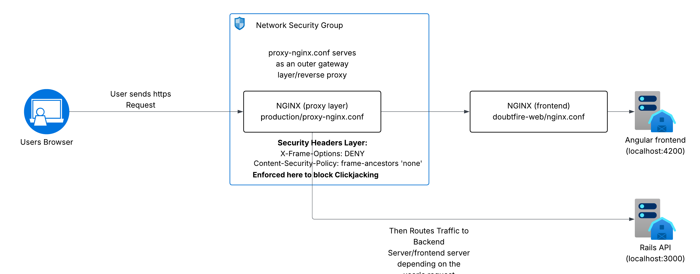
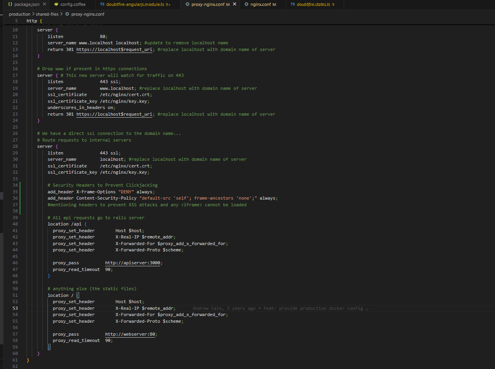
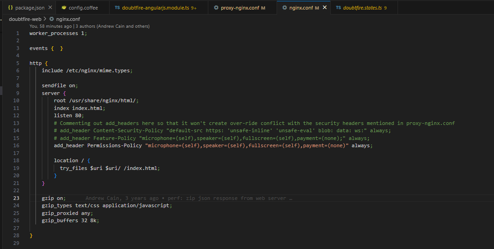
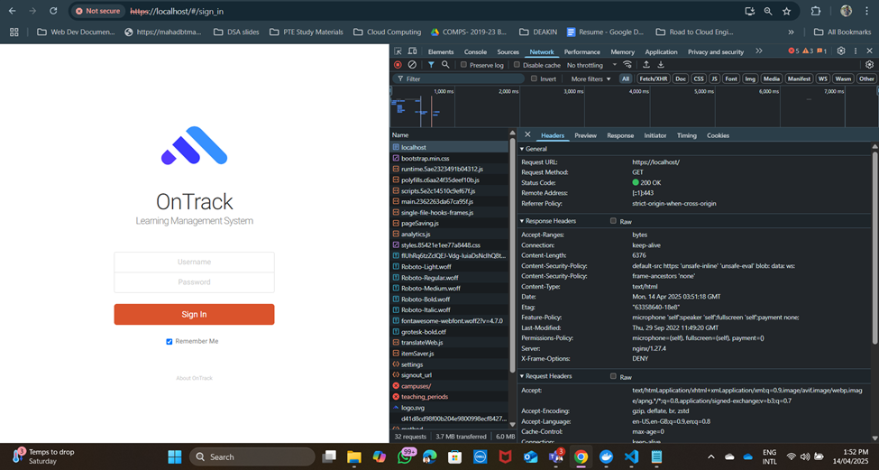

# AppAttack x OnTrack Vulnerability review

## Team Member Name

| Name                    | Student ID |
| ----------------------- | ---------- |
| Atharv Sandip Bhandare  | 223650012  |

---

## Vulnerability Details

### Vulnerability Name

Clickjacking Vulnerability

### Vulnerability purpose

Clickjacking works by embedding the legitimate OnTrack UI inside an invisible or disguised iframe on a malicious site. The attacker tricks users into interacting with this framed site, causing unintentional actions (e.g., clicking a login or delete button).

This exploit is made possible by the absence of key HTTP response headers:
- X-Frame-Options
- Content-Security-Policy (frame-ancestors)
Without these, the browser allows the page to be embedded elsewhere.

### Affected Assets and Interaction Points

This vulnerability posed a severe threat to OnTrack's application security if successfully exploited. Below are the components which were vulnerable:
- `http://10.0.2.15:3000/` – Doubtfire API
- `http://10.0.2.15:4200/` - OnTrack Frontend
- `http://10.0.2.15:4200/assets`
- `http://10.0.2.15:4200/assets/icons`

## Vulnerability outcomes 

### Outcomes

Expected Outcomes if Vulnerability Was Exploited:
- Users could be tricked into performing unintended actions like submitting forms or clicking buttons on the legitimate app embedded in a malicious iframe.
- Sensitive actions such as login, logout, or grade modification could be triggered unknowingly.

### Interactions:

Routing Flowchart: 

1. #### User's Browser
    - User initiates a secure (HTTPS) request to the application by visiting OnTrack.

2. #### proxy-nginx.conf (Outer Gateway Layer)
    - This is the first NGINX configuration layer that receives the user's request. It acts as a reverse proxy, meaning it handles incoming requests and decides where to route them next (frontend or backend).

    #### Security Headers Applied Here
    The proxy-nginx.conf file is responsible for enforcing important HTTP security headers to protect against clickjacking and other attacks.
    These include:
    - `X-Frame-Options: DENY` -> Prevents the site from being embedded inside an `<iframe>`
    - `Content-Security-Policy: frame-ancestors 'none'` -> Ensures the page can only be displayed in the top-level window, blocking embedding on any other domain.

3.  #### doubtfire-web/nginx.conf (Frontend Server)
    - Once the request passes the outer proxy layer, it is routed to the internal frontend server defined in this file.
    This layer serves static files like HTML, TypeScript, and CSS for the Angular application.

    #### Frontend Server (localhost:4200): 
    The Angular-based frontend runs on this port. It is responsible for rendering the user interface and making client-side requests (e.g., API calls).

4. Interacts With Backend API (localhost:3000)
    - The frontend communicates with the backend Rails API hosted at port 3000 to fetch and update dynamic data.

## My Approach to Resolving the Vulnerability

Below is my approach in resolving the vulnerability:

1. Understanding the Hard Hat Vulnerability Report
    - The fix begin by reviewing the vulnerability report generated by Hard Hat leads, which highlighted a Clickjacking vulnerability.
    - The report specifically pointed out that the OnTrack application could be embedded within an `<iframe>` from a malicious site, allowing attackers to trick users into performing unintended actions.

2. Identifying Affected Assets
    - The report helped narrow down the affected assets, which were primarily route-based.
    - These routes were accessible without proper restrictions on embedding or framing, leaving them open to potential Clickjacking attacks.
    - The issue was not in the application code itself, but rather in how requests were being handled and routed by NGINX, especially around headers.

3. Mapping OnTrack's Routing Architecture
    - To understand where to implement the fix, I referred to the DEPLOYING.md and project structure. Here's what I found:
        - There are two NGINX configuration files:
            - `production/proxy-nginx.conf` -> acts as the reverse proxy and entry point.
            - `doubtfire-web/nginx.conf` -> serves static frontend content
        - All incoming user requests hit `proxy-nginx.conf` first. It then routes requests to: 
            - `webserver:4200` -> for frontend (Angular)
            - `apiserver:3000` -> for backend (Rails API)

4. Discovery: Why Existing Headers Weren’t Working
Although security headers like `Content-Security-Policy` were already defined inside `doubtfire-web/nginx.conf` , they were not showing up in the browser. Upon investigation:
    - NGINX sends only one set of response headers.
    - Since `proxy-nginx.conf` is the first point of contact, it overrides any headers set downstream.
    - Therefore, the security headers had to be defined in `proxy-nginx.conf`, not in `doubtfire-web/nginx.conf`.

5. Root Cause:
Here’s what was conflicting:
`doubtfire-web/nginx.conf` defined a `Content-Security-Policy` like this:
    - `Content-Security-Policy: default-src https: 'unsafe-inline' 'unsafe-eval' blob: data: ws:;`
    - This allowed unsafe-inline, which is insecure and directly conflicts with a stricter policy like:
    - `Content-Security-Policy: frame-ancestors 'none';`
    - Browsers do not allow `'unsafe-inline'` to coexist with `frame-ancestors`.
    - Allowing `'unsafe-inline'` means scripts can be executed directly within HTML files. This is dangerous because it opens up the surface for XSS (Cross-Site Scripting) attacks.

6. My Plan to fix implementation:
-  In proxy-nginx.conf (production layer):
    - production/proxy-nginx.conf: 
    
- This ensures:
    - Clickjacking Protection via `X-Frame-Options: DENY`
    - CSP Enforcement that disallows the app from being embedded anywhere
- In `doubtfire-web/nginx.conf` (frontend layer):
    - doubtfire-web/nginx.conf: 
- I commented out the Content-Security-Policy and Feature-Policy to avoid conflict.
- Retained `Permissions-Policy` since it doesn’t interfere with framing or scripts.

## Vulnerability Validation

- [ ] Verified via Browser Developer Tools
    - Compose your application first, then once the app has started; go to developer's console -> Network -> Selected any request -> Look under Response Headrs:
        - `X-Frame-Options: DENY`
        - `Content-Security-Policy: default-src 'self'; frame-ancestors 'none';`

        - Temporary Check: 
- [ ] Yet to test Clickjacking Prevention in a Malicious Iframe Setup as listed in the report.