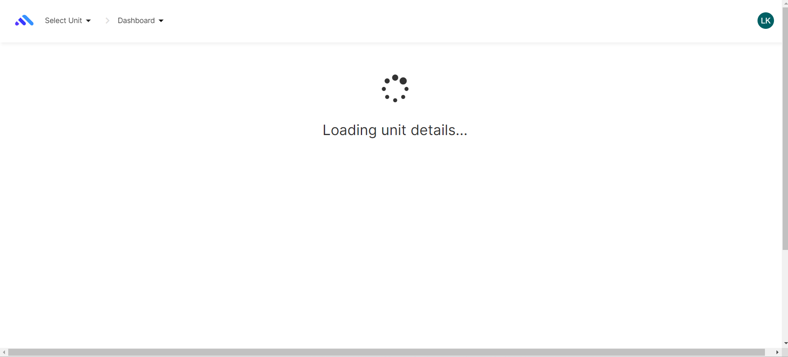

# Component Review - Index.coffee Migration

## Student Name: Jayani Vithanage

## Student ID: 220194805

## Component Name

\\\\./src/app/units/states/states/index/index.coffee

File Name: index.coffee

## Component purpose

This component is used to: Once we login to the ontrack and select the unit/ module, it might takes a few seconds to load the dashboard content/ unit details. This component displays the unit details loading with buffering icon and the time gap of loading unit details is filled by this component.

This is component combination of index.coffee and index.tpl.html

## Component outcomes/interactions

It aligns the buffering icon and displays the "loading unit details..." message.

current web design:

The current model gives the perfect message and it properly covers the window with the message and the loading icon.

This modal has a proper mechanism, the component can be migrated and continued with the same design.

**Component migration Check list** – What is needs to be checked for this component to work once
migrated?

[ ] ability to collect details from the user

[ ] high user friendliness

[ ] Outcome should be aligned with the expectation
