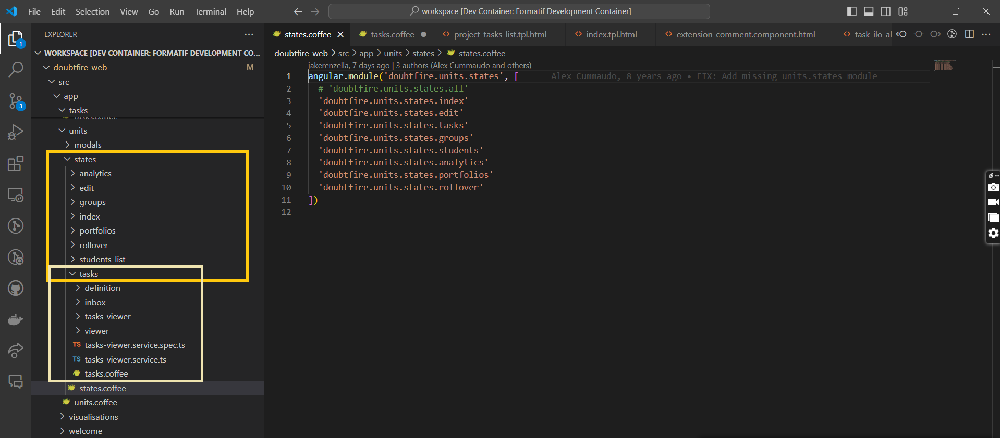

# Component Migration - Sates.coffee

## Student Name: Jayani Vithanage

## Student ID: 220194805

## Component Name

\*\*\*\*./src/app/units/states/states.coffee

**Description**

States.coffee: Although this component has been identified as a single component and mentioned as one in the Trello board, this comes with eight other subcomponents. Therefore, this can be categorized as follows,

        -analytics.coffee
        -edit.coffee
        -groups.cofee
        -index.coffee
        -portfoliod.coffee
        -rollover.coffee
        -student-list.coffee
        -tasks.coffee

Tasks.coffee is also a combination of another set of subcomponents (subcomponents: definition, inbox,taks-viewer, viwer) and task-viewer has been already migrated.

Following images explains the categorization and the existence of subcomponents:

Images 01:

Image 02:

