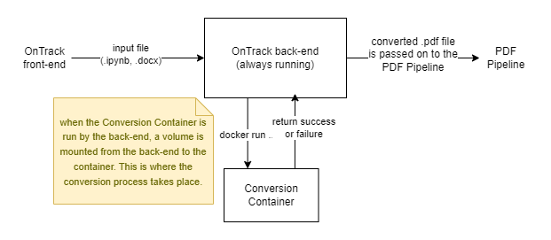

# Docker Documentation and Research (WIP) T1-2022

- [Back to Jupyter Notebook Documentation Index](./Index.md)

The API container gets the input file from the frontend which needs to be converted and puts it into a location **known** to the conversion container (i.e., a *temp* directory in a shared volume).

The shared *temp* directory ensures that both the API container **and** the conversion container have read and write access to the input and output files.

This *temp* directory will be the shared volume specified in `docker-compose.yml`.

The API container then runs a *bash script* which will tell the conversion container to start, read the input file from the *temp* directory, perform the conversion process, write the output file to the *temp* directory, and finally `exit`.

```sh
docker run 
```

**How do we tell the API container whether it was a success or failure??? Need more research into this**

If the file conversion was a success, the API container will then read the output file from the temp directory and pass it on to the next steps.
The files in the temp directory can safely be removed by the API container.

[](./docker_flow.png)
 

