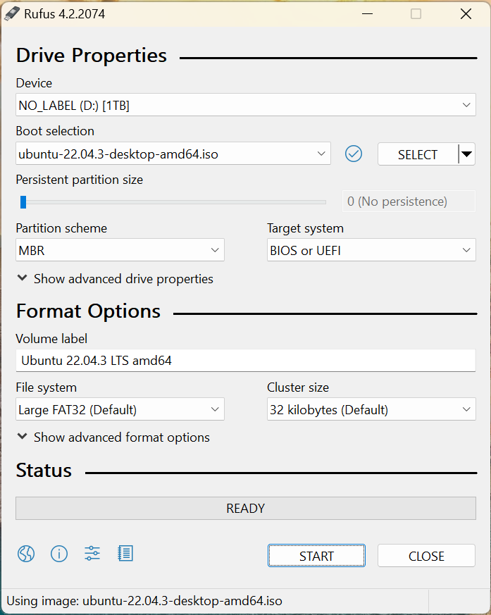
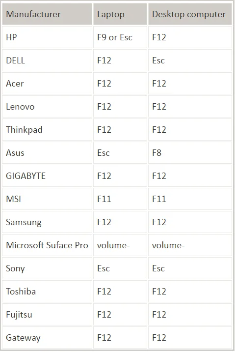
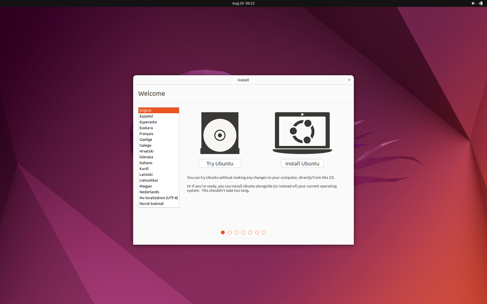
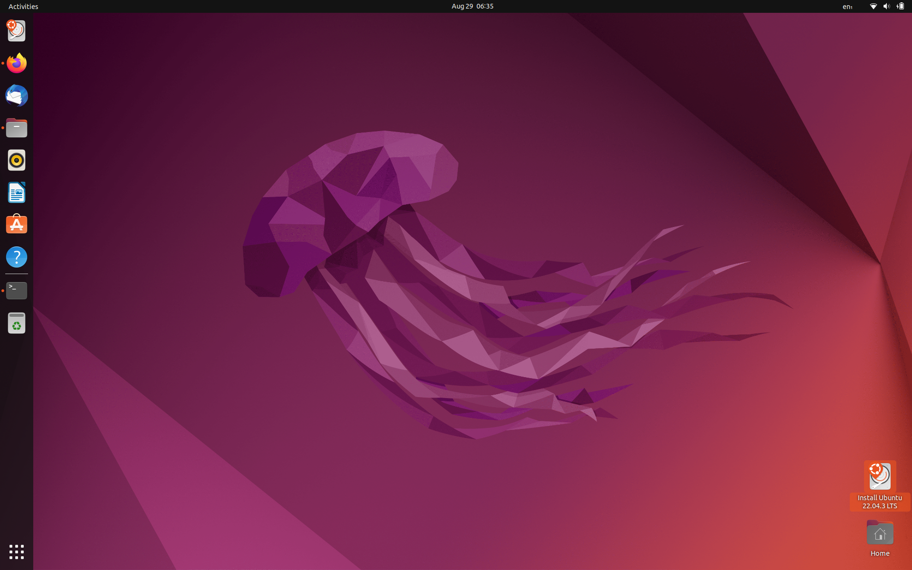
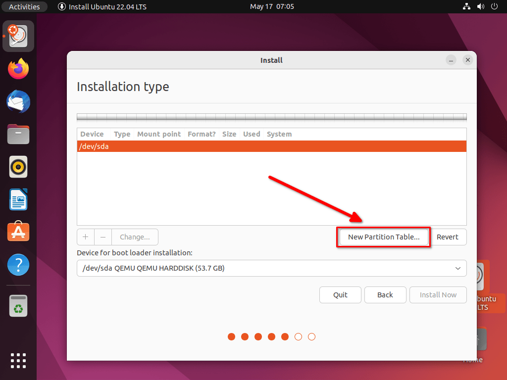
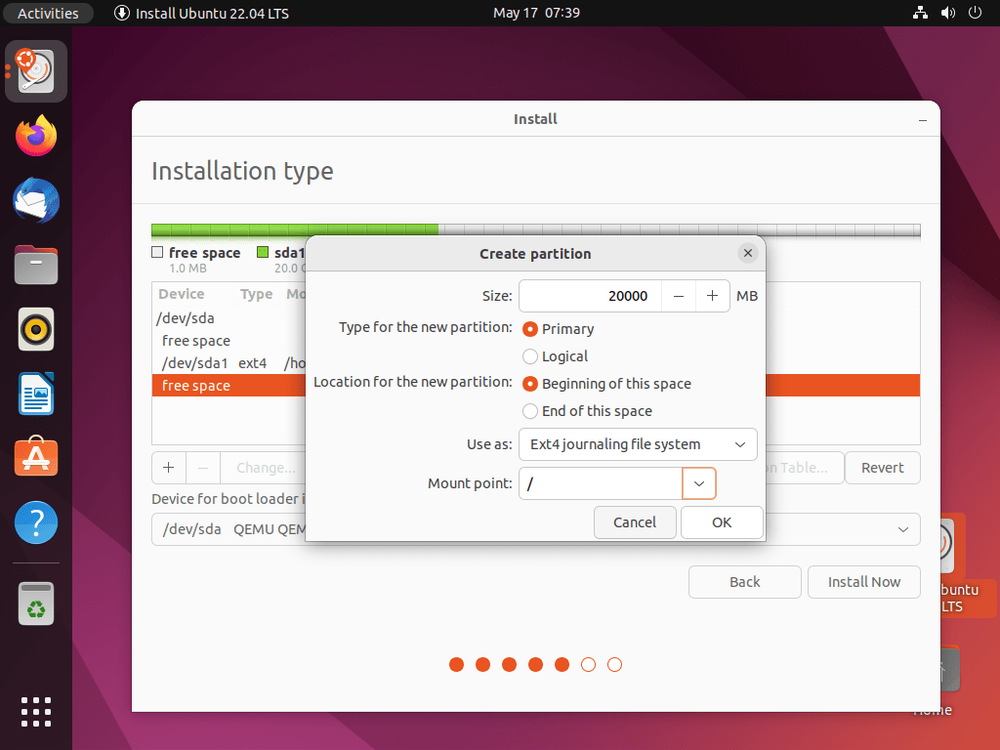
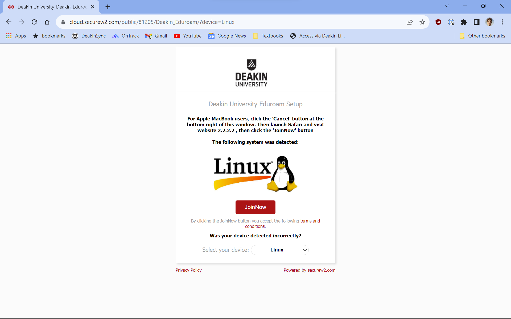
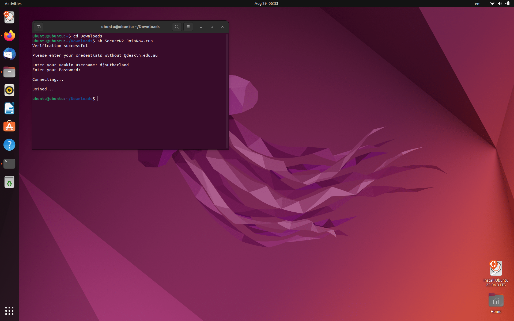

# How to Run OnTrack with Ubuntu on an External SSD

## Requirements

- A PC with Windows 10 installed.
- An external SSD with at least 64GB of storage.
- A USB drive with at least 8GB of storage. (Recommended)

## 1. Download Ubuntu and Rufus

- Download [Ubuntu](https://ubuntu.com/download/desktop) from the official website.
- Download [Rufus](https://rufus.ie/en/).

## 2. Create a Bootable USB Drive

1. Open Rufus.
2. Select the USB drive from the 'Device' dropdown.
3. Click the 'SELECT' button to choose the Ubuntu ISO (should be in your downloads folder).
4. Click the 'START' button at the bottom.

   

## 3. Prepare Booting

1. Plug the USB or SSD into your PC.
2. Restart your PC and continually hit the boot menu key to open BIOS settings.

   

3. There should be a list of boot options including Windows Boot Manager. Select the bootable USB
   with the Ubuntu ISO.
4. The Ubuntu OS will load in portable mode from the USB.

## 4. Install Ubuntu on External SSD

1. After booting into Ubuntu you should be provided with the option to Try Ubuntu or Install Ubuntu.
   Select Install Ubuntu.

   

2. If not prompted, open the "Install Ubuntu" application from the desktop.

   

3. Proceed through the initial steps until you reach the "Installation type" step.
4. Choose the "Something else" option to manually configure partitions.
5. Identify the external SSD as a device like `/dev/sdb`.

   

## 5. Partitioning

1. Create the root partition:

   - Use as: Ext4 journaling file system.
   - Mount point: /
   - Tick the box to format.

   

2. Click OK to start the installation.
3. Select your timezone.

## 7. Deakin WiFi Setup (Optional)

1. Connect to the Deakin Setup WiFi network.
2. It should launch this webpage in your browser.

   

3. Click the JoinNow button to download the setup wizard.
4. Change directory into the `Downloads` folder in the terminal.

   ```shell
   cd Downloads
   ```

5. Enter the following command in the terminal to connect to the wifi network and follow the prompts
   to enter your Deakin username and password.

   ```shell
    sh SecureW2_JoinNow.run
   ```

   

## 6. Install Additional Software

1. After installation, open a terminal.
2. Install Git:

   ```shell
   sudo apt install git
   ```

3. Install Docker

   ```shell
   sudo apt install docker.io
   ```

4. Install vscode

   ```shell
   sudo snap install --classic code
   ```

## 7. Clone OnTrack Repository

1. Clone the OnTrack repository (change `YOUR_USERNAME` to your GitHub username):

   ```shell
   git clone --recurse-submodules git clone https://github.com/YOUR_USERNAME/doubtfire-deploy
   ```

2. Open the `doubtfire-deploy` folder in vscode:

   ```shell
   cd doubtfire-deploy
   code .
   ```

3. Run change remotes script in the integrated terminal to change the remote to your own repository.

   ```shell
   ./change-remotes.sh
   ```

   and follow the prompts to enter your GitHub username.

## 8. Run OnTrack

1. After re-opening vscode, the script should automatically run and open the OnTrack application in
   your browser.
2. Happy coding!
