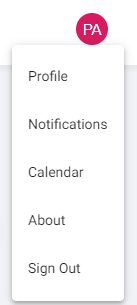
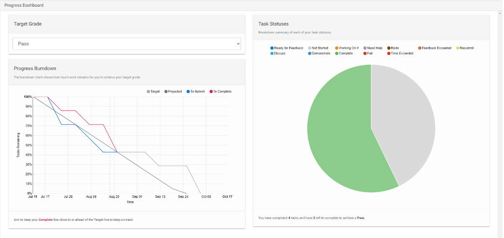
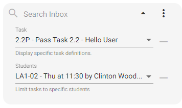
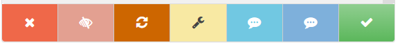
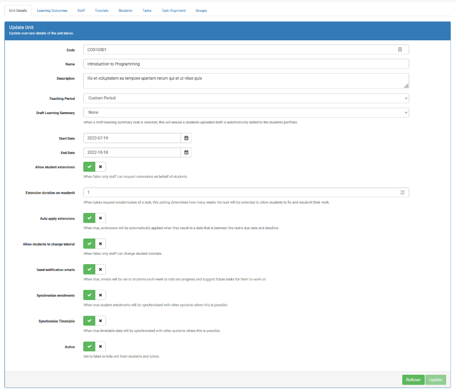

**[Thoth Tech Quality Assurance:]{.underline}**

**[Ontrack Feature List]{.underline}**

**Ontrack Home Screen**:

-   Shows all current units along with a progress bar to show how much
    of its content has been completed by the student.

-   History Button on the right to show all past units that have been
    completed or discontinued

**\`**

-   Ontrack logo is clickable which directs user to the home screen

-   "Select Unit" drop down which shows and provides links to all
    current units

-   User Initials/Avatar in top right corner with dropdown to Profile,
    Notifications, Calendar, About and Sign
    out.

{width="1.5673611111111112in"
height="3.2618055555555556in"}**Ontrack Unit Dashboard Screen**

-   Task List

    -   Task Name

    -   Icon for Individual/Group task

    -   Task level (Pass/HD)

    -   Task Status Icon (Complete, Not Started, In Progress, Ready for
        Feedback)

    -   Timeline Icon (Hourglass to show if task is to be started or
        should have been started along with how many days/weeks ago)

-   Progress Dashboard

    -   Dropdown to select Target Grade which updates task list
        accordingly.

    -   Progress Burndown Chart to show projection lines\
        \
        for Target, Projected, to submit and To Complete.

    -   Task Statuses -- Pie Chart which shows all tasks categorized by
        their status (Pass, Fail etc)

-   "Not Started" Task View

    -   Status module with Dropdown to select what status the student is
        at for that task (Eg. Not Started, Working on It, Need Help,
        Ready for Feedback")

    -   Request Extension button

    -   Task Details Module: Description for Task, Recommend Start Date,
        Due Date and "Download Task Sheet" and "Download Task Resources"
        button.

    -   Preview search button to look at Task details and Task Sheet

**[Admin Perspective]{.underline}**

**Admin Home Screen**

-   Shows all current units being taught along with a progress bar to
    show the teaching period progress.

-   History Button on the right to show all past units that have been
    completed or discontinued

-   Allocate Trimester Dates in OnTrack

-   Allocate Campuses and configure abbreviations, sync mode and active
    status.

-   Allocate and configure Units in OnTrack

-   Create and Manage Users that can access and use OnTrack for Admins,
    Tutors, Convenors and Students

**Task Explorer**

-   Task Search: Searches tasks submitted by students and task names.

-   Tasl Bulk Export Option

-   Task List Filter: Can be filtered by task or student groups
    (Specific Practical/Class)

-   Mark Buttons (7): Fail, Feedback Exceeded, Redo, Resubmit, Discuss,
    Demonstrate and Complete

**Mark Tasks Offline**

-   Button to download Tasks to Mark in a zip file with a CSV that is
    used to mark and leave comments for each task

-   Button to upload the zip file so that the marks and comments in the
    CSV file are uploaded into the system

-   Button to upload CSV file into the system so that just the marks are
    updated for tasks with no feedback

**Student List**

-   Search field to Search for students by Student ID and Campus

-   Filter for All Tutorials or "My Tutorials"

-   Sort Flags by Grade, Plagiarism Report and Portfolio Status

**[Convenor Perspective]{.underline}**

**Tutorials Setup**

-   The tutorial configuration allows convenors to setup: Abbreviation,
    Campus, Location, Day, Time, Tutor Name and Capacity of tutorial

-   The screen provides a list view of all tutorial streams such as
    Tutorials, Practical's and Classes, which can then be configured
    individually

(./Feature_Images/media/image14.png)
**Unit Configuration**

-   Categorized Configuration tabs

-   This screen provides individual unit configurations, for text-based
    information such as Code, Name of Unit, Description

-   Dropdowns provide teaching periods and if a draft learning summary
    is required

-   2 Date pickers can be used to select the start and end date of the
    unit

-   There are also Boolean toggle buttons for all settings such as email
    notifications, extension availability, option to change tutorial
    etc.

 
