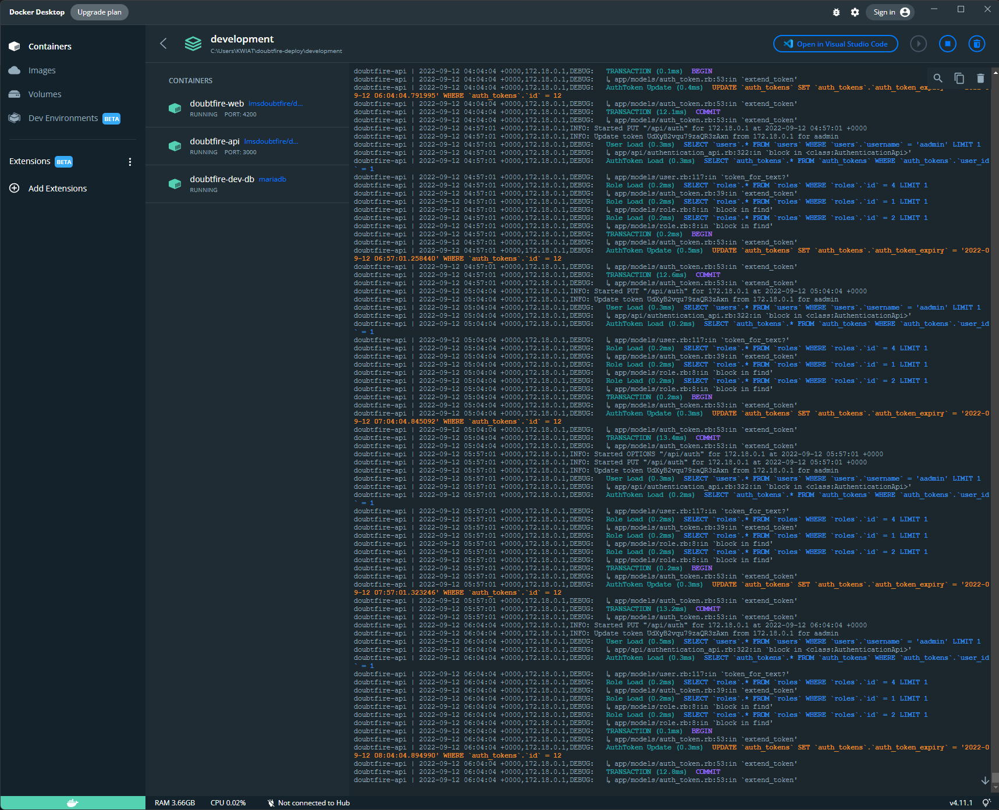
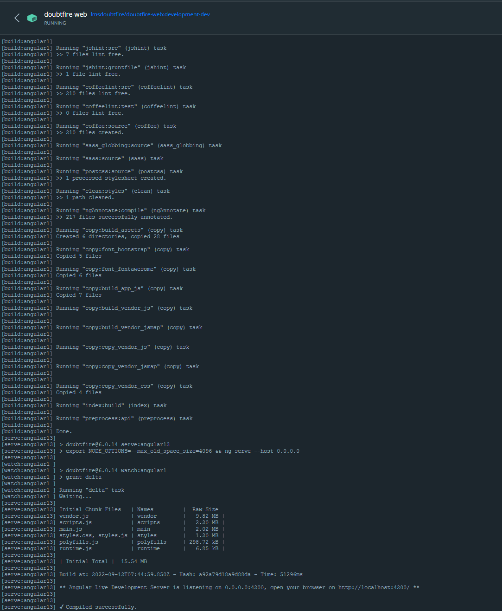
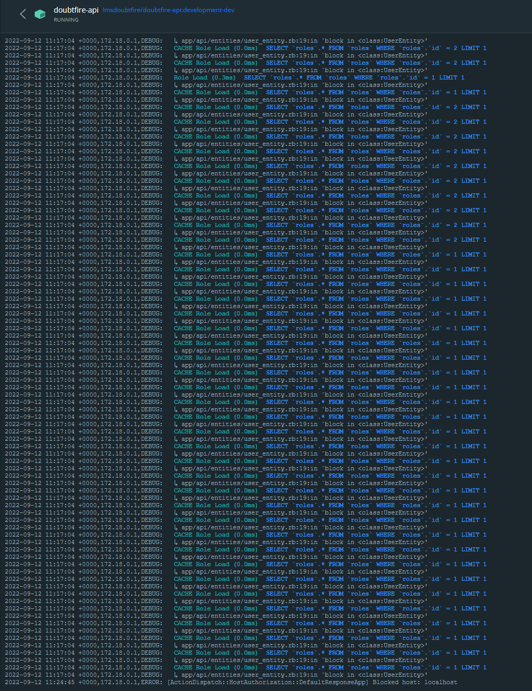

# Public Doubtfire/Ontrack cloud deployment for testing and development purposes

## Doubtfire-web

Website front end docker container running all the code required to publish a front end and provide
visuals

## Doubtfire-api

Resource that links in various API calls in the `Doubtfire` system and provides basic access and
entries for the DB

## Doubtfire-dev-db

Docker container in which all the database is housed and managed, providing all the required data to
service user requests, the database houses

The `Doubtfire-web` docker instance, the `Doubtfire` web frontend is running on a range of different
utilities. It is mostly compacted with a range of JavaScript, CSS and Angular.

Angular is a TypeScript-based free and open-source web application framework led by the Angular Team
at Google. This framework is utilized for its responsive and well-rounded application while being
actively developed and open source

### `Doubtfire` -- API

This deployment of the `Doubtfire` API provides a method of which frontend API calls can interact
with the MarinaDB docker container. It provides required information to the frontend. The systems
are all required to work interchangeably as they all provide each other with the required
information required for day-to-day functionality.

