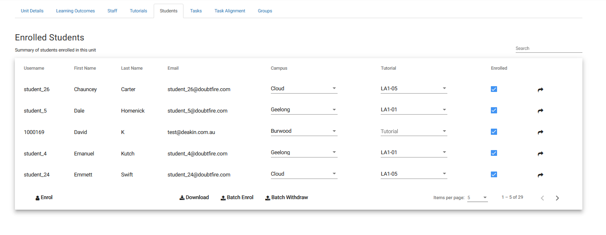

**As \[a user persona\], I want \[to perform this action\] so that \[I
can accomplish this goal\]**

As a \[Student\] I want \[to be able to see all my subjects\] so that
\[I can choose the one I need\]

Student user stories

{width="6.80207239720035in"
height="3.296593394575678in"}

As a student, I want to be able to identify all my units, so that I can
select the unit I want to work on.

As a student, I want to be able to identify how far along my unit I have
progressed, so that I am aware of how much pending work there is.

As a student, I want to be able to visualize what trimester my units are
scheduled for, so that I can understand if I am to complete or have
completed courses.

{width="6.779663167104112in"
height="3.2083333333333335in"}

As a student, I want to be able to understand my progress through the
trimester, so that I can be aware of remaining and completed tasks

As a student, I want to see the status of all my tasks, so that I can
understand if changes need to be made

As a student, I want to see my recommended progress throughout the
trimester, so I can visualize my completion in comparison to the
requirements.

{width="1.96875in"
height="4.097128171478565in"}

As a student, I want to see the status of my task with ease, so that I
can be quickly informed of any updates

As a student, I want to see start and due dates, so that I can prepare
for submissions

As a student, I want to see if I have group or individual tasks, so that
I can start collaboration if required.

As a student, I want to see what grade of task I have, so that I can
ensure I complete all grade relevant tasks

{width="1.9411811023622048in"
height="4.322916666666667in"}

As a student, I want to sync my OnTrack tasks with my calendar, so that
I can schedule my work

As a student, I am waning granular notification controls for my tasks,
so that I can be notified of soon to be due tasks

As a student, I want to be able to see what revision of ontrack I am
using, so that I can ensure I am up to date

As a student, I want settings access to my profile, so I can make
amendments to my personal profile

{width="6.669280402449694in"
height="1.9479166666666667in"}

As a student, I want to quick switch between my units, so that I can
change unit pages

As a student, I want to head back to the portal, so that I can have an
overview of OnTrack

As a student, I want to see my "Active" units, so that I can see what I
am currently studying

{width="6.5in"
height="2.3402777777777777in"}

As a student, I want to view the task sheet and resources for a task, so
that I can understand the work and task requirements.

As a student, I want to upload files, so that I can publish my work for
grading

As a student, I want to download my submissions, so that I can confirm
my submission is correct

As a student, I want to be able to comment on my submission, so that I
can discuss it with my marker.

As a student, I want to have a chat between myself and the marker, so
that I can discuss regarding my submission.

<https://github.com/doubtfire-lms/doubtfire-web/pull/564#issue-1313949947>

User Story:

As a marker, I want to be able to simply rate students' task with an
easy-to-read interface, so that I can provide correct marks to students.

As a marker, I want to be able to understand what mark I am setting, so
that students can have easily identifiable marks

As a marker, I want to be able to slide a value based on a student's
grade

Acceptance criteria:

Given that the marker has a result and is ready to publish the mark

When the marker goes to select a grade within the provided options

Then a student is assigned a grade within the provided UI options

Given that I am a marker and need to mark students

When I complete marking a students work

Then I should be able to slide a slider to assign a students grade

Given that I am a marker and need to mark students

When I complete marking a students work

Then I should be able to select a classification to assign a students
grade (Fail, Pass, Credit, Distinction, High Distinction)

Admin Portal User stories

{width="5.323659230096238in"
height="4.354774715660542in"}

As an administrator, I want to set trimester dates, so that students can
be aware of study periods throughout the year

As an administrator, I want to be able to add and remove users, so that
new students can be enrolled

As an administrator, I want to have the ability to create units, so that
I can setup new subjects

As an administrator, I want to be able to change institution settings,
so that I can configure campuses

{width="4.323520341207349in"
height="2.906655730533683in"}

As an administrator, I want to view the tutor settings, so I can make
unit relevant changes

As an administrator, I want to see the commencement month of the unit,
so I can see if its scheduled correctly

{width="1.5873676727909012in"
height="3.560554461942257in"}

As an administrator, I want to be able to change my profile options, so
that I can change my personal details

As an administrator, I want to be able to change my notification
options, so that I can change what sends me notifications

{width="5.399597550306212in"
height="7.546643700787402in"}

As an administrator, I want to change my details, so that I can update
details if required

As an administrator, I want to be able to change a user role, so that I
can ensure the correct roles are assigned

As an administrator, I want to be able to select whether my data is
gathered, so I can ensure my privacy

Tutor user stories

{width="3.7003160542432196in"
height="5.079064960629921in"}

As a tutor, I want to check students within my unit, so that I can
ensure I have the correct class list

As a tutor, I want to check the level of plagiarism, so that I can
ensure no students are cheating

As a tutor, I want to check students' portfolios, so I can grade their
final submission

As a tutor, I want to check current task submissions, so that I can
provide a mark and feedback

As a tutor, I want to explore set tasks, so that I can ensure all
required tasks are uploaded

As a tutor, I want to download all student submissions, so that I can
grade them without an internet connection

As a tutor, I want to check student groups, to ensure group tasks are
being submitted as required

As a tutor, I want to check unit analytics, so that I can have reports
on student submissions within the unit

{width="6.166972878390201in"
height="7.667047244094488in"}

As a tutor, I want to change my details, so that they can be updated
when required

As a tutor, I want to be able to select whether my data is gathered, so
I can ensure my privacy

{width="3.7921959755030623in"
height="6.740523840769904in"}

As a tutor, I want to be able to check my tasks inbox, so that I can
view student submissions and provide feedback and marking

As a tutor, I want to be able to filter tasks, so that I can be multiple
of a specific task

As a tutor, I want to be able to filter students, so that I can see how
specific students are progressing in comparison to them all

As a tutor, I want to be able to have an easy view of students progress,
so that I can tell how a student is going based off the logo

As a tutor, I want to be able to tell which tasks I am marking, so that
I can ensure I am up to date with marking

{width="6.5in"
height="2.415277777777778in"}

As a tutor, I want to be able to select a marking option, so that I can
provide vital feedback for students

As a tutor, I want to be able to provide audio messages, so that
students can complete any additional work that may be required.

As a tutor, I want to be able to see what a student has submitted, so I
can review their work

Convenor

{width="1.6252263779527558in"
height="5.6674573490813644in"}

As a convenor, I want to be able to admin my managed units, so that I
can setup units for students and tutors

{width="6.5in"
height="5.585416666666666in"}

As a convenor, I want to be able to configure and alter the unit site,
so that students can be provided with all of the correct unit-based
information

As a convenor, I want to be able restrict extension dates, so that
students are only permitted 1 week to submit extensions after being
requested to resubmit

As a convenor, I want to be able to send weekly notifications regarding
tasks, so that students can ensure they are kept up to date with
coursework

As a convenor, I want to be able to mark my units as active or inactive,
so that I can ensure only the correct units are published

{width="6.5in"
height="2.5708333333333333in"}

{width="6.5in"
height="2.292361111111111in"}

{width="6.5in"
height="3.877083333333333in"}

{width="6.5in"
height="2.532638888888889in"}

{width="6.5in"
height="4.819444444444445in"} {width="6.5in"
height="4.9631944444444445in"} {width="6.5in"
height="1.6534722222222222in"}

Public Doubtfire/Ontrack cloud deployment for testing and development
purposes

{width="6.5in"
height="5.269444444444445in"}

{width="3.448397856517935in"
height="2.437840113735783in"}

Doubtfire-web = Website front end docker container running all the code
required to publish a front end and provide visuals

Doubtfire-api = the resource the links in various API calls within the
Doubtfire system and provides easy access and entries for the DB

Doubtfire-dev-db = the docker container in which all the database is
housed and managed, providing all the required data to service user
requests, the database houses

{width="6.046821959755031in"
height="7.347276902887139in"}

The doubtfire-web docker instance, the doubtfire web frontend is running
on a range of different utilities but is mostly compacted with a range
of JavaScript, CSS and Angular.

Angular is a TypeScript-based free and open-source web application
framework led by the Angular Team at Google. This framework is utilized
for its responsive and well-rounded application while being actively
developed and open source

{width="5.740510717410324in"
height="7.4418121172353455in"}

Doubtfire -- API

This deployment of the doubtfire API provides a method of which frontend
API calls can interact with the MarinaDB docker container and provide
required information to the frontend. The systems are all required to
work interchangeably as they all provide each other with the required
information required for day-to-day functionality.

{width="3.1566907261592303in"
height="0.9063768591426071in"}
