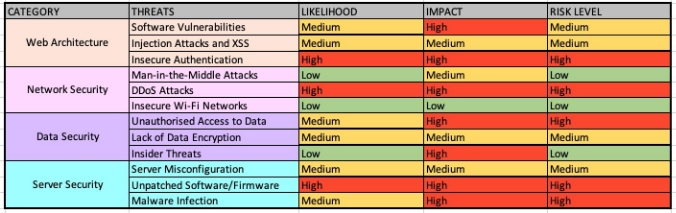

# CYBERSECURITY REPORT (Current Features Report)

## **1.0 Introduction**

This report provides a comprehensive analysis, along with strategies, for avoiding the overall
threats and vulnerabilities for the existing features of OnTrack. The scope of this report is on
emphasising the importance of maintaining the security of components of the website: the web
architecture, network security, data security and server security. This report outlines several
recommendations that can help enhance the cybersecurity of OnTrack.

## **2.0 Types of Threats and Vulnerabilities**

There are many types of threats and vulnerabilities that exist. Listed below are some of the most
common types of threats that could affect the OnTrack website:

- MitM (Man-in-the-Middle) Attacks

An MitM attack involves intercepting a communication between two parties and collecting or modifying
data for monetary gain.

- Cross-Site Scripting (XSS) Attacks

An SS attack involves injecting malicious code into web pages viewed by users in order to compromise
their browsers.

- DDoS (Distributed Denial of Service) Attacks

A DDoS attack uses a large number of compromised devices (botnet) to flood a website server with a
tremendous amount of traffic or requests. As a result, the server cannot handle legitimate user
requests because of its exhaustion of resources.

- CSRF (Cross Site Request Forgery)

As a confused deputy cyber-attack, CSRF exploits users credentials by tricking them into
inadvertently using their credentials to change their state, such as moving money from their
account, changing their email address and changing their password.

- SQL (Structured Query Language) Injection Attacks

Using SQL injection, attackers are able to access sensitive data by exploiting vulnerabilities in
poorly coded queries in the database.

- Insecure Direct Object References (IDOR)

There is an IDOR when an attacker is able to directly access internal resources without getting
proper authorisation to do so.

- Insider Threats

The insider threat involves individuals within an organisation compromising the system or stealing
sensitive information through their access privileges.

- Credential Theft

Using stolen credentials, attackers gain unauthorised access to sensitive information and user
accounts.

- Server Misconfiguration

The misconfiguration of servers can expose sensitive information, allow unauthorised access or allow
attackers to take advantage of vulnerabilities.

- Data Breaches

A data breach occurs when unauthorised access is gained to sensitive user data and can lead to
identity theft or other malicious activities.

- Brute Force Attacks

A brute force attack involves trial and error in decoding private data. The most common brute force
attacks involve password cracking and encryption key cracking. API keys and SSH logins are also
popular targets of this attack.

## **3.0Potential Threats and Vulnerabilities**

Keeping sensitive information secure and ensuring the integrity of online platforms is paramount in
todays digital world. As a result of the nature of the OnTrack website, it is particularly
vulnerable to various threats. This is why it is essential to identify potential vulnerabilities and
take appropriate steps to address them.

1. Web Architecture
   1. Taking advantage of software vulnerabilities in order to execute malicious code.
   1. Injection attacks and cross-site scripting (XSS) attacks targeting user input fields.
   1. Unauthorised access caused by insecure authentication mechanisms.
1. Network Security Threats

- Interception of communication between users and the website through MitM (Man- in-the-Middle)
  attacks.
- Attacks that cripple the website availability, such as Distributed Denial of Service (DDoS).
- Insecure Wi-Fi networks, for instance, increase the risk of eavesdropping.
  - Data Security Risks
- Unauthorised access to sensitive data due to inadequate encryption.
- A lack of encryption of sensitive data allows unauthorised access to it.
- Individuals within an organisation gaining unauthorised access to data via insider threats.

3\.4 Server Security Vulnerabilities

- Misconfigured permissions and weak server configurations, allowing unauthorised access.
- Software and firmware on the server that is unpatched, exposing the website to known
  vulnerabilities.
- A malware infection or server compromise that results in data manipulation or theft.

## **4.0 Risk Assessment**

Taking these risks into account and thoroughly assessing how they might negatively affect the
website is crucial. Security risk assessments are important to be conducted to identify, prioritise
and address security risks to prevent attacks and avoid severe damage from these attacks. The
following table summarises the risk assessment for the threats and vulnerabilities mentioned in the
above section.

## **5.0 Mitigation**

Mitigation strategies are imperative to avoid ad prevent severe damage from cyber-attacks. Some
mitigation strategies for the risks above include:

Web Architecture

1.Software Vulnerabilities

A frequent update of all software components, including the web server, application server and
framework, is the best practice for addressing known vulnerabilities. Stay informed about security
patches and make sure they are applied as soon as they become available.

2.Injection Attacks and XSS

Ensure inputs are validated and outputs are encoded. To prevent SQL injection attacks, parameterised
queries or prepared statements should be used. To mitigate XSS attacks, incorporate the use of
Content Security Policy (CSP). It is also crucial to sanitise user input to clear out potentially
malicious code.

3.Insecure Authentication

``It is important to implement secure authentication mechanisms, including strong password policies,
secure session management, and multi-factor authentication (MFA) to avoid insecure authentication.
Passwords should never be stored in plain text and should be hashed and salted.

Network Security

1.Man-in-the-Middle Attacks (MitM)

Ensure protection against MitM attacks by implementing encryption protocols like HTTPS/TLS to
encrypt data in transit. Advise users to verify website authenticity by validating certificates.

2.DDoS Attacks

Monitoring network traffic patterns will help identify and respond to potential DDoS attacks. DDoS
mitigation services and appliances may be used to detect and mitigate attacks. These techniques may
include traffic filtering, load balancing and rate limiting.

3.Insecure Wi-Fi Networks

Users should be encouraged to use secure and trusted Wi-Fi networks that use WPA2 or WPA3 encryption
to protect themselves. Provide users with information on the dangers of using public or insecure
Wi-Fi networks and the importance of using VPN (Virtual Private Network) for extra security.

Data Security 1.Encryption

Protect sensitive data in both rest and in transit using encryption protocols, such as TSL/SSL.
Implement industry-standard encryption algorithms to encrypt files, databases and other important
data on the server.

2.Access Control

Ensure that user access rights re reviewed and audited regularly to prevent unauthorised access to
sensitive data. Restrict access to sensitive information by utilising role-based access controls
(RBAC).

Server Security 1.Patch Management

Implement automated patch management tools to streamline the patch management process. Patch server
software, operating systems and firmware regularly with the latest security patches.

2.Malware Protection

Ensure server is protected by reputable anti-malware and intrusion detection software (IDS). Ensure
that the server is regularly scanned for malware and that strong security measures are in place to
prevent unauthorised access.

3.Server Configuration

Disable unnecessary services to reduce the attack surface. Regularly review and make sure server
configurations are up to date to ensure they adhere to security best practices.

Besides the above measures, it is essential to conduct regular security audits, vulnerability
assessments and penetration tests to address any new or existing security threats. Educate users on
the best security practices and stay on top of the latest security trends in order to ensure the
website remains secure.

## **6.0 Vulnerability Management**

Vulnerability management is an important part in ensuring the prevention of attacks. Listed below
are some steps in vulnerability management for the security issues mentioned above.

1.Consistent Monitoring

Regularly monitor the website and its components for known vulnerabilities using an automated
vulnerability scanning tool. Update the vulnerability scanner database frequently to ensure the
newer vulnerabilities are detected.

2.Patch and Updates Management

Manage patches and updates for all software components by establishing a patch management process.
Ensure that updates are regularly being looked out for and prioritise critical patches based on
known vulnerabilities.

3.Penetration Testing and Assessment

Test the security infrastructure against potential vulnerabilities and simulate real-world attacks
with regular assessments and tests. Perform comprehensive assessments by hiring professional
security firms with experience in web application security. Address the vulnerabilities identified
in the assessments based on their severity and impact.

4.Secure Coding Practices

By implementing secure coding practices, vulnerabilities can be minimised during development.
Provide developers with secure coding training and enforce secure coding guidelines.

## **7.0 Incident Response**

The incident response should contain a structured plan to detect, respond and recover from security
breaches. Here is a 5-step incident response plan that can be used for OnTrack.

1.Preparation

Develop a plan that addresses the security concerns of the OnTrack website. Regularly check the plan
and conduct tests using simulators. The plan should define roles, responsibilities, communication
channels and the processes/steps to follow in the event of a security breach. Form a team for
incident response which includes roles such as coordinator, technical experts and a management
representative. Ensure that there are dedicated channels for communication within the team and
relevant people. Examples of such channels could be email, or messaging platforms.

2.Identifying

Monitor network traffic, system logs and user activities for signs of security incidents by
implementing intrusion detection systems (IDS) and other similar tools. Analyse and investigate
incident severity and impact to identify some signs of a compromise, such as suspicious behaviour,
or unusual network traffic.

3.Containment

Immediately disconnect affected servers from the network or disable compromised user accounts to
prevent further damage or unauthorised access to the systems. Limit the impact of the incident by
implementing temporary countermeasures, such as firewall rules, changes in configuration, or access
control adjustments.

4.Recovery

Investigations should be conducted to determine the root cause of the incident. Review all evidence
available to determine the vulnerabilities that were exploited and how the attack occurred. Address
the vulnerabilities identified by patching and updating affected systems. Remove any remaining
malware from the affected systems or networks. Restore data and services using secure backups.

5.Post-incident Activity

Involve the lessons learnt from the incident into the response plan. Include any issues encountered
such as miscommunication or communication gaps and technical controls. Evaluate the incident
response process, actions taken and the effectiveness of said actions. If there were many weaknesses
identified, revise and improve the plan for future incidents. Inspect and test the incident response
plan frequently to ensure its effectiveness as it needs continuous improvement to be effective.

## **8.0 Conclusion**

It is possible to significantly enhance the cybersecurity protection level of OnTrack by addressing
potential threats and vulnerabilities through this approach. In order to keep OnTrack protected
against potential risks, it is crucial to ensure that there is continuous monitoring and upgrading.

## **9.0 References**

ACS (2016) Cybersecurity Threats, Challenges, Opportunities, _ACS_, accessed 21 March 2023

Acunetix (n.d) Web Server Security and Database Server Security, _Acunetix by Invicti,_ accessed 19
April 2023

Atlassian (n.d) Incident management for high-velocity teams, _Atlassian_, accessed 26 April 2023

Cloudflare (n.d) What is a brute force attack?, _Cloudflare_, accessed 3 April 2023 Cloudflare (n.d)
‘What is a DDoS attack?’, _Cloudflare_, accessed 30 March 2023 Cloudflare (n.d) ‘What is SQL
Injection?’, _Cloudflare_, accessed 3 April 2023

CrowdStrike (2022) Incident Response Plan: Frameworks and Steps, _CrowdStrike_, accessed 5 April
2023

Essential Tech (2022) Network Security Threats and Solutions You Need To Know, _Essential Tech,_
accessed 8 April 2023

Hendricks D (n.d) 10 Essential Steps to Improve Your Website Security, _IEEE Computer Society_,
accessed 6 April 2023

Irei A and Shea S (n.d) What is incident response? Plans, teams and tools, _TechTarget_, accessed 3
May 2023

Jones J (n.d) 11 Best Practices for Developing Secure Web Applications, _LRS Web Solutions_,
accessed 10 April 2023

LogSign (2019) How to ensure Network Security?’, _LogSign,_ accessed 10 April 2023 ManageEngine
(n.d) ‘Vulnerability Management’, _ManageEngine_, accessed 30 April 2023

Newton S (2021) 5 Incident Response Best Practices Your Organisation Should Consider, _Stickman
Cyber_, accessed 9 May 2023

Schoeman J (2000) Web site security? Is the threat real?, _South African Journal of Information
Management_, 2(2/3), accessed 28 March 2023

Tagade K (2023) A Complete Guide on Vulnerability Assessment Methodology, _Astra_, accessed 23 April
2023

Varghese J (92023) Web Server Security-Beginner’s Guide, _Astra_, accessed 13 April 2023

Williams L (2023) 10 Most Common Web Security Vulnerabilities, _Guru99_, accessed 23 March 2023
