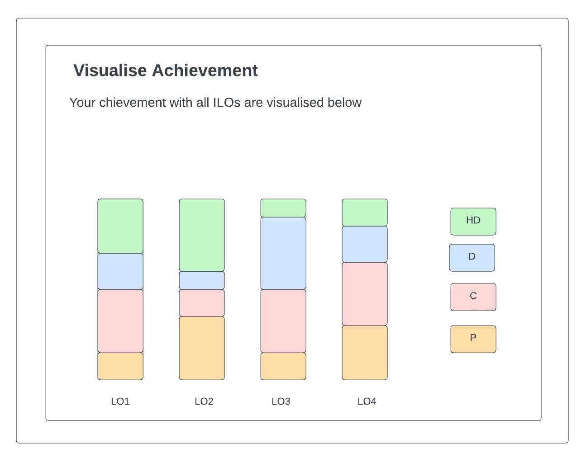

# Component Review - Component achievement-custom-bar-chart.coffee

## Student Name: Jayani Vithanage

## Student ID: 220194805

## Component Name
Path: ./src/app/visualisations/achievement-custom-bar-chart.coffee

File Name: achievement-custom-bar-chart.coffee

## Component purpose

It is used to visualize the achievements of particular learnig outcomes according to the overall progress of unit outcomes from student account.
## Component outcomes/interactions

It gives a visualization of achievements of each and every learning outcome of tasks from student account and it displays the propotion of achievement of the particular learning outcome for each category of tasks.

current model:

It works through  the learning outcomes from the tasks which are submitted by students.

This visualization has proper mechanism, but some of the changes can be proposed to enhance this.

So, in the proposed visualization modal, the user provides the following changes:

1. The description boxes should be added to the right hand side of the bar chart and it will help to display the color representations.

2. The description of learning outcomes should be aligned cente.

3. The seperate bars could be displayed for pass tasj range,credit task range, distinction task range and High distiction task range.

New design sketch: Existing UI components are to be used for the input fields and button etc.

New design sketch: proposed different design, existing UI components are to be used for the input fields and button etc.

Design one:

Design two:

**Component migration Check list** – What is needs to be checked for this component to work once
migrated?

[ ] Ability to collect details from the user

[ ] The rating values should be correctly passed and store (data validation)

[ ] high user friendliness

[ ] Check with the output data, the rating value should be through the graph accordingly - student task submission
