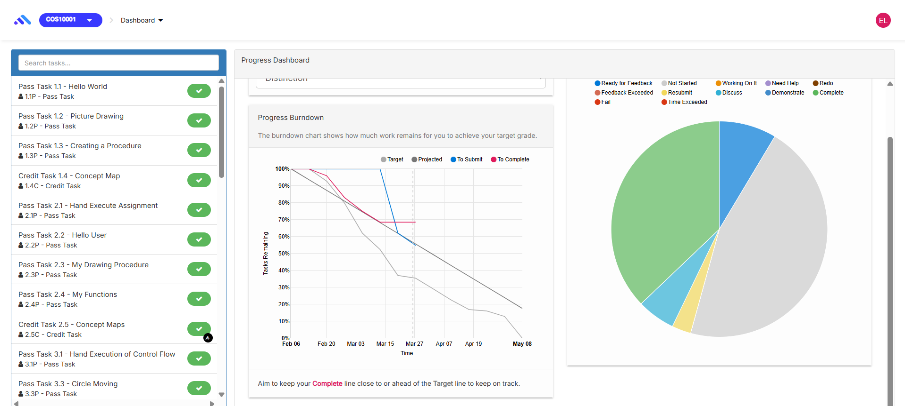

# OnTrack Component Review

## Team Member Name

| Name                    | Student ID |
| ----------------------- | ---------- |
| Atharv Sandip Bhandare  | 223650012  |

---

## Component Details

### Component Name

`Pogress Burndown Chart`

### Files included
1. `progress-burndown-chart.coffee`
2. `progress-burndown-chart.scss`

---

## Component purpose

The burndown chart visually tracks remaining task workload over time, helping students monitor progress toward their target grade. It dynamically plots lines for target, projected, to-submit, and completed tasks using real-time task completion data.

---

## Component outcomes and interactions

1. The component takes two inputs:  `project` and `unit`, which are objects passed from the parent.

2. `project` contains the task progress data (like `burndownChartData`).

3. `unit` provides the start and end dates for the chart timeline.

4. It listens for updates in `project.burndownChartData` and refreshes the chart when data changes.

5. The chart is drawn using D3.js with custom formatting for lines, tooltips, and colors.

6. It interacts with the backend by calling `refreshBurndownChartData()` to load the latest data.

### Current Uses

- `project-progress-dashboard.tpl.html`
- `progress-dashboard.tpl.html`

---

## Component migration plan

1. Create a new branch called `migrate/progress-burndown-chart` to work on the migration separately.

2. Create three new files: `progress-burndown-chart.component.ts`, `progress-burndown-chart.component.html`, and `progress-burndown-chart.component.scss`.

3. Import necessary Angular 17 modules following the migration guide to set up the component properly.

4. Unlink the old directive and update references in doubtfire-angular.module.ts and doubtfire-angularjs.module.ts.

5. Downgrade required services so they remain usable in AngularJS parts of the app.

6. Migrate the old CoffeeScript logic to TypeScript and Angular17.

7. Manually test the component by running the app and using console logs to verify correctness.

---

## Component Post-Migration

Yet to be implemented...

---

## Component review checklist

[ ] ability to collect details from the user 
[ ] succeeds when data is valid 
[ ] handles errors - duplicate unit code in the teaching period, or invalid dates [ ] created unit is shown on success

## Discussion with Client (Andrew Cain)

Finally you will need to take the feedback from Andrew and Discuss any addtional considertions he
may have with this component before writing any code.