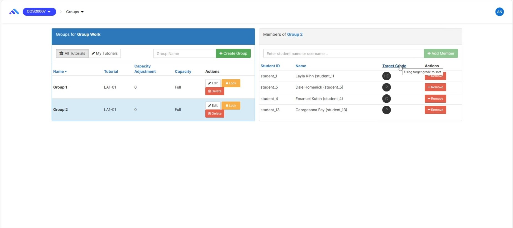
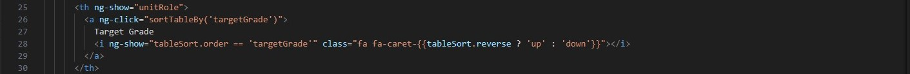
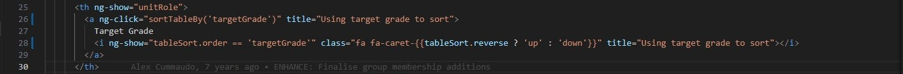

# OnTrack Component Review

## Team Member

Zhongyu Zhang

## Component

`group-member-list`

Relevant files:

- `group-member-list.coffee` Removed
- `group-member-list.tpl.html` Removed
- `group-member-list.scss` Removed
- `group-member-list.component.ts` Added
- `group-member-list.component.html` Added
- `group-member-list.component.scss` Added

## Component Purpose

The `group-member-list` component is designed to provide a dynamic user interface for managing and displaying a list of members within a specific group. Its primary function is to allow users to view, sort, and manage group members effectively, facilitating administrative tasks in a user-friendly environment.

## Component Outcomes and Interactions

- **View Members**: Users can view all members of a group sorted by various criteria such as name, role, and status.
- **Sort Members**: Incorporates interactive sorting capabilities, allowing users to sort the member list by different attributes like student ID or name by clicking on the respective column headers.
- **Tooltip on Target Grade**: Implementing a tooltip feature where a tooltip appears when a user hovers the mouse over the 'Target Grade' icon or text. The tooltip will display the message "Using target grade to sort", providing immediate contextual help and enhancing user understanding of interactive elements.
    - **Before Tooltip Implementation**:
      
    - **After Tooltip Implementation**:
      
- **Add/Remove Members**: Users with appropriate permissions can add new members to the group or remove existing members directly from the list.
- **Dynamic Loading**: Members are loaded dynamically into the list as needed, with loading indicators to improve user experience during data fetch operations.
- 

## Component Migration Plan

- **Phase 1: Removal of Legacy Files**: Removal of the old CoffeeScript, HTML, and CSS files to clean up the project and prepare for new Angular components.
- **Phase 2: Component Development**: Development of the new Angular component, ensuring it integrates seamlessly with existing services and backend APIs.
- **Phase 3: Implementing Tooltip Feature**: Adding interactive tooltips to enhance user interface interaction and provide contextual information efficiently.
    - **HTML Code Before Tooltip Implementation**:
      
    - **HTML Code After Tooltip Implementation**:
      
- **Phase 4: Testing and Feedback**: Rigorous testing with a focus on usability and performance. Gathering feedback from users to identify potential areas for improvement.
- **Phase 5: Final Deployment**: After testing and adjustments based on feedback, the component will be fully integrated into the production environment.

## Component Post-Migration

Post-migration, the `group-member-list` component will provide enhanced performance, better integration with modern development practices, and improved user experience. The use of Angular's reactive programming model will ensure that the component is both efficient and scalable, meeting the needs of growing user bases and complex group structures.
