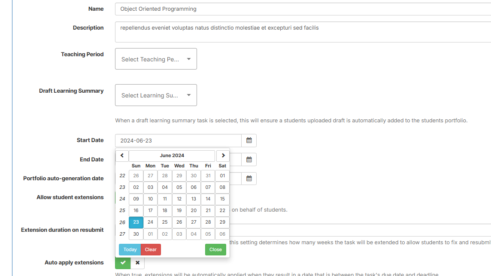

# Ontrack Component Review

## Team Member Name
Xin Huang | 218161625

## Component Name
`Unit-dates-selector` Component

## Files in this Component
- `unit-dates-selector.coffee`
- `unit-dates-selector.tpl.html`

## Component Purpose

The `unit-dates-selector` component is a date selection tool for editing a unit's key details during the rollover process. It enables users to configure teaching periods, select start and end dates, and save the updated information for the unit.
**Screenshots:**
Original (PDF): 

## Component Functions
The `unit-dates-selector` component allows users to:

- View and select teaching periods: Dynamically load available teaching periods and display them in a dropdown list.
- Pick start and end dates:Use interactive date pickers for precise selection of custom dates.
- Save updated unit details:Submit teaching period or date information to the backend for processing.
- Receive feedback:Display success or error messages after saving data.

## Interaction with Other Components/Services
- **newTeachingPeriodService**  
  Output: 
  - Loads and caches available teaching periods.
  - Filters and formats data for display in the dropdown.

- **alertService**
  Outputs:
  - Displays success or error notifications to users.

- **$state**
  Redirects users to the updated unit admin page after successful save.

- **Date Pickers**
  Outputs: 
  - Manages the state of two date pickers for `startDate` and `endDate`.

## Migration Steps
I will be following the
[doubtfire-web's Migration Guide](https://github.com/thoth-tech/doubtfire-web/blob/e70f4c7cd1395eaab942ee389788f75f92e985c9/MIGRATION-GUIDE.md)

1. **Analyze Existing Component:**
   - Review the AngularJS implementation.
   - Identify key functions, filters, and service dependencies.

2. **Setup Angular Environment:**
   - Ensure Angular 17 project setup is ready.
   - Install required dependencies (e.g., Angular Material, ngx-pagination).

3. **Create Angular Component:**
   - Generate a new Angular component `unit-dates-selector`.
   - Transfer HTML template and styles to Angular.

4. **Rewrite Core Logic:**
   - Migrate key functions (e.g., filtering, pagination, sorting, and CSV export) into TypeScript.
   - Replace AngularJS `$scope` with reactive properties using Angular's `@Input` and `@Output`.

5. **Integrate Services:**
   - Migrate services (newTeachingPeriodService, alertService) to Angular’s DI system.
   - Use Angular Router for navigation instead of $state.

6. **Replace Date Picker:**
   - Integrate Angular Material date pickers.
   - Replace $scope.calOptions with reactive form controls.

7. **Testing:**
    Validate all functionalities:
    - Teaching period dropdown.
    - Date pickers’ open/close behavior.
    - Successful save and error handling.
    - Navigation to the updated unit admin page.

8. **Downgrade Component (if needed):**
   - Use `UpgradeModule` to allow Angular and AngularJS components to coexist.

## Component Review Checklist

- [ ] Teaching periods load dynamically and correctly.

- [ ] Date pickers toggle and update values properly.

- [ ] Data submission (teaching period or dates) works as expected.

- [ ] Success and error messages are displayed.

- [ ] Navigation occurs after a successful save.