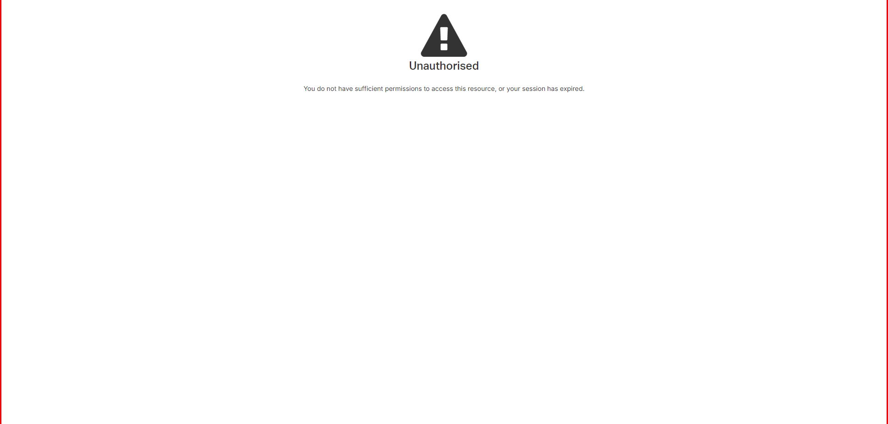

# Ontrack Component Review

## Team Member Name
*Xin Huang*
Student ID: 218161625

## Component Name
UnauthorisedComponent

### Files in this Component:
- `Unauthorised.coffee`
- `Unauthorised.tpl.html`

## Component Purpose
The primary purpose of the `Unauthorised` is to provide a user interface to inform that the user do not have sufficient permissions to
access this resource,or his session has expired.
**Screenshots:**
Original (PDF): 

## Component Outcomes and Interactions

**Expected Outcomes:**
- Just inform that user has no permission to access this resource. 

## Component Migration Plan

**Migration Steps:**
I will be following
[doubtfire-web's Migration Guide](https://github.com/thoth-tech/doubtfire-web/blob/e70f4c7cd1395eaab942ee389788f75f92e985c9/MIGRATION-GUIDE.md)

1. **Analyze Existing Component:**
   - Review the current implementation in AngularJS.
   - Identify key functionalities and dependencies.

2. **Setup Angular Environment:**
   - Ensure the Angular project is properly set up.
   - Install necessary dependencies (e.g., Angular Material).

3. **Create Angular Component:**
   - Generate a new Angular component.
   - Transfer the HTML template, styles, and logic from AngularJS to Angular.

4. **Integrate Services:**
   - Migrate and integrate the `Unauthorised` into the new Angular component.

5. **Downgrade Component:**
   - Use `Unauthorised` to downgrade the Angular component for use in the AngularJS app.

6. **Testing:**
   - Test the new component to ensure it replicates the behavior of the old one.
   - Fix any issues that arise during testing.

## Component Review Checklist

- [ ] Ability to collect details from the user
  - The modal allows users to enter and select grading details.

- [ ] Succeeds when data is valid
  - The modal successfully closes and returns valid data.

- [ ] Handles errors
  - The component gracefully handles errors such as invalid ratings or missing grades.

- [ ] Created unit is shown on success
  - The updated task details are visible in the UI after successful grading.