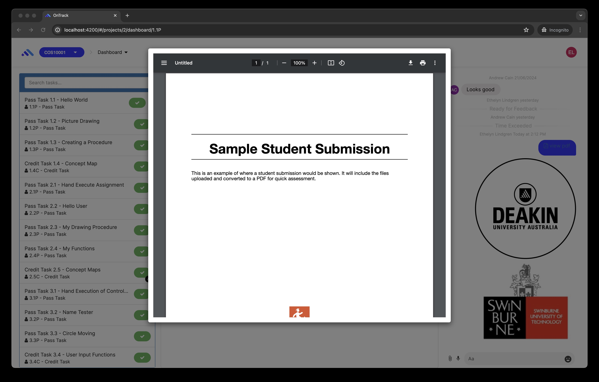
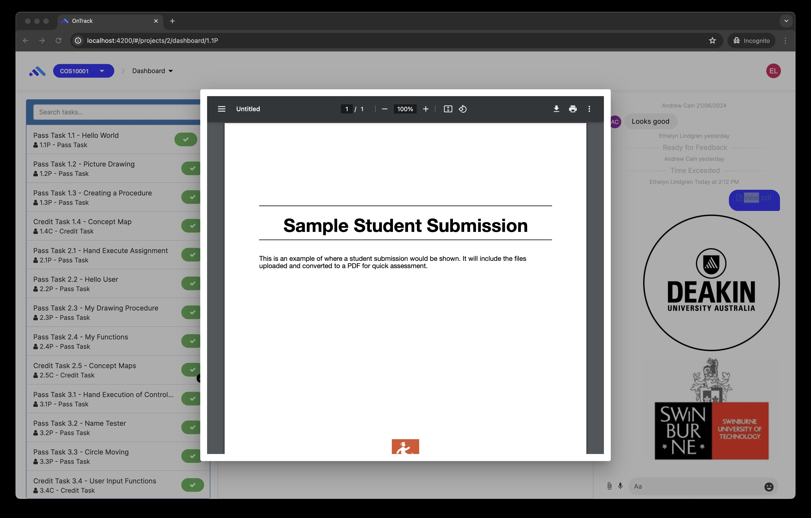

# Ontrack Component review

## Team Member Name

Eliya G | s222313935

## Component Name

- `comments-modal.coffee`
- `comments-modal.tpl.html`
- `comments-modal.scss`

## Component purpose

The purpose of `comments-modal` is to display images and PDFs from task comments as a fullscreen
modal popup, allowing users to view the content without having to download or open it in another
tab.

## Component outcomes and interactions

Users can click on the image or `view PDF` comment on task which triggers `comments-modal` to popup
with the enlarged image, or an embedded PDF. `comments-modal` accepts two objects:

```ts
  @Input() commentType: string; // either 'image' or 'pdf'
  @Input() commentResourceUrl: string; // the url to the image or pdf
```

## Component migration plan

I will be following
[doubtfire-web's Migration Guide](https://github.com/thoth-tech/doubtfire-web/blob/e70f4c7cd1395eaab942ee389788f75f92e985c9/MIGRATION-GUIDE.md)
and refer to existing components already migrated to TypeScript to ensure my code follows the same
code style & conventions.

Original (Image): 

Original (PDF): 

## Component Post-Migration

Migrated (Image): 

Migrated (PDF): 
