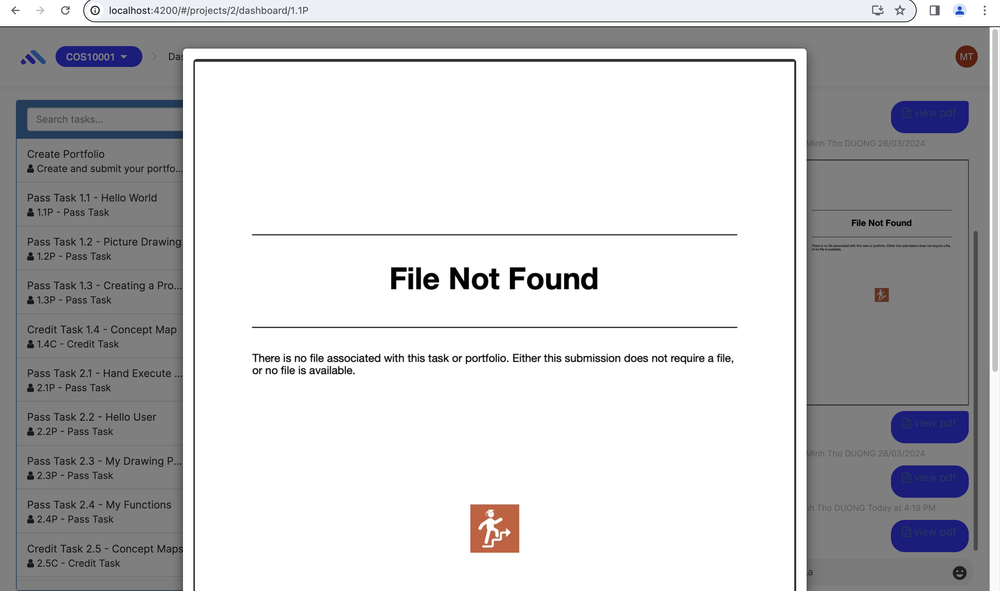
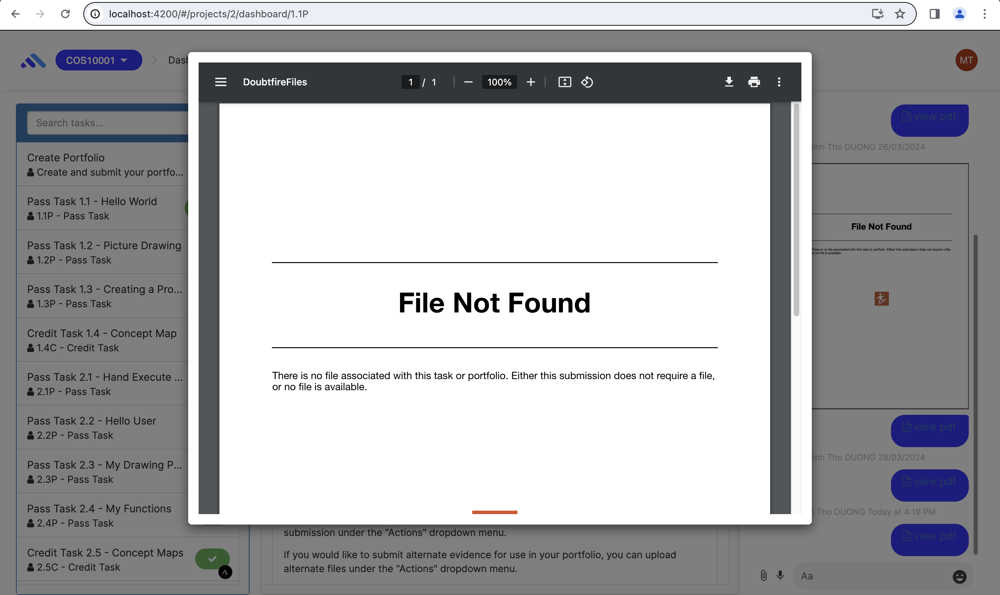
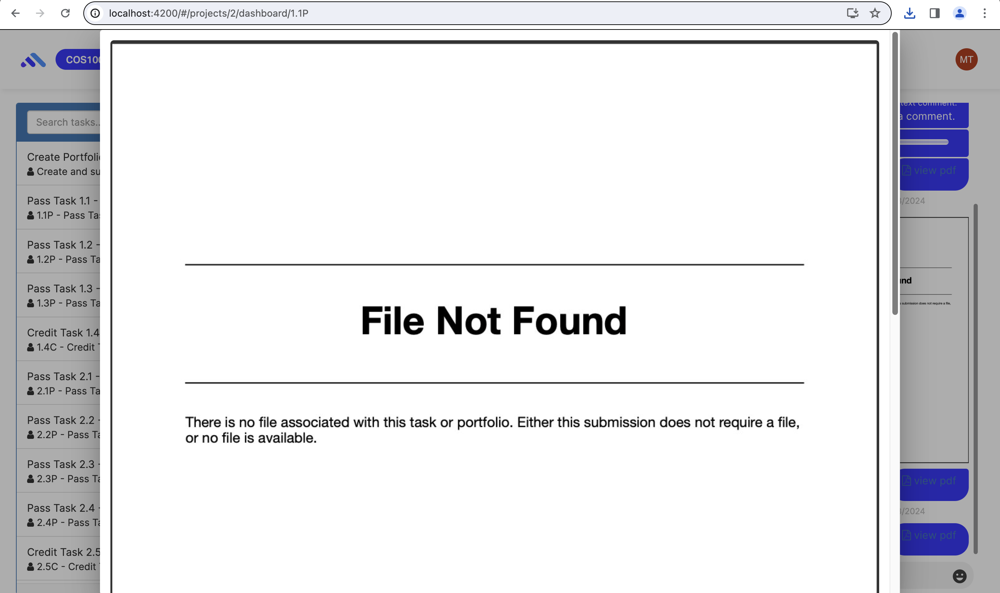
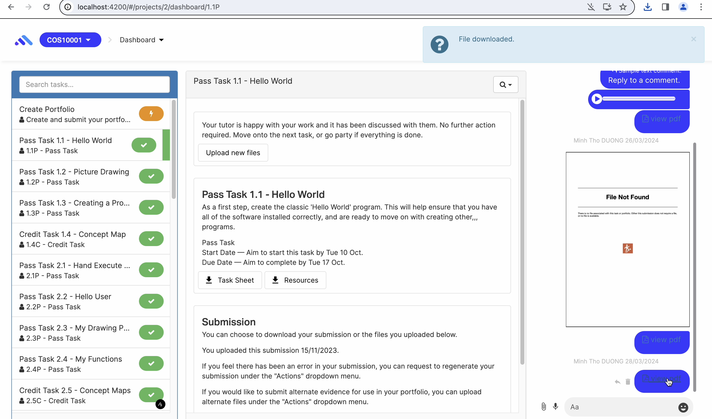
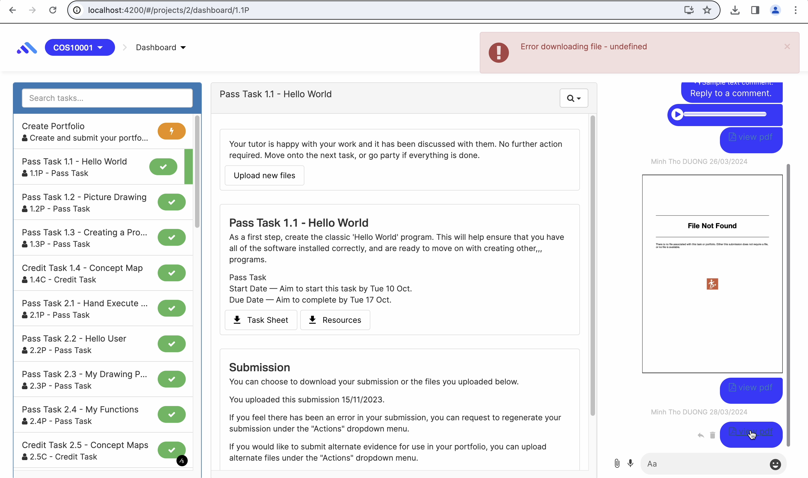

# OnTrack Component Review

## Team Member

Minh Tho DUONG - s223749059

Unit SIT782 Team Project B: Execution and Delivery - Trimester 1, 2024.

## Component

`comments-modal`

Relevant files:

- `task-comments-viewer.component.ts`
- `pdf-image-comment.component.ts`

## Component Purpose

The comments-modal component is located in the comment section. The purpose of the component is to display the original size of image and pdf files. In that, users can download the comments.

## Component Outcomes and Interactions

The expected outcome of the component is to provide a user-friendly interface by displaying image and pdf comments, allowing the user to have an overview on the files, interact and download the comment files when necessary.

## Component Migration Plan

The migration plan is followed from learning resources (/doubtfire-web/MIGRATION-GUIDE.md) to review and migrate CoffeeScript files in the component into TypeScript and Angular. There is no modification on the component design.

## Component Post-Migration

The work required to migrate the component is complete. All CoffeeScript sections in the component is removed with TypeScript files.

There are modifications on the functions. In specific:

- If the comment is an image type, by clicking at the file, displaying the original size of the image.

- If the comment is a pdf type, by clicking at the file, downloading the pdf. Then, display an inform alert message.

