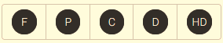
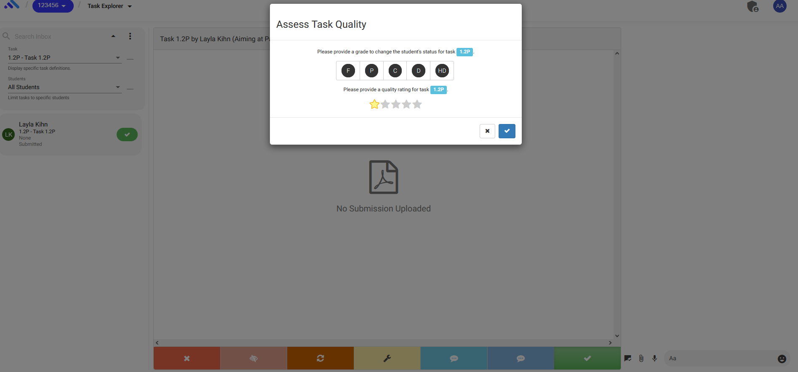

# Ontrack Component review

## Riley Helmore

## grade-icon

- grade-icon.coffee
- grade-icon.scss
- grade-icon.tpl.html

## Component purpose

This component provides the grade icons which can be found in numerous areas of OnTrack for tasks such as grading work.

## Component outcomes and interactions

The component should provide the ability to show grade icons.

## Component migration plan

- Review existing component to understand the functionality and structure.
- Setup environment.
- Setup new Angular component.
- Convert the CoffeeScript code to Tyscript.
- Update and check templates and styles.
- Test and debug the new component.

## Component review checklist
[ ] ability to collect details from the user 
[ ] succeeds when data is valid 
[ ] handles errors -
duplicate unit code in the teaching period, or invalid dates
[ ] created unit is shown on success

## Discussion with Client (Andrew Cain)
