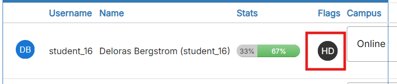
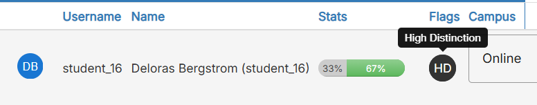
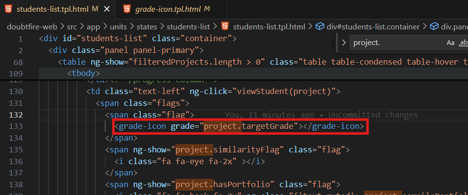

# Ontrack Component review

## Team Member Name
Shounak Bhalerao | S224743249

## Component Name

- `grade-icon.coffee`
- `grade-icon.scss`
- `grade-icon.tpl.html`

## Component purpose

The purpose of `grade-icon` is to provide a unified simple component, for displaying the grade student is expecting.
This item, can only be seen on screens with Tutor or higher permissions.

## Component outcomes and interactions
Users can hover over this icon to get what grade student is targeting.
It's a Visual component with no interactivity or subcomponents.

### Normal View


### Hover View


## Interaction with other components
### Input
Any Component which wants to invoke this components need the following inputs
```typescript
  @Input grade: string; // project.targetGrade
```

### Current Usages
I noticed that this component was used in `student-list` model.
In order to view this model we need to log in using the following credentials.
> username: atutor

> password: password



## Component Migration Plan
will be following doubtfire-web's Migration Guide and refer to existing components already migrated to TypeScript to ensure my code follows the same code style & conventions.
I will be using the following as reference: [comments-modal](comments-modal.md)

### Original (Image):


### Post-Migration (Image)
  > ADD ME 😀

## Referenes
- Doubtfire-web Pull Request: 🔴 ADD ME!

## Status of operations: Started
