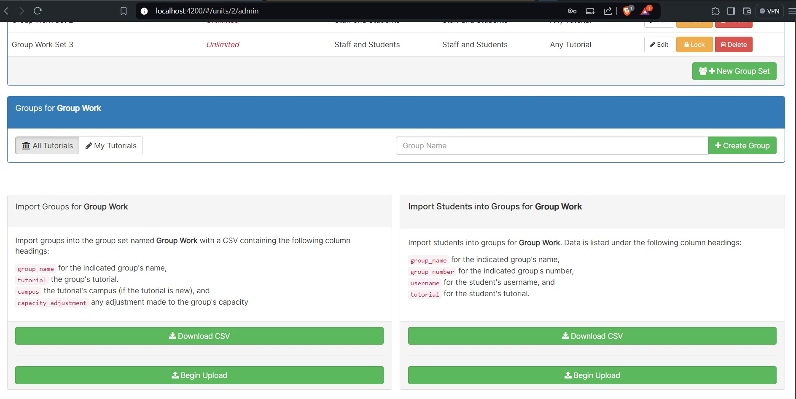
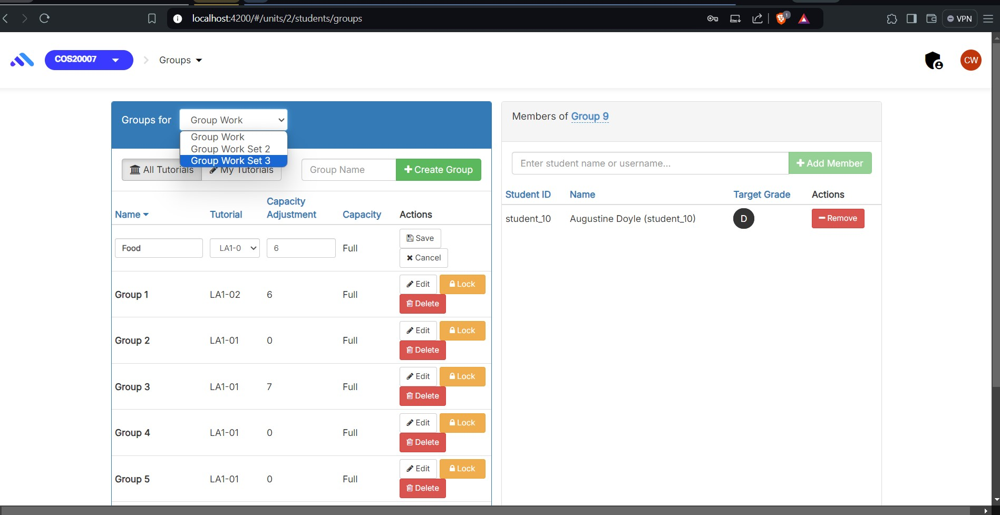

# Ontrack Component review

Amrith Jayadeep|| S224015719

First select a component to review from the list below:
<https://deakin365.sharepoint.com/:x:/r/sites/ThothTech2/Shared%20Documents/OnTrack%20-%20UI%20Enhancement/T3_2022/Management%20%5BT3_2022%5D/selected_task(revised).xlsx?d=wac02013da5224c958ac60fd96fac7b20&csf=1&web=1&e=UfCmZ5>

## Component Name

group-set-selector group-set-selector.coffee group-set-selector.tpl.html

## Component purpose

The unit-group-set-selector component is designed to allow users to switch the context of a specific
group set within a unit

## Component outcomes and interactions

1. Display a dropdown menu for selecting a group set.
2. Trigger a function when a group set is selected.

## Component migration plan

1. I will be following
   [doubtfire-web's Migration Guide](https://github.com/thoth-tech/doubtfire-web/blob/e70f4c7cd1395eaab942ee389788f75f92e985c9/MIGRATION-GUIDE.md)
   and refer to existing components already migrated to TypeScript to ensure my code follows the
   same code style & conventions

2. Convert the CoffeeScript logic to TypeScript, ensuring all functionalities are retained.

3. Convert the unit-group-set-selector.tpl.html template to the new Angular component template.

4. Component Before Images 
   
