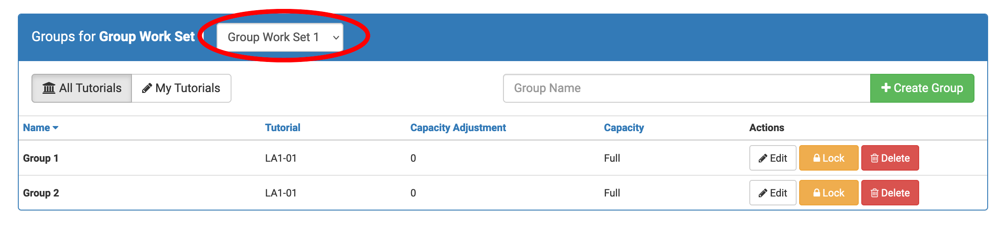

# OnTrack Component Review

## Team Member

Ethan Holley

## Component

`group-set-selector`

Relevant files:

- `group-set-selector.coffee`
- `group-set-selector.tpl.html`
- `group-set-selector.scss`
- `group-set-selector.component.ts`
- `group-set-selector.component.html`
- `group-set-selector.component.scss`

## Component Purpose

The purpose of this component is to handle selecting group sets in the Groups tab of managing a unit.

## Component Outcomes and Interactions

The expected outcome of the component is to allow the user to select a group set and return the information
from that group set object.

## Component Migration Plan

The plan is to review how other migrations were done. I will be able to model my migration off of those.

I will update the code, and then perform tests locally to make sure that it works the same way it was when
it was in CoffeeScript.

## Component Post-Migration

Make sure nothing breaks in the future. Perform unit tests. Keep the TypeScript updated too.
