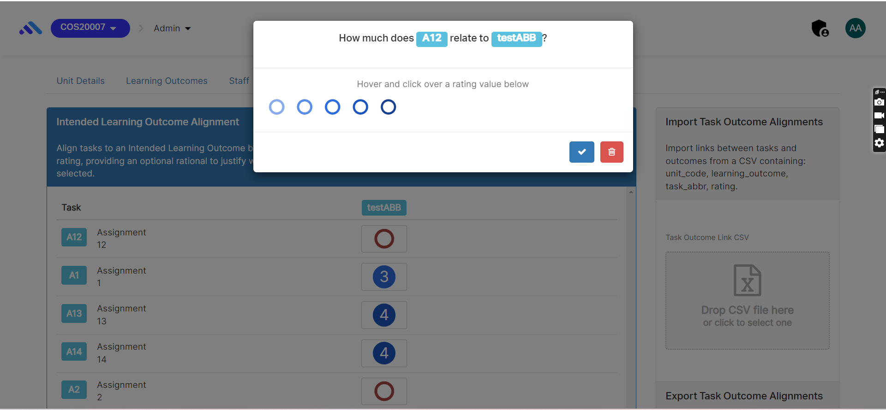
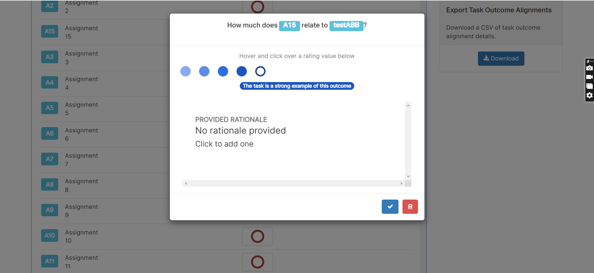
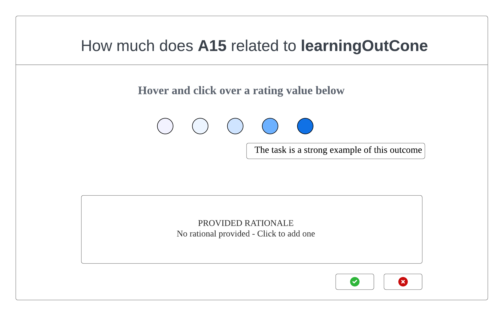

# Component Review - Component task-ilo-alignment-modal.coffee

## Student Name: Jayani Vithanage

## Student ID: 220194805

## Component Name

\*\*\*\*./src/app/tasks/task-ilo-alignmnet/modals/task-ilo-alignment-modal/task-ilo-alignment-modal.coffee

File Name: task-ilo-alignment-modal.coffee

## Component purpose

It is used to maintain alignment  and rating of learning outcomes for assignments

## Component outcomes/interactions

It aligns and rate the learning outcomes for all assignments through a popup window.

The current model gives the ability to enter learning outcomes of assignments, which can be rated through progress buttons as above. This displays how the task is a strong example of this outcome. 

This modal has proper mechanism, but some of the changes can be proposed to enhance this.

So, in the proposed modal the user provides the following changes:

1.Progress bar should be alighned to center of the popup window
2.The assignment name and the learning outcome is displayed through bold letters, not in the colored boxes
3.The rational message should be displayed with proper alignment and font size.

New design sketch: Existing UI components are to be used for the input fields and button etc.
``

**Component migration Check list** – What is needs to be checked for this component to work once
migrated?

[ ] ability to collect details from the user

[ ] high user friendliness

[ ] correct rating value should be displayed thorugh the progress buttons once it hovered and click

[ ] the progress buttons should be centered and rational message should be displayed within the popup window