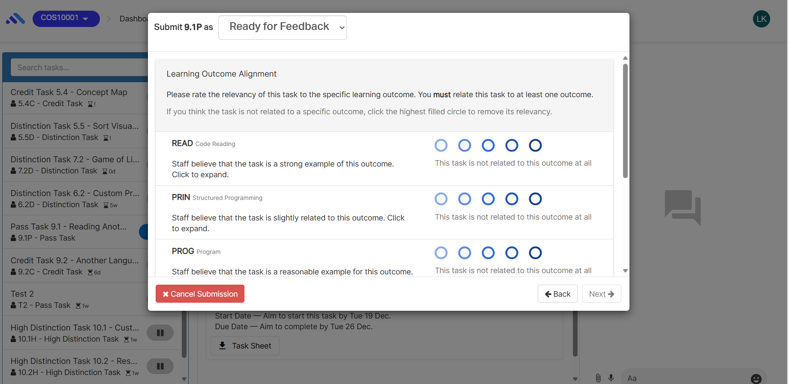
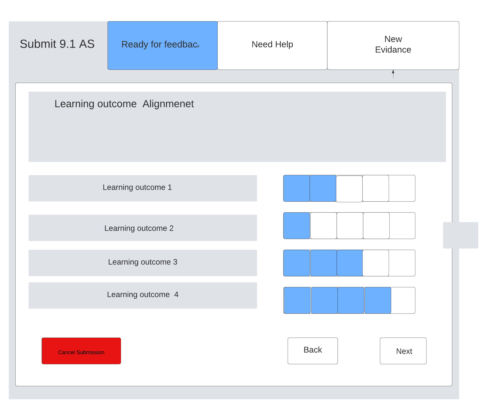
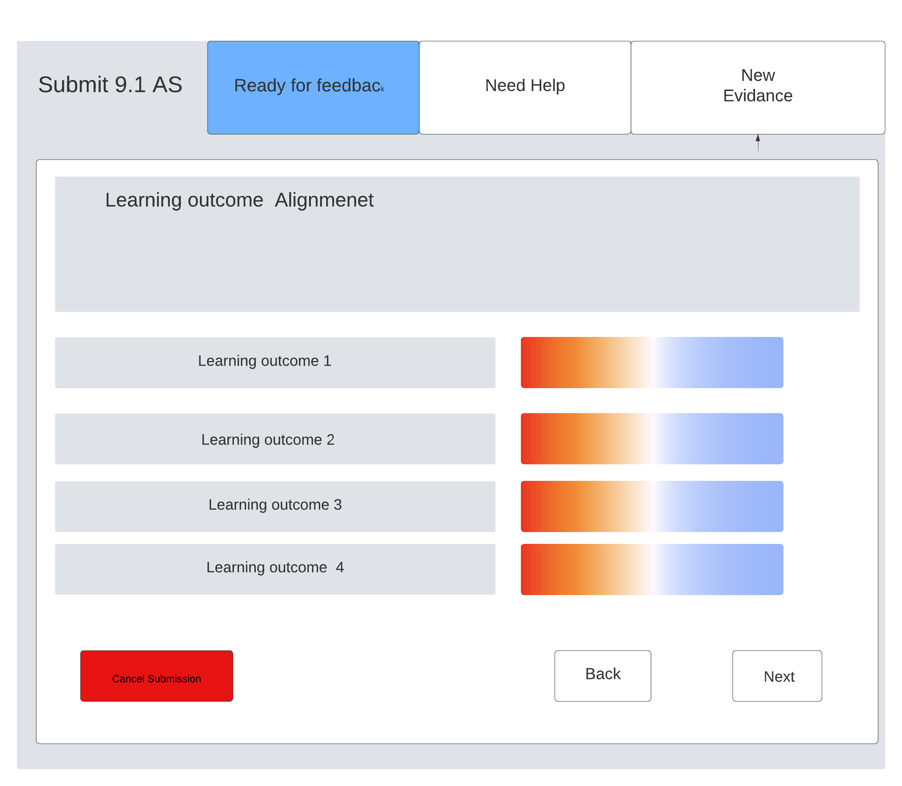

# Component Review - Component task-ilo-alignment-rater.coffee

## Student Name: Samadhi Weerasingha

## Student ID: 222356873

## Component Name

\\\\./src/app/tasks/task-ilo-alignmnet/task-ilo-alignment-rater/task-ilo-alignment-rater.coffee

File Name: task-ilo-alignment-rater.coffee

## Component purpose

It is used to find out to which extend that the student is aligning with the learning outcomes of the unit.

## Component outcomes/interactions

It measures the ability of the student to align with a given task.

Currently student can rate each and every learning outcome using a method that as above.

So, in the proposed modal the user provides the following to enhance the exisiting modal:
In the proposed model , these are the suggested changes;

1. Progress bar which provide the exact percentage that studets align with the learning outcome.
2. The drop box which is next to the tittle bar can be change to set of tabs.
3. Color chart to find out the ratings of the students regarding the learning outcomes.

New design sketches: Existing UI components are to be used for the input fields and button etc.

*Component migration Check list* – What is needs to be checked for this component to work once
migrated?

[ ] ability to collect information from the user

[ ] Correct ratings should be represented according to the user input

[ ] User friendliness of the interace