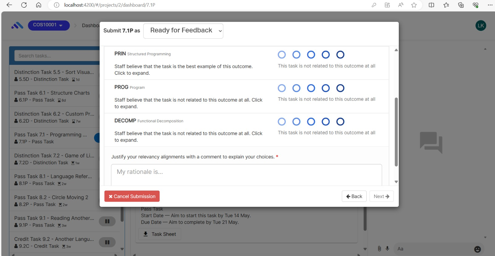

# Component Review - Migrate task-ilo-alignment-rater.coffee

## Student Name: Samadhi Weerasingha

## Student ID: 222356873

./src/app/errors/states/timeout/timeout.coffee
## Component Name

src/app/tasks/states/tasks/task-ilo-alignment/task-ilo-alignment-rater.coffee

File Name: task-ilo-alignment-rater.coffee

## Component purpose

This allows all users to rate their alignment for the task which they have submitted to the system.Simply students can rate their assignnment align rate to show the tutor that they have completed the given assignement to given standard or not.

## Component outcomes/interactions

It allows to enhance the user friendliness of the system.

Currently after submitting the relevant submission , the system allows user to mark and rate their submissions accordimg to the unit learning outcomes.

*Component migration Check list* – What is needs to be checked for this component to work once
migrated?

[ ] ability to collect information from the user.

[ ] outcome should be align with the expectation.

[ ] User friendliness of the interace.