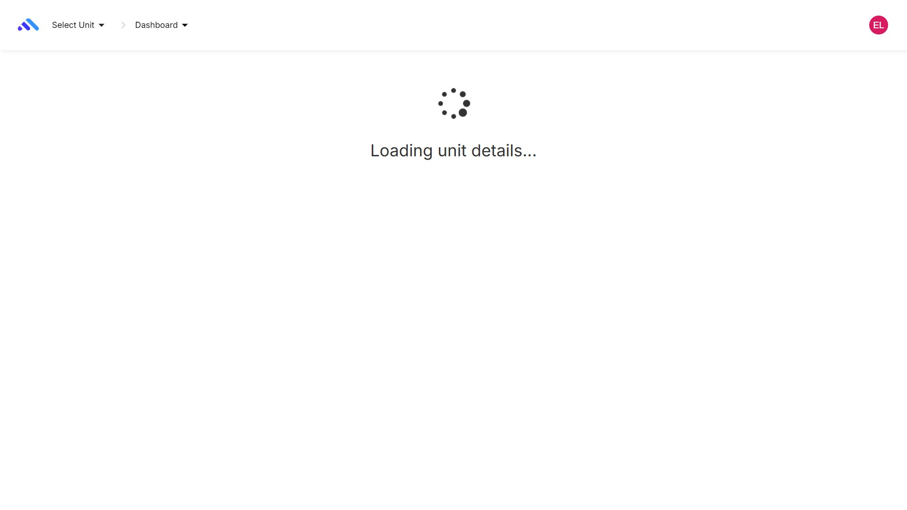
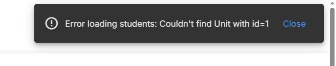
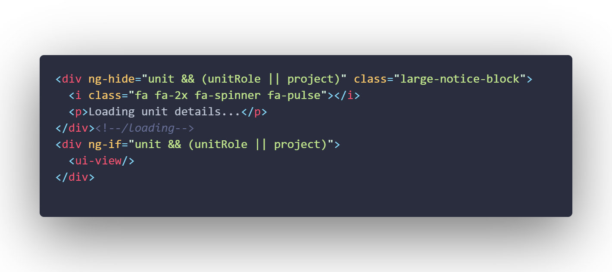

# Ontrack Component review

## Team Member Name

Lachlan Mackie Robinson (220325142)

## Component Name

UnitsIndexStateCtrl

## Files in Component

-   index.coffee
-   index.tpl.html

## Component purpose

The primary purpose of this component is to manage the state and view for a specific unit within the application. It handles loading the unit details, determining the user's role within the unit, and displaying the appropriate view based on the loaded data.

It also displays a loading spinner while processing the state logic.

## Component outcomes and interactions

### Functionality

1. Gets the Unit ID from the state parameters and navigates to home unless a unit ID exists.

2. Finds the user's role within the unit.
3. If the user is an admin or auditor -> Role is assigned manually using newUserService.
4. Redirect to home state unless a role is found.

5. Update the view to reflect the unit being accessed in the context of the user's role.
6. Fetches the unit data using newUnitService.
7. Fetches the student data for the unit using newProjectService.

8. Error handling for errors loading students or loading unit.

## Component migration plan

The visual display for the component is extremely simple in function. And will not require changes outside of updates to the angular directives.

The important part of the migration will be maintaining the same logic flow in the new typescript file that matches the functionality above.

Finally, the component will be integrated in the necessary reference locations and downgraded to be accessible for angularjs.

## Component review checklist

- [  ] New Files Created
- [  ] Logic and Visuals Migrated
- [  ] Logic and Visuals Tested
- [  ] Pull to repo.
- [  ] Iterate if necessary

## Component post migration

Pending...