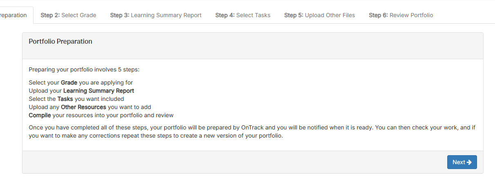

# Ontrack Component review

## Team Member Name

Josh Talev | ID: 215121167

## Component Name

- portfolio-welcome-step.component.ts
    - portfolio-welcome-step.component.html
    - portfolio.component.scss

# Note
- For the rest of this component review, portfolio-welcome-step will be referred to as 'this component', and all other files and components will be explicitly identified

## Component purpose

- The purpose of this component is to display information to students regarding the steps involved in preparing and compiling their portfolio for review.
- This component is for providing information only, with a single button used to navigate to the 'Select Grade' tab, the second step in preparing the students portfolio.
- When running OnTrack in a browser, at the bottom of the task list for any given unit is a 'Create Portfolio' task that when clicked leads the user to the page that this component can be viewed at. 

## Component outcomes and interactions

- Expected outcomes
    - Outline the 6 steps involved in preparing a student portfolio for submission
    - Have a button that allows users to navigate to the next step in this process

- Interactions
    - There are no nested components
    - Component 'portfolio' depends on this component
        - 'portfolio.coffee' contains the function 'advanceActiveTab' which is triggered by clicking the 'Next' button in this component
            - 'advanceActiveTab' sets one of the 6 steps as active, allowing conditional rendering of the corresponding component in 'portfolio.tpl.html'

- Data
    - 'advanceActiveTab' must be bound and received by this component as an input
    - 'externalName.value' from DoubtfireConstants must also be bound and received as input

## Component migration plan

- Create 'portfolio-welcome-step.component.ts', 'portfolio-welcome-step.component.html' files
- Downgrade new component in doubtfire-angularjs.module.ts file
- Migrate code from 'portfolio-welcome-step.coffee' and 'portfolio-welcome-step.tpl.html' to new component files
    - The code for this component only defines a template file to be injected into its parent component, so code migration will only require html, styling, and inputs externalName.value and the function 'advanceActiveTab' described earlier
- For the html template, replace existing elements with Angular Material UI 'mat-card' and its child elements
    - To allow for consistent styling across the components responsible for rendering the next steps in the portfolio preparation process, and in preparation to allow these components to be migrated easily, portfolio.component.scss will contain the general styling for the mat-card and child elements and any styles specific to the migrated component can be defined in its own .scss file.
- Delete old files and delete/adjust references where necessary
- Once complete, view running in browser to confirm navigation functionality still works and styling is consistent

## Component review checklist

Next add a checklist similar to: then create a checklist:

- [x] can navigate to next step in portfolio preparation flow

## Discussion with Client (Andrew Cain)

Finally you will need to take the feedback from Andrew and Discuss any addtional considertions he
may have with this component before writing any code.