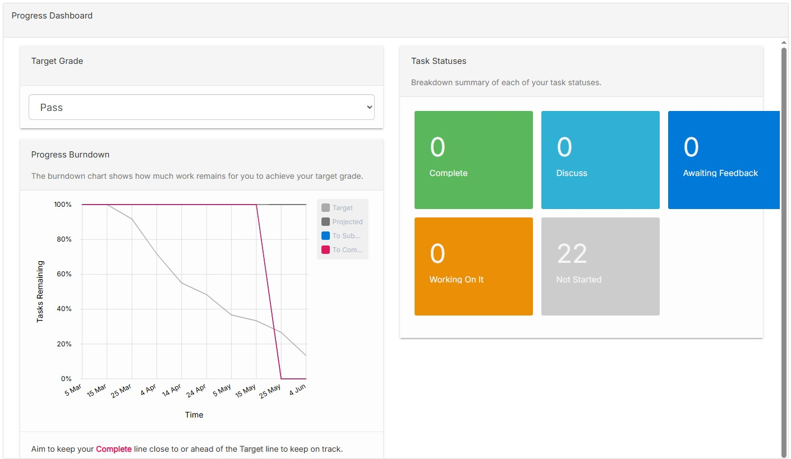

## Ontrack Component Review - Progress Dashboard

### Team Member Name

Lachlan Mackie Robinson (220325142)

### Component Name

`progress-dashboard`

### Component Files

- `progress-dashboard.coffee`
- `progress-dashboard.scss`
- `progress-dashboard.tpl.html`

### Component Purpose

This component is designed to present the unit progress of the user. The unit progress is presented
relative to the target grade through a burndown chart and a counter. (In previous versions, a pie
chart is present where the counter currently exists).

### Expected Outcomes

1. Users can select their target grade and visualisations update.
2. As a users' task status changes, the visualisations should update.

### Interactions

- Uses the alert service to notify the user.
- Updates the visualisations on changes.
- Uses the grade service to handle names and values of grades for data.

### Migration Plan

- [] Review current component
- [] Create new component files
- [] Migrate component functionality
- [] Unlink previous component
- [] Link new component & downgrade
- [] Test for errors
