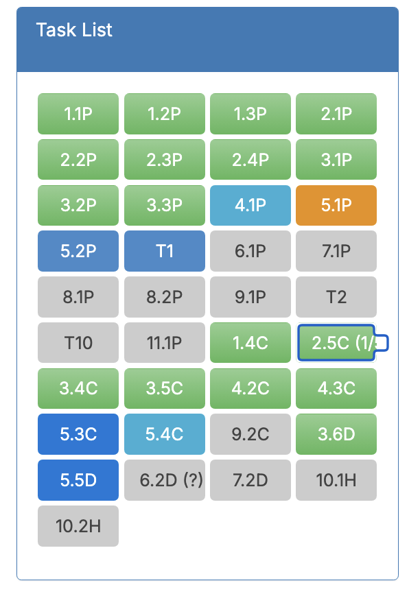

# Ontrack Component review

## Team Member Name

Alvin Odunga | s222316611

## Component Name

- `project-tasks-list.coffee`
- `project-tasks-list.html`
- `project-tasks-list.scss`

## Component purpose

The purpose of `project-tasks-list` is to display the tasks of an individual student. 
In the styling you can determine the status of the task . 

## Component outcomes and interactions
The expected outcome of the component is to recreate the previous - `project-tasks-list.coffee` file in an updated angular 17 fashion.

While keeping the same functionality and styling as the previous design

Interaction occurs with the user through selecting a task bringing up a tooltip of the task name.

## Component migration plan

I will be following
[thoth-tech's Migration Guide](https://github.com/thoth-tech/doubtfire-web/blob/development/MIGRATION-GUIDE.md)
and refer to existing components already migrated to TypeScript to ensure my code follows the same
code style & conventions.

Original (Image): 

## Component Post-Migration

