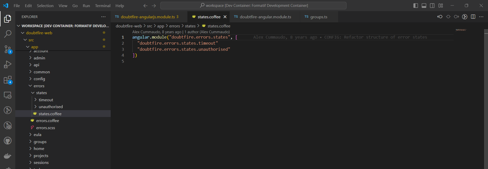

# OnTrack Component Review

## Team Member

Jayani Vithanage

## Component

states.coffee

Pre req files:

- `timeout.coffee`
- `unauthorised.coffee`

## Component Purpose

The purpose of the component is manage the timeout and unauthorised components and these two are the pre requisite for this component. This main handles the error notification displays when it is a timeout or an unauthorised error.

path to the component: doubtfire-web/src/app/errors/states

## Component Migration Plan

The migration plan is to review and complete the migration of timeout.coffee and unauthorised.coffee components and then review the states.coffee and complete the migration of states.coffee component.

