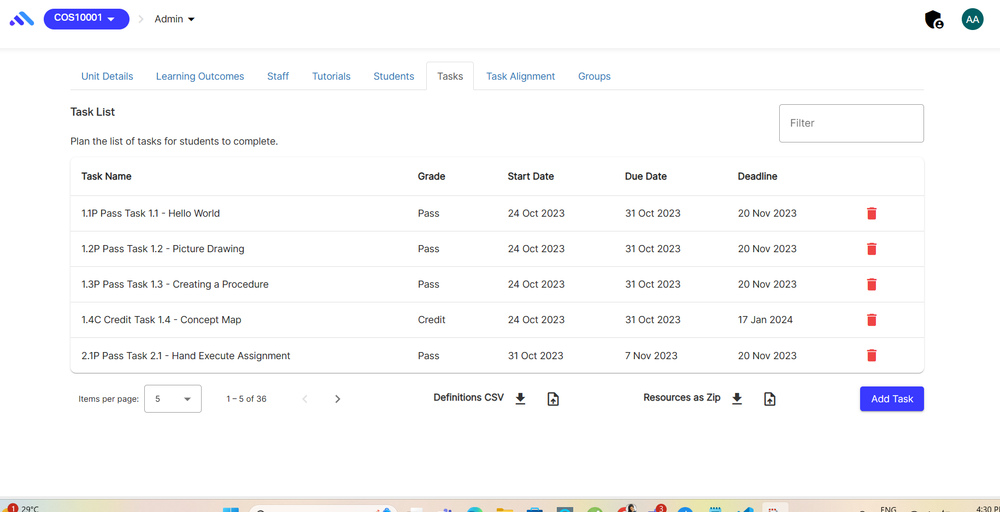
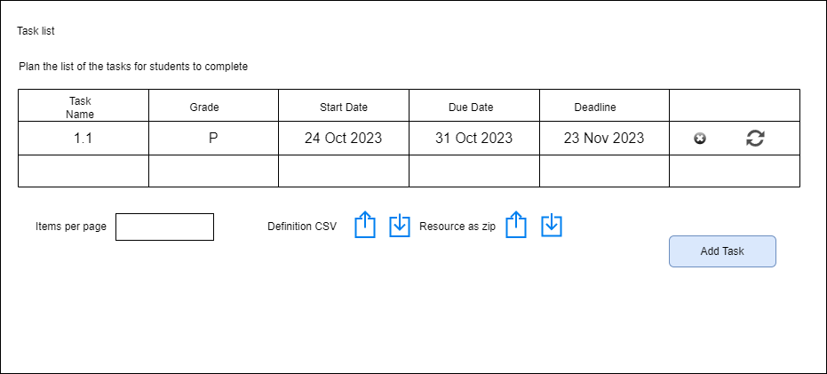
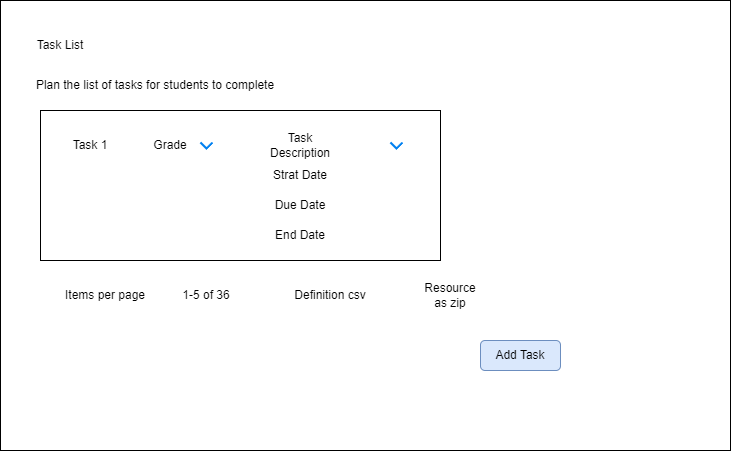

# Component Review - Component tasks.coffee

## Student Name: Samadhi Weerasingha

## Student ID: 222356873

## Component Name

src/app/units/states/tasks/tasks.coffee

File Name: Component tasks.coffee

## Component purpose

This allows tutors and admin to add tasks with the resources and delete tasks.

## Component outcomes/interactions

It allows students to preview the related tasks for them and download the related resources.

Currently tutors can add the tasks and related resources for each tasks using this component. There is a delete option to delete the tasks which tutor has uploaded and preview the task.

So, in the proposed modal the tutor provides the following to enhance the exisiting modal:
In the proposed model , these are the suggested changes;

1. A new Update button should be added 
2. Task details preview should be more compressed without having many details inside the grid.
3. In Task description and resources there should be selection for the file type.

New design sketches: Existing UI components are to be used for the input fields and button etc.

*Component migration Check list* – What is needs to be checked for this component to work once
migrated?

[ ] ability to collect information from the user

[ ] Correct ratings should be represented according to the user input

[ ] User friendliness of the interace