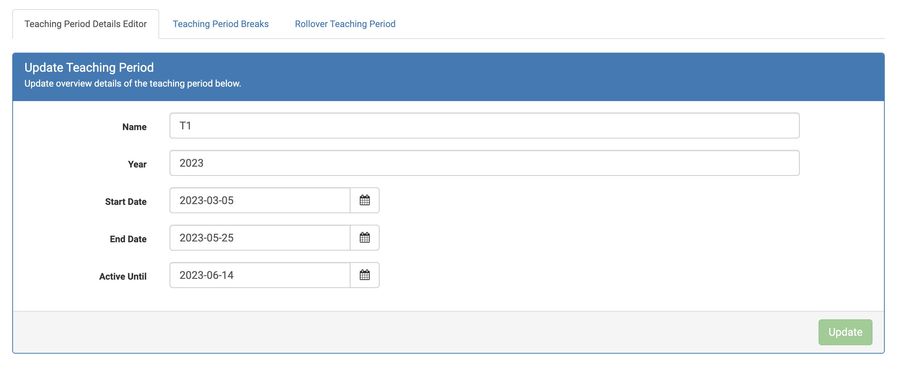
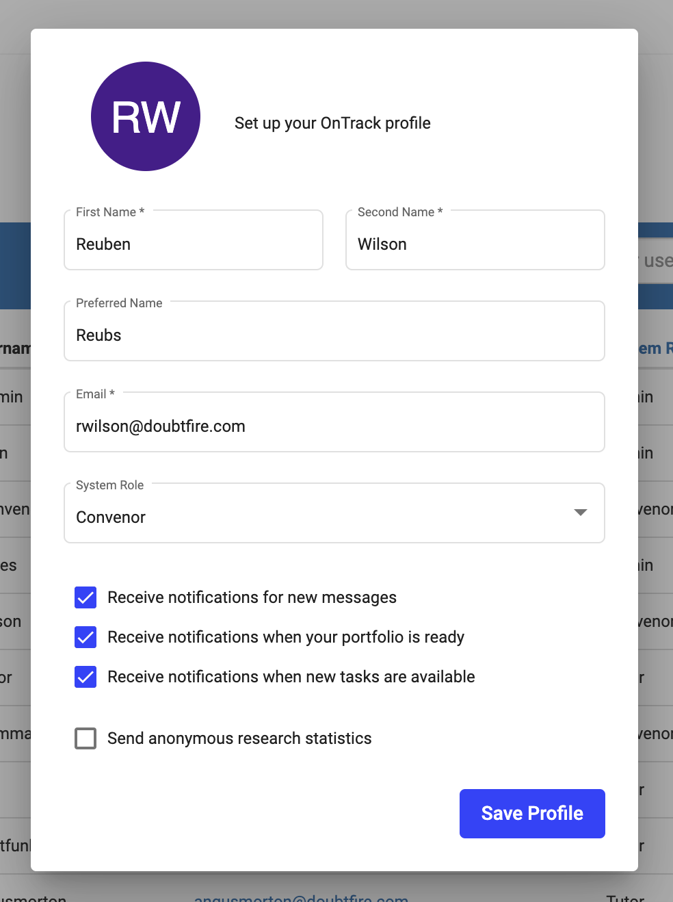
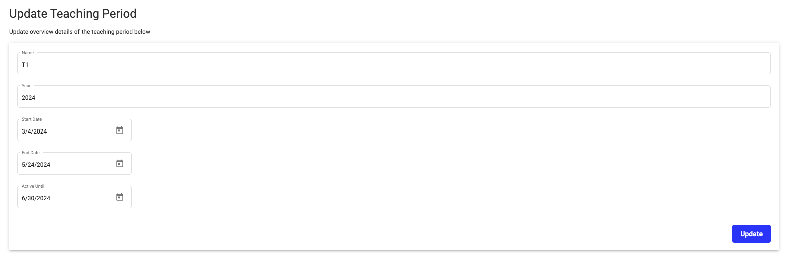

# OnTrack Component Review

## Team Member

Matt Kinnia

## Component

`teaching-period-details-editor`

Relevant files:

- `teaching-period-details-editor.coffee`
- `teaching-period-details-editor.tpl.html`

## Component Purpose

The purpose of the component is to edit the details for a teaching period. It also allows the user
to update key properties of a teaching period, such as the name and length.

## Component Outcomes and Interactions

The expected outcome of the component is to provide a user-friendly interface for updating the key
properties of a teaching period.

Interaction occurs with the user through a form which contains a series of text and date inputs.

## Component Migration Plan

The migration plan is to review similar form based components that have already been migrated to
TypeScript and Material UI.

For example, the `edit-profile-form` component. Based on this review, migrate the component in such
a way that is in line with the previous works to maintain consistency.

`edit-profile-form`

## Component Post-Migration

The work required to migrate the component is now complete and the migrated component is shown
below.

