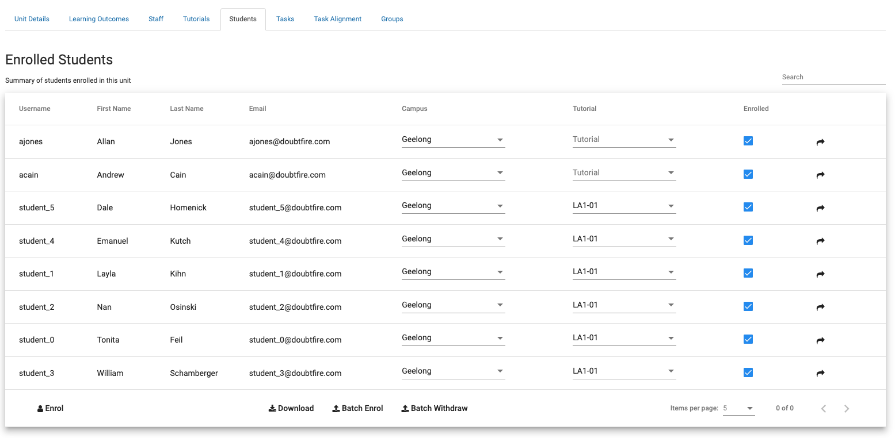

# OnTrack Component Review

## Team Member

Matt Kinnia

## Component

`teaching-period-units`

Relevant files:

- `teaching-period-units.coffee`
- `teaching-period-units.tpl.html`

## Component Purpose

The purpose of the component is to display the units that have been registered against a teaching
period. It also allows the user to search for specific units, sort the list by different criteria,
and navigate to a unit detail view.

## Component Outcomes and Interactions

The expected outcome of the component is to provide a user-friendly interface for managing units
registered against a teaching period, allowing the user to quickly find and view information about
specific units.

Interaction occurs with the user through filtering and pagination controls. Each table row is
clickable, which links to the unit detail page. A button is clickable which invokes the
`RolloverTeachingPeriodModal` (which is out of scope for this review).

The component takes in a `teachingPeriod` object where its properties are used to display
information in the user interface.

## Component Migration Plan

The migration plan is to review similar tabular based components that have already been migrated to
TypeScript and Material UI.

For example, the `unit-students-editor` component. Based on this review, migrate the component in
such a way that is in line with the previous works to maintain consistency.

`unit-students-editor`

## Component Post-Migration

The work required to migrate the component is now complete and the migrated component is shown
below.

