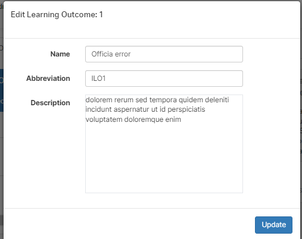

# Ontrack Component Review

## Team Member Name
*Ivan Justin*
Student ID: s223844277

## Component Name
UnitILOEditComponent

### Files in this Component:
- `unit-ilo-edit-modal.coffee`
- `unit-ilo-edit-modal.tpl.html`

## Component Purpose
The primary purpose of the `UnitILOEditModalComponent` is to provide the user (a tutor or a convenor) the ability to insert and edit ILOs that match the units that they oversee. It includes the ability to add new ILOs, the ability to give them names, abbreviations, and descriptions, as well as data from pre-existing ILOs. 

**Screenshots:**
Original (PDF): 

## Component Outcomes and Interactions

**Expected Outcomes:**
- Users can name ILOs
- Users can abbreviate the ILOs
- Users can provide the description for ILOs
- Users can edit ILOs, as the modal takes data from the page before it

**Interactions:**
- **Inputs:** 
  - `ilo`: Object containing the data of the ILO in question, including its name, its abbreviation, and its description.
  - `prototypeIlo`: Object to store user inputs.

- **Outputs:**
  - The modal creates a new `LearningOutcomeService` object which will store and associate the new ILO with the certain unit ID.
  - If selected from a pre-existing ILO, the modal will display its data in the modal, which will then be available for modification.

## Component Migration Plan

**Migration Steps:**
I will be following
[doubtfire-web's Migration Guide](https://github.com/thoth-tech/doubtfire-web/blob/e70f4c7cd1395eaab942ee389788f75f92e985c9/MIGRATION-GUIDE.md)

1. **Analyze Existing Component:**
   - Review the current implementation in AngularJS.
   - Identify key functionalities and dependencies.

2. **Setup Angular Environment:**
   - Ensure the Angular project is properly set up.
   - Install necessary dependencies (e.g., Angular Material).

3. **Create Angular Component:**
   - Generate a new Angular component.
   - Transfer the HTML template, styles, and logic from AngularJS to Angular.

4. **Integrate Services:**
   - Migrate and integrate the `UnitILOEditModalService` into the new Angular component.

5. **Downgrade Component:**
   - Use `UpgradeModule` to downgrade the Angular component for use in the AngularJS app.

6. **Testing:**
   - Test the new component to ensure it replicates the behavior of the old one.
   - Fix any issues that arise during testing.

## Component Review Checklist

- [ ] Ability to collect details from the user
  - The modal allows users to enter and save learning outcomes.

- [ ] Succeeds when data is valid
  - The modal successfully closes and returns valid data.

- [ ] Handles errors
  - The component gracefully handles errors such as blank entries or data misinput.

- [ ] Created unit is shown on success
  - The new or edited ILO will be displayed in detail after the save button is prompted.