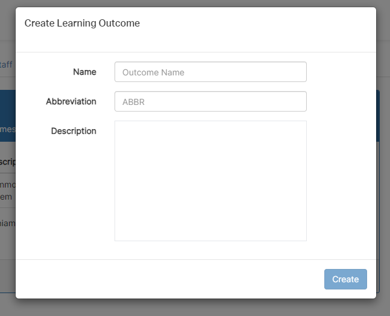
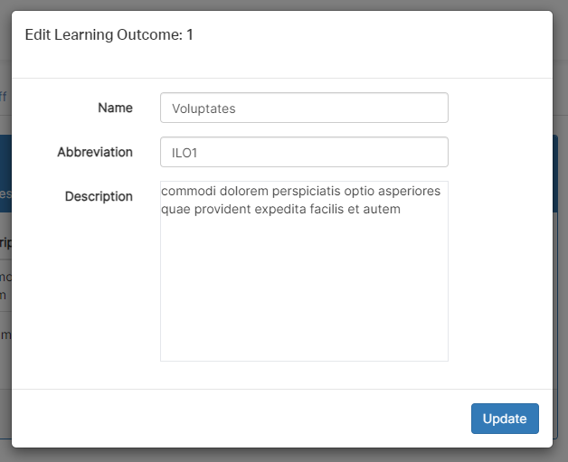

# Ontrack Component review

## Team Member Name

Joshua Bourquin

## Component Name

`unit-ilo-edit-modal`

Relevant Files:

- `unit-ilo-edit-modal.coffee`
- `unit-ilo-edit-modal.tpl.html`

## Component purpose

The purpose of this component is to enable the editing or creation of a unit learning outcome. It enables editing the name, abbreviation and description of a learning outcome.

Creating new objective:

Editing existing objective:

## Component outcomes and interactions

The expected outcome for this component is to provide a user friendly interface for managing existing and creating new unit learning objectives.

The user interacts with this component through editable text boxes and a create / update button.

This component takes in a `unit` object and `ilo` object. The `unit` object is used when saving changes to the ilo, and the `ilo` object is used to identify if a new ilo is being created or an existing one is being edited.

## Component migration plan

The migration plan is to follow the existing migration guide and review other similar components which have already been migrated. This will ensure consistency between this component and other similar components.

## Component review checklist

- [x] Ability to identify whether editing existing ilo or creating new ilo
- [x] Successfuly saves changes to ilo when create / update button is pressed
- [x] Reverts changes if modal is clicked out of / closed without pressing update button

## Discussion with Client (Andrew Cain)

Finally you will need to take the feedback from Andrew and Discuss any addtional considerations he
may have with this component before writing any code.
